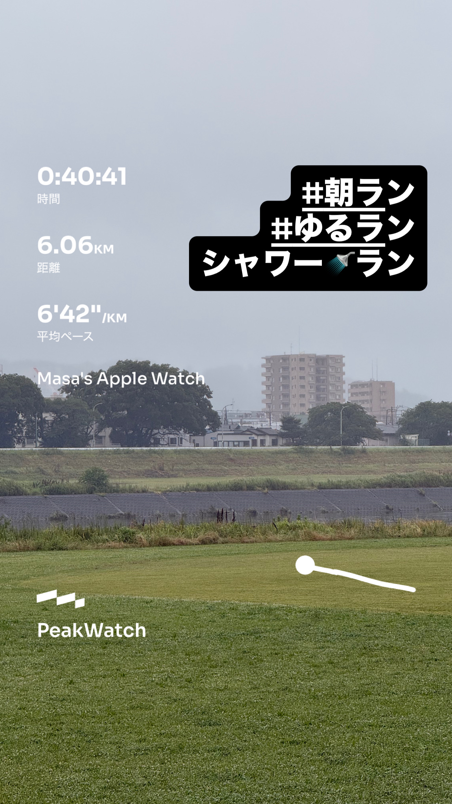
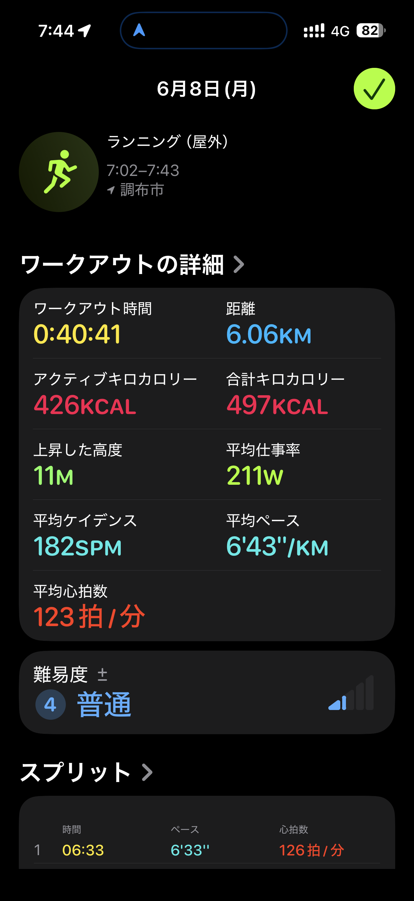
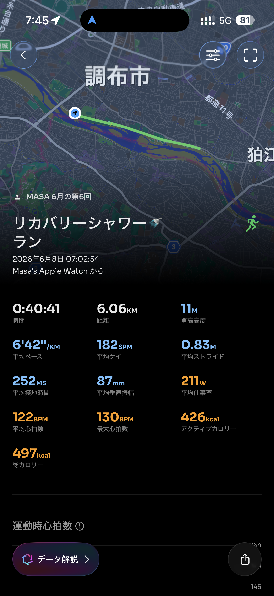

- 距離：6.06km
- 時間：0:40:41
- 平均ペース：平均6'43/km 最大5'01/km
- 平均心拍数：122拍/分
- 最大心拍数：130bpm
- 平均ケイデンス：182spm
- 平均ストライド：0.83m
- VO2Max：42.9（ワークアウトピーク：31.3）
- カロリー：アクティブ426/総計497kcal
- 使用シューズ：インフィニットプロ
- 時間帯：7時頃
- 天候：取得失敗
- コース：調布市
- 補給：
- 睡眠：6時間27分 スコア85
- 今日の目的：リカバリーシャワーラン
- RPE：5 中程度
- コメント：#朝ラン #ゆるラン シャワーラン
- 自分メモ：リカバリーシャワーラン
- 心拍ゾーン：ゾーン1 93%/ゾーン2 7%
- ペースゾーン：簡単97%/マラソン3%
- トレーニング負荷：TRIMPexp44/ATL6/CTL1
- 心拍回復：心拍回復にはゾーン4+のデータが必要です

## 📊 ラップデータ
- 1km(6'33/126bpm/86cm/178spm)
- 2km(6'37/124bpm/83cm/182spm)
- 3km(6'44/122bpm/81cm/182spm)
- 4km(6'55/122bpm/79cm/183spm)
- 5km(6'48/123bpm/80cm/183spm)
- 6km(6'35/124bpm/83cm/185spm)
- 7km(0'29/123bpm/80cm/168spm)

## 📝 コーチコメント
MASAさん、今回のリカバリーシャワーランお疲れ様でした。全体のデータを見ると、平均ペース6'43/km、平均心拍数122bpmと、リカバリー目的のランニングとしては非常に良い強度で実施できたと評価できます。RPE（主観的運動強度）も『5 中程度』とされており、身体への負担が少なく、疲労回復を促す効果が期待できます。心拍ゾーン分布もゾーン1が93%、ゾーン2が7%と、ほぼ有酸素運動に集中しており、心臓のポンプ機能向上や脂肪燃焼促進に貢献しているでしょう。トレーニングインパルス（TRIMPexp44、ATL6、CTL1）も、現在のフィットネスレベルを維持しつつ、疲労を蓄積させない理想的な数値を示しています。また、現在のVO2Maxが42.9と年齢層の男性グループの中では比較的高く、『非常に良好』の評価を得ている点も素晴らしいです。これはMASAさんのこれまでのトレーニングが着実に成果として表れている証拠と言えます。前日の睡眠データも『6時間27分、スコア85』と質が高く、ランニングパフォーマンスだけでなく、日々のコンディショニングにも気を配れていることが伺えます。リカバリーランの目的を達成しつつ、身体全体を整える素晴らしいセッションでした。次のトレーニングに向けて、この良いコンディションを維持していきましょう。

## 📸 写真一覧

