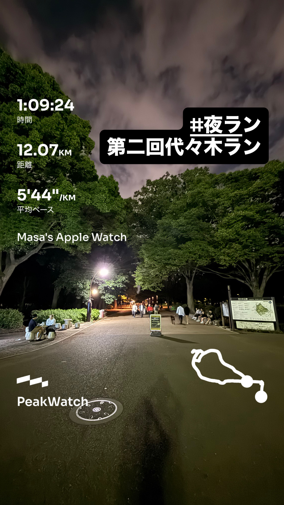
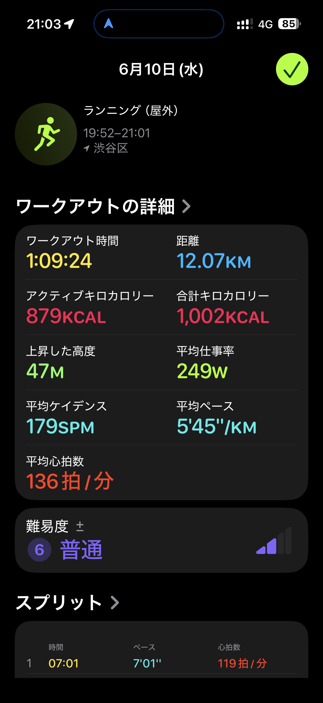
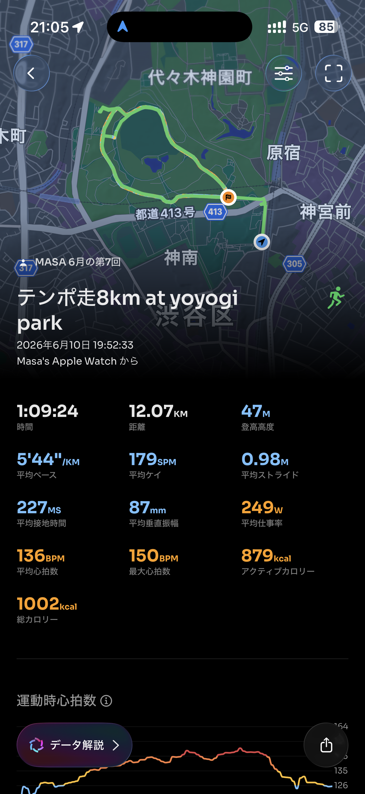

- 距離：12.07km
- 時間：1:09:24
- 平均ペース：平均5'44/km 最大4'14/km
- 平均心拍数：136拍/分
- 最大心拍数：150bpm
- 平均ケイデンス：179spm
- 平均ストライド：0.98m
- VO2Max：42.3（ワークアウトピーク：36.3）
- カロリー：アクティブ879/総計1002kcal
- 使用シューズ：スーパーノヴァ
- 時間帯：19時頃
- 天候：取得失敗
- コース：渋谷区
- 補給：
- 睡眠：睡眠時間 3時間54分/睡眠評価 71%/睡眠スコア 普通 64点
- 今日の目的：テンポ走8km at yoyogi park
- RPE：6 ややきつい
- コメント：#夜ラン 第二回代々木ホラン
- 自分メモ：2kmアップ、8kmテンポ走、2kmクールダウンやってみた
- 心拍ゾーン：ゾーン4 24%/ゾーン3 35%/ゾーン2 29%/ゾーン1 10%/ゾーン0 2%
- ペースゾーン：スプリント1%/繰り返し8%/インターバル18%/スレッショルド24%/マラソン6%/簡単43%
- トレーニング負荷：TRIMPexp134/ATL19/CTL3
- 心拍回復：心拍数変化の差 23BPM 優秀, 心拍数の回復2分 126→103BPM 優秀

## 📊 ラップデータ
- 1km(7'01/121bpm/88cm/174spm)
- 2km(6'13/127bpm/90cm/179spm)
- 3km(5'40/134bpm/98cm/181spm)
- 4km(5'20/139bpm/104cm/180spm)
- 5km(5'10/142bpm/106cm/183spm)
- 6km(5'10/143bpm/105cm/182spm)
- 7km(5'04/146bpm/109cm/181spm)
- 8km(5'17/144bpm/103cm/182spm)
- 9km(5'01/148bpm/108cm/183spm)
- 10km(5'12/147bpm/104cm/182spm)
- 11km(6'45/133bpm/86cm/175spm)
- 12km(6'59/128bpm/80cm/175spm)
- 13km(0'34/125bpm/81cm/169spm)

## 📝 コーチコメント
MASAさん、今回の「2kmアップ、8kmテンポ走、2kmクールダウン」という構成のワークアウト、大変素晴らしい内容でした！目標達成に向けて着実にステップを踏んでいますね。まず、全体のワークアウト時間1時間9分24秒で12.07kmを平均ペース5'44/kmで走り切ったことは、非常に良いスタミナとペース配分能力を示しています。特に、8kmのテンポ走パートでは、ペースゾーン分布で「スレッショルド」が24%を占め、しっかり強度を上げて走れていることが分かります。心拍ゾーンもゾーン3とゾーン4が合わせて59%と高く、心肺機能に適切な負荷をかけられた証拠です。8kmのテンポ走は、あなたのハーフマラソンPB1時間48分33秒（約5'09/km）やフルマラソンサブ4（約5'40/km）の目標に対して、非常に効果的なトレーニングとなります。ラップデータを見ると、テンポ走パート（概ね3km～10km）では5'40/kmから5'01/kmと安定したペースを刻めており、特に9km目の5'01/kmは素晴らしいです。平均心拍数136bpm、最大心拍数150bpmは、あなたの年齢や基礎体力から見ても適切な範囲で、効率的な心肺機能の活用ができています。平均ケイデンス179spm、平均ストライド0.98mというデータも、非常にバランスの取れた走り方を示しており、無駄の少ないフォームで走れていると推測されます。ワークアウトピークVO236.3、現在のVO2Max42.3という数値は、あなたの持久力を高める上で重要な指標であり、今回のトレーニングがピーク酸素摂取量の86%VO2maxでより高強度のゾーンに入っていたことは、パフォーマンス向上に大きく貢献するでしょう。心拍回復データも23BPM「優秀」と出ており、運動後の回復能力も非常に優れています。これはトレーニング効果を効率的に取り込む上で重要な要素です。睡眠データを見ると、前日の睡眠時間が3時間54分と短めだったため、睡眠スコアが「普通」の64点となっています。トレーニング効果を最大限に引き出すためには、良質な睡眠が不可欠です。目標レースに向けて、質の高いトレーニングを継続するためにも、平均睡眠時間をもう少し確保できるよう、就寝時刻を早めるなどの工夫を検討してみてください。RPE（主観的運動強度）が「6 ややきつい」というのは、今回のワークアウトの強度として妥当であり、感覚と実際のデータが一致していることの表れでもあります。今後のトレーニングでは、このテンポ走のペースを維持しつつ、少しずつ距離を伸ばしたり、ペースアップを試みたりすることで、さらに目標達成に近づけるでしょう。特に、横浜マラソンでのサブ4達成と情熱ハーフでの1時間45分切りという目標に向けて、今回のテンポ走のような閾値走は欠かせません。自信を持って次へと進んでいきましょう！

## 📸 写真一覧

