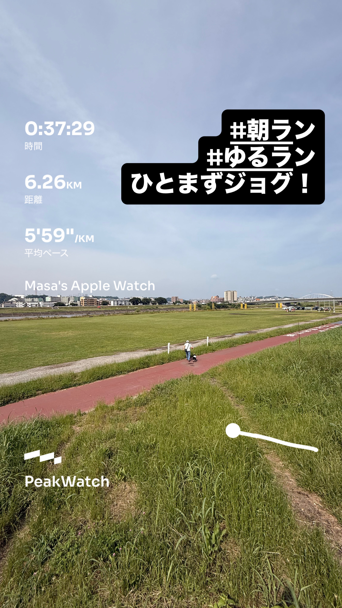
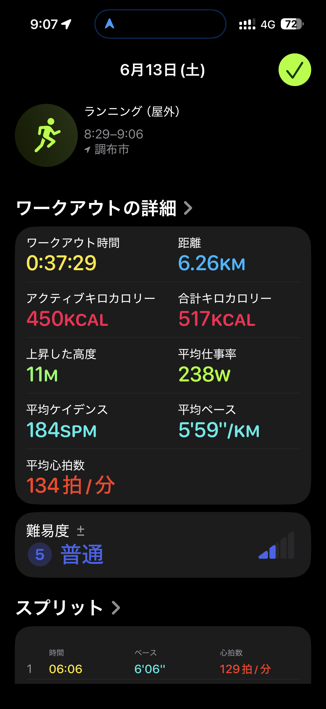
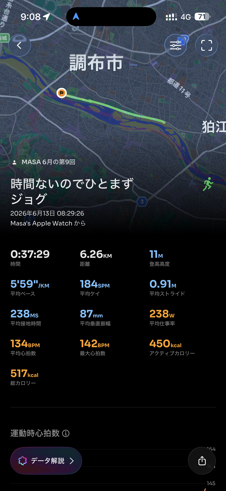

- 距離：6.26km
- 時間：0:37:29
- 平均ペース：平均5'59/km 最大4'41/km
- 平均心拍数：134拍/分
- 最大心拍数：142bpm
- 平均ケイデンス：184spm
- 平均ストライド：0.91m
- VO2Max：42.5（ワークアウトピーク：34.6）
- カロリー：アクティブ450/総計517kcal
- 使用シューズ：インフィニットプロ
- 時間帯：8時頃
- 天候：取得失敗
- コース：調布市
- 補給：
- 睡眠：8時間16分 スコア90
- 今日の目的：時間ないのでひとまずジョグ
- RPE：5 中程度
- コメント：#朝ラン #ゆるラン ひとまずジョグ！
- 自分メモ：時間なくひとまずジョグ！
- 心拍ゾーン：ゾーン2 62%/ゾーン3 36%/ゾーン1 2%
- ペースゾーン：簡単85%/マラソン9%/スレッシュホルド5%/インターバル1%
- トレーニング負荷：TRIMPexp62/ATL8/CTL1
- 心拍回復：心拍回復にはゾーン4+のデータが必要です

## 📊 ラップデータ
- 1km(6'06/129bpm/91cm/179spm)
- 2km(5'49/134bpm/92cm/184spm)
- 3km(5'57/134bpm/90cm/185spm)
- 4km(6'06/134bpm/88cm/185spm)
- 5km(5'58/136bpm/89cm/188spm)
- 6km(6'01/135bpm/90cm/184spm)
- 6-7km(5'56/140bpm/94cm/187spm)

## 📝 コーチコメント
MASAさん、お疲れ様です！今回は「時間なくひとまずジョグ！」とのことでしたが、非常に安定した良いジョグになりましたね。平均ペースは5'59/kmで、平均心拍数134bpm、平均ケイデンス184spm、平均ストライド0.91mと、各データがリラックスした状態でのランニングを示しています。心拍ゾーン分布もゾーン2が62%、ゾーン3が36%と、有酸素運動を効果的に行えている理想的な構成です。これは心肺機能の強化と脂肪燃焼促進に繋がり、目標達成に向けた基盤作りとして非常に重要です。また、RPE（主観的運動強度）が『5 中程度』であることから、身体への負担も適切だったと判断できます。VO2Maxも42.5と高いレベルを維持されており、素晴らしいです。睡眠データも8時間16分、スコア90と非常に良好で、日々の回復がしっかりできている証拠ですね。特に就寝時刻が普段より早かったとのこと、体が休息を求めていたのかもしれません。MASAさんの目標であるハーフマラソン1時間45分切り、フルマラソンサブ4達成のためには、このような質の高いジョグを継続することが不可欠です。時間がない中でも、短時間で効率的に体を動かす意識が感じられます。次回のランニングでは、可能であれば短い距離でペースを上げるインターバル走や、少し長めの距離で目標ペースを意識したペース走を織り交ぜることで、より目標達成に向けた具体的な刺激を入れていきましょう。特にハーフマラソンの目標ペースである5'00/km前後、フルマラソン目標ペースである5'40/km前後でのペース感覚を養う練習を取り入れると良いでしょう。日々の忙しさもあるかと思いますが、トレーニングの質を意識しつつ、怪我なく継続していきましょう。今後もMASAさんのデータを詳細に分析し、全力でサポートさせていただきます！

## 📸 写真一覧

