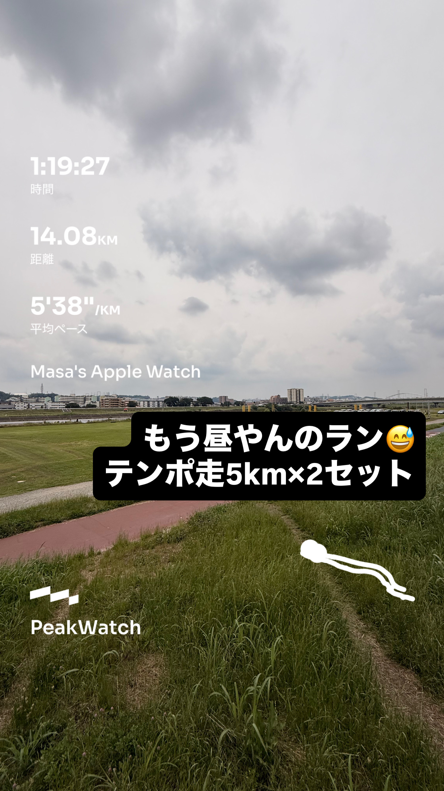
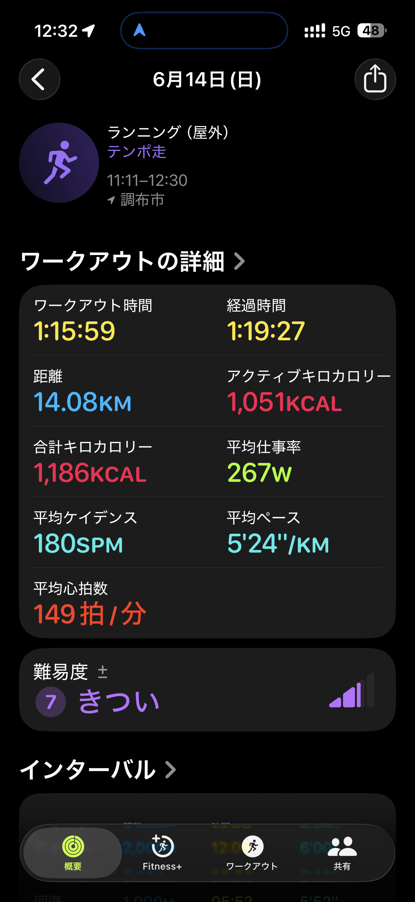
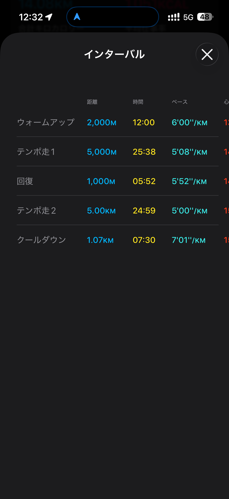

- 距離：14.08km
- 時間：1:19:27
- 平均ペース：平均5'38/km 最大3'14/km
- 平均心拍数：149拍/分
- 最大心拍数：167bpm
- 平均ケイデンス：181spm
- 平均ストライド：1.04m
- VO2Max：43.4（ワークアウトピーク：40.7）
- カロリー：アクティブ1051/総計1186kcal
- 使用シューズ：マジックスピード4
- 時間帯：11時頃
- 天候：取得失敗
- コース：調布市
- 補給：
- 睡眠：7時間41分, スコア84
- 今日の目的：ランニング(屋外) テンポ走
- RPE：6 ややきつい
- コメント：もう昼やんのラン もう屋やんのラン テンポ走5km×2セット
- 自分メモ：テンポ走5km×2セット！
蒸し暑くて死ぬ
- 心拍ゾーン：ゾーン5 33%/ゾーン4 38%/ゾーン3 13%/ゾーン2 12%/ゾーン1 3%/ゾーン0 1%
- ペースゾーン：プリント2%/繰り返し20%/インターバル28%/スレッショルド14%/簡単32%
- トレーニング負荷：TRIMPexp231/ATL33/CTL5
- 心拍回復：中程度 (心拍数変化の差13BPM, 2分間の回復147→134BPM)

## 📊 インターバルデータ
- ウォームアップ:2000m/12:00/6'00/km
- テンポ走1:5000m/25:38/5'08/km
- 回復:1000m/05:52/5'52/km
- テンポ走2:5.00km/24:59/5'00/km
- クールダウン:1.07km/07:30/7'01/km

## 📊 ラップデータ
- 1km(6'03/128bpm/98cm/174spm)
- 2km(5'52/135bpm/96cm/177spm)
- 3km(5'07/142bpm/106cm/183spm)
- 4km(5'08/148bpm/108cm/184spm)
- 5km(5'03/149bpm/109cm/183spm)
- 6km(5'05/152bpm/106cm/184spm)
- 7km(5'14/153bpm/108cm/178spm)
- 8km(5'56/143bpm/95cm/180spm)
- 9km(5'06/152bpm/106cm/182spm)
- 10km(5'02/152bpm/107cm/187spm)
- 11km(4'59/159bpm/107cm/186spm)
- 12km(4'59/162bpm/108cm/183spm)
- 13km(4'53/165bpm/112cm/183spm)
- 14km(6'39/156bpm/87cm/177spm)
- 15km(10'39/148bpm/90cm/144spm)

## 📝 コーチコメント
MASAさん、お疲れ様でした！「テンポ走5km×2セット、蒸し暑くて死ぬ」というコメントから、今回のワークアウトがいかにタフな環境で行われたかが伝わってきます。しかし、その状況下で目標とするテンポ走のペースを安定して刻み、かつ心拍数も適切にコントロールできている点は素晴らしいです。特に、テンポ走1の平均ペース5'08/km、テンポ走2の平均ペース5'00/kmと、2セット目でペースアップできているのは、暑さにも関わらず高い集中力とスタミナを維持できた証拠です。

詳細データを見ていきましょう。ワークアウト時間1時間19分27秒で14.08km、平均ペース5'38/kmは、ハーフマラソンPB1時間48分33秒（平均4'39/km）やフルマラソン目標サブ4（平均5'41/km）を考えると、非常に効果的なトレーニングになったと言えるでしょう。平均心拍数149拍/分、最大心拍数167bpmは、暑さも考慮すると適切な強度だったと判断できます。心拍ゾーン分布では、ゾーン4とゾーン5で合計71%と高い割合を占めており、まさに「高強度有酸素運動」として心肺機能に良い刺激を与えられました。

ケイデンスも平均181spmと非常に高く、ストライドも平均1.04mとバランスが取れています。これにより、効率的なフォームで走れていることが伺えます。VO2Maxも43.4と「非常に良好」な範囲にあり、現在の高いフィットネスレベルを物語っています。ワークアウトピークVO2が40.7と、普段のVO2Maxに近い値が出ていることは、今回のトレーニング負荷が非常に高かったことを示唆しています。

TRIMPexp231、ATL33、CTL5という数値から、今回のワークアウトが身体に与えたトレーニング負荷がかなり大きかったことが分かります。特にTRIMPexpの高さは、高強度のトレーニングであったことを示しています。RPEも「6 ややきつい」とのことですが、これだけの負荷をかけた中で、「ややきつい」と感じているのは、MASAさんの基礎体力とリカバリー能力が高い証拠でもあります。心拍回復データも「中程度」であり、ハードなワークアウト後にもかかわらず、心臓が適切に回復していることが確認できます。

睡眠データも7時間41分、スコア84と良好で、就寝時刻も早まったとのこと。疲労回復のためには非常に重要な要素ですので、この良い習慣を継続してください。

MASAさんの目標レースである2026/09/22情熱ハーフマラソン（目標1時間45分切り）と2026/10/25横浜マラソン（目標サブ4）に向けて、今回のテンポ走は非常に質の高いトレーニングとなりました。蒸し暑い中でのこのパフォーマンスは、本番での厳しい状況にも対応できる自信につながるはずです。

今後のアドバイスとしては、これだけ高強度のトレーニングを継続していく中で、オーバートレーニングに陥らないよう、リカバリーをさらに重視することです。特に今回のATL33という数値は、一時的に疲労が蓄積されていることを示唆していますので、翌日以降は軽めのジョグや完全休養日を設け、身体をしっかり休ませましょう。また、暑い時期のトレーニングでは、水分補給と電解質補給を徹底し、熱中症対策を怠らないでください。次のトレーニングも楽しみにしています！

## 📸 写真一覧

