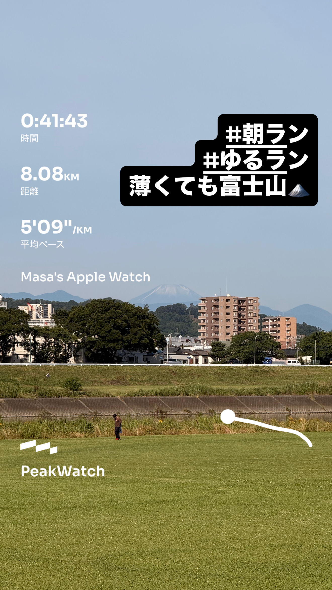
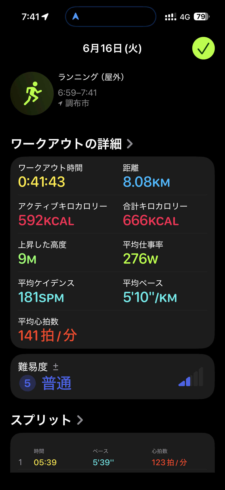
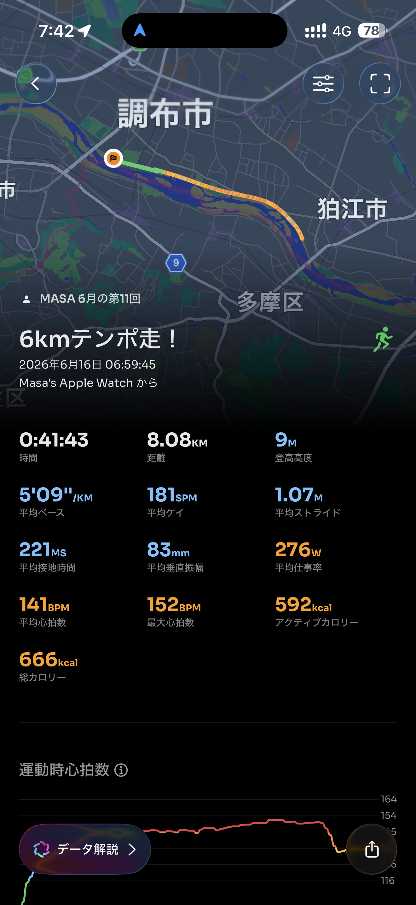

- 距離：8.08km
- 時間：0:41:43
- 平均ペース：平均5'10/km 最大3'48/km
- 平均心拍数：141拍/分
- 最大心拍数：152bpm
- 平均ケイデンス：181spm
- 平均ストライド：1.07m
- VO2Max：43.4（ワークアウトピーク：37.2）
- カロリー：アクティブ592/総計666kcal
- 使用シューズ：マジックスピード4
- 時間帯：6時頃
- 天候：6時頃 晴れ 気温16.5℃ 風速1.5m/s
- コース：調布市
- 補給：
- 睡眠：4時間45分 睡眠の評価90%/睡眠スコア74点(普通)
- 今日の目的：6kmテンポ走！
- RPE：5 中程度
- コメント：#朝ラン #ゆるラン 薄くても富士山
- 自分メモ：6kmテンポ走！前後1kmはアップとクールダウンね
- 心拍ゾーン：ゾーン4 51%/ゾーン3 27%/ゾーン2 16%/ゾーン1 2%/ゾーン0 3%
- ペースゾーン：スプリント4%/繰り返し39%/インターバル25%/スレッシュホルド9%/マラソン4%/簡単19%
- トレーニング負荷：TRIMPexp95/ATL13/CTL2
- 心拍回復：心拍変化の差 7BPM(悪い)/心拍数の回復2分 139→132BPM

## 📊 ラップデータ
- 1km(5'39/123bpm/102cm/172spm)
- 2km(4'50/141bpm/113cm/181spm)
- 3km(4'46/144bpm/113cm/187spm)
- 4km(4'49/146bpm/112cm/184spm)
- 5km(4'57/147bpm/111cm/183spm)
- 6km(4'50/150bpm/112cm/185spm)
- 7km(4'56/151bpm/109cm/183spm)
- 8km(6'21/138bpm/100cm/177spm)
- 9km(0'32/136bpm/89cm/163spm)

## 📝 コーチコメント
MASAさん、お疲れ様でした！今回の『6kmテンポ走』は、ワークアウト名通り6kmを目標ペースで走り切る意図があったと推察します。全体を振り返ると、ラップデータから1km〜7kmまでを平均4'50/km前後のペースで維持できており、特に6km時点では目標のテンポ走ペースを達成できています。平均心拍数141bpm、最大心拍数152bpmは、あなたのハーフマラソンPBやフルマラソン目標から見ても、テンポ走としての適切な強度であったと言えるでしょう。平均ストライド1.07m、平均ケイデンス181spmは、非常に効率の良いランニングフォームを示しています。VO2Maxも43.4と「良好」レベルを維持しており、心肺機能は高い水準にあります。

ただし、心拍回復が「悪い」と評価されている点、そして睡眠時間が4時間45分と短めであった点は懸念事項です。特に翌日のリカバリーに影響が出る可能性がありますので、睡眠時間の確保を意識してください。リカバリーが不十分だと、トレーニングの質が低下したり、怪我のリスクが高まったりすることもあります。

今後のトレーニングに向けて、6kmのテンポ走は概ね良好でしたが、レース後半の持続力をさらに向上させるためにも、テンポ走の距離を徐々に伸ばしていくか、インターバル走でより高いペースでの耐性を高めることを検討しましょう。例えば、4'50/kmペースでの5km〜8kmのテンポ走を目標にしたり、短めのインターバルで4'30/km台のペースを維持する練習も有効です。

横浜マラソンでのサブ4、そして情熱ハーフマラソンでの1時間45分切りという目標達成に向けて、現在の心肺機能とランニングエコノミーは良い土台となっています。あとは、これらの要素をレース後半まで維持できる持久力と、疲労回復をしっかりと行うことが重要になります。特に疲労が溜まっていると感じる日や、睡眠が不足している日は、無理せず休息を取り入れる勇気も大切です。次回のトレーニングも楽しみにしています！

## 📸 写真一覧

