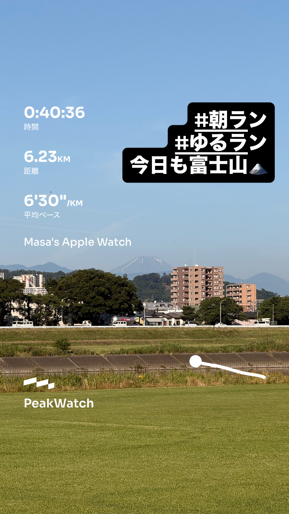
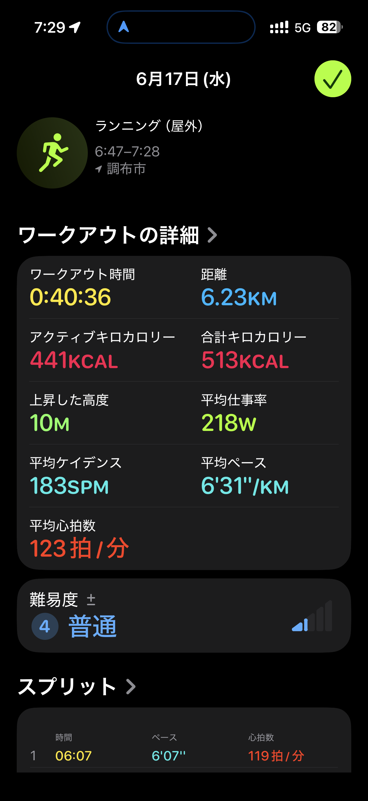
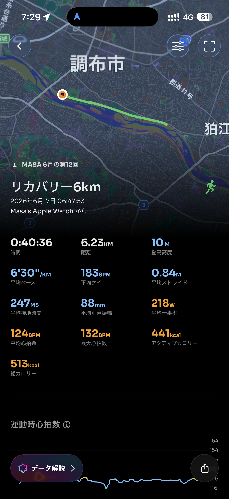

- 距離：6.23km
- 時間：0:40:36
- 平均ペース：平均6'31/km 最大4'35/km
- 平均心拍数：124拍/分
- 最大心拍数：132bpm
- 平均ケイデンス：183spm
- 平均ストライド：0.84m
- VO2Max：44.1（ワークアウトピーク：33.5）
- カロリー：アクティブ441/総計513kcal
- 使用シューズ：インフィニットプロ
- 時間帯：6時頃
- 天候：6時頃 晴れ 気温18.2℃ 風速2.2m/s
- コース：調布市
- 補給：
- 睡眠：5時間33分(評価:94%)/睡眠スコア普通74点
- 今日の目的：リカバリー6km
- RPE：5 中程度
- コメント：#朝ラン #ゆるラン 今日も富士山
- 自分メモ：低心拍リカバリー！
- 心拍ゾーン：ゾーン1 73%/ゾーン2 21%/ゾーン3 0%/ゾーン4 0%/ゾーン5 0%
- ペースゾーン：簡単98%/マラソン1%/スレッシュホールド1%
- トレーニング負荷：TRIMPexp50/ATL7/CTL1
- 心拍回復：心拍回復にはゾーン4+のデータが必要です

## 📊 ラップデータ
- 1km(6'07/124bpm/91cm/179spm)
- 2km(6'09/126bpm/89cm/181spm)
- 3km(6'23/124bpm/84cm/185spm)
- 4km(6'46/123bpm/80cm/184spm)
- 5km(6'45/124bpm/80cm/186spm)
- 6km(6'45/124bpm/81cm/184spm)
- 6-7平均(6'47/125bpm/82cm/183spm)

## 📝 コーチコメント
MASAさん、お疲れ様でした！今朝は「リカバリー6km」ということで、見事に低心拍でのリカバリーランを実行できていますね。平均心拍数が124bpmで、心拍ゾーンのほとんどがゾーン1とゾーン2に集中していることから、身体への負担が非常に少ない質の高いリカバリーになったことが分かります。特に、MASAさんからの「低心拍リカバリー！」というコメントの通り、目標を達成できています。これは、疲労回復を促進し、今後のトレーニングに向けて身体をリセットする上で非常に重要なことです。平均ペースは6'31/kmと穏やかで、平均ケイデンス183spmと高い水準を維持できています。疲労回復を目的としたランでも、ケイデンスを高く保つことは、脚への負担を減らしながら効率的なフォームを維持する上でとても良い傾向です。ただし、平均ストライドが0.84mとやや短めなので、もう少しだけストライドを伸ばす意識を持てると、今後さらに効率的な走りに繋がる可能性があります。今回のランで、TRIMPexp50とトレーニングの焦点が有酸素運動に94%集中している点も素晴らしいです。これは心肺機能の強化と脂肪燃焼効果が期待できるトレーニングであり、MASAさんのハーフマラソン1時間45分切り、フルマラソンサブ4という目標達成に向けて、基礎的な体力を着実に積み上げている証拠と言えるでしょう。唯一の改善点として、心拍回復のデータを得るにはゾーン4+での運動が必要というコメントがありました。リカバリーランの目的から考えるとゾーン4+まで上げる必要はありませんが、たまにインターバル走などの高強度トレーニングを取り入れて、最大心拍数に近いデータも取得できると、より正確な心拍回復データが得られ、トレーニング効果の評価がさらに詳細になります。来月の情熱ハーフマラソン、そして横浜マラソンに向けて、この低心拍でのリカバリーランを継続しつつ、週に1〜2回は目標ペース走やインターバル走を取り入れて、スピードと持久力の両面をバランス良く鍛えていきましょう。睡眠スコアが「普通」で74点とのことでしたが、平均睡眠時間が目標レースに近づくにつれてより重要になりますので、今後は睡眠の質と時間も意識的に改善していけると良いですね。素晴らしい努力を続けているMASAさんなら、必ず目標を達成できると信じています！

## 📸 写真一覧

