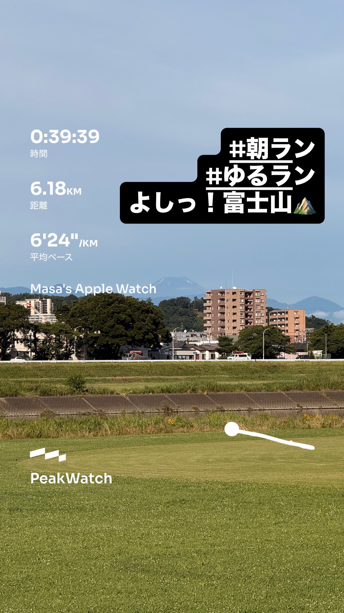
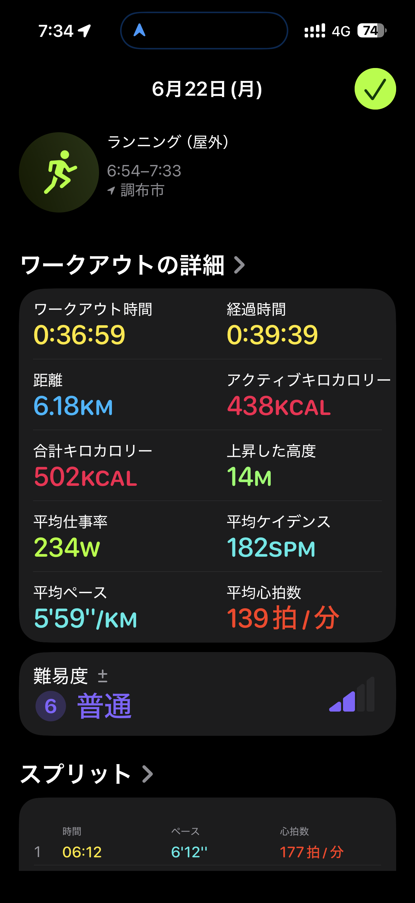
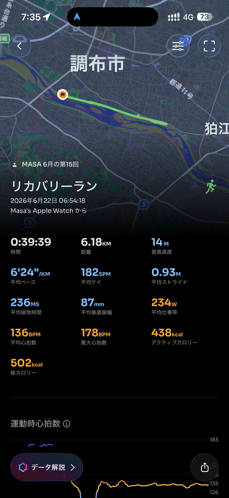

- 距離：6.18km
- 時間：0:39:39
- 平均ペース：平均6'24/km 最大4'13/km
- 平均心拍数：136拍/分
- 最大心拍数：178bpm
- 平均ケイデンス：182spm
- 平均ストライド：0.93m
- VO2Max：46.1（ワークアウトピーク：45.3）
- カロリー：アクティブ438/総計502kcal
- 使用シューズ：インフィニットプロ
- 時間帯：6時頃
- 天候：6時頃 快晴 気温20.6℃ 風速2.7m/s
- コース：調布市
- 補給：
- 睡眠：5時間6分/79点 普通
- 今日の目的：リカバリーラン
- RPE：5 中程度
- コメント：#朝ラン #ゆるラン よしっ！富士山
- 自分メモ：リカバリーになったかな？のラン
- 心拍ゾーン：ゾーン5 21%/ゾーン4 1%/ゾーン3 13%/ゾーン2 57%/ゾーン1 2%/ゾーン0 7%
- ペースゾーン：スプリント0%/繰り返し0%/インターバル1%/スレッショルド6%/マラソン10%/簡単83%
- トレーニング負荷：TRIMPexp80/ATL11/CTL1
- 心拍回復：心拍数変化の差 16BPM (良い) / 心拍数の回復2分 133→117BPM

## 📊 ラップデータ
- 1km(6'12/177bpm/93cm/177spm)
- 2km(5'46/170bpm/94cm/182spm)
- 3km(5'57/131bpm/94cm/182spm)
- 4km(5'59/134bpm/92cm/182spm)
- 5km(5'55/134bpm/91cm/185spm)
- 1-5平均(5'58/149bpm/93cm/182spm)
- 6km(6'00/134bpm/91cm/184spm)
- 7km(1'09/134bpm/92cm/180spm)
- 6-7平均(6'05/134bpm/91cm/182spm)

## 📝 コーチコメント
MASAさん、今回の「リカバリーラン」お疲れ様でした！「リカバリーになったかな？」とのことですが、データを見る限り、全体的にはリカバリーの目的に沿った良いランニングだったと言えるでしょう。

まず、ワークアウトの平均ペースは6'24/km、平均心拍数は136拍/分と、比較的抑えられた強度で走れています。心拍ゾーン分布を見ると、ゾーン2（有酸素運動ゾーン）が57%と大半を占めており、低〜中強度の有酸素運動が中心だったことが伺えます。これはリカバリーランとして非常に理想的なバランスです。体への負担を抑えつつ、血流を促進し、疲労回復を助ける効果が期待できます。

ただし、心拍ゾーンの「ゾーン5が21%」「ゾーン4が1%」という点が気になります。短時間ではありますが、最大心拍数178bpmまで上がっており、一時的にかなり高い強度に達している部分がありますね。ラップデータを見ると、最初の2kmで心拍数が177bpm、170bpmと高めになっています。ウォームアップの段階で少しペースが速かったのかもしれません。リカバリーランの目的を考えると、もう少しゆったりとした入りを意識しても良いかもしれません。特に疲労が蓄積している場合は、このゾーン5の刺激も疲労につながる可能性があります。

平均ケイデンス182spm、平均ストライド0.93mは、効率の良いランニングフォームを示唆しています。ケイデンスが高いと地面からの衝撃が分散され、体への負担が軽減されます。これはリカバリーランにおいても重要な要素です。TRIMPexp80、ATL11、CTL1というトレーニングインパルスは、今回のランニングが体に与えた負荷を客観的に示しています。ATLが着実に積み上がってきていますので、疲労の管理も引き続き意識していきましょう。

RPEは「5 中程度」とのこと。ご自身の体感とデータが概ね一致しているのは素晴らしいですね。心拍回復データも「良い」という評価であり、心肺機能の回復能力は良好です。

睡眠については、5時間6分でスコア79点「普通」とのこと。平均就寝時刻を17分過ぎたとのことですので、可能であればもう少し早く、そして長く睡眠時間を確保できると、リカバリー効果はさらに高まります。特に、疲労回復には十分な睡眠が不可欠です。

Masaさんの今後の目標であるハーフ1時間45分切り、フルサブ4達成に向けては、このリカバリーランのような低強度での走り込みが非常に重要になります。今後は、ウォームアップをよりゆっくり入ることを意識し、ゾーン5のような高強度ゾーンは極力避けて、心拍数をゾーン2中心に保つことを目標にしてみましょう。また、心拍ゾーン3が13%ありますが、これもリカバリーランではもう少し抑えめ（10%以下）にできると、より効果的なリカバリーにつながります。

今回は富士山も綺麗に見えて、心身ともにリフレッシュできたことと思います。この調子で、体と相談しながらトレーニングを継続していきましょう！

## 📸 写真一覧

