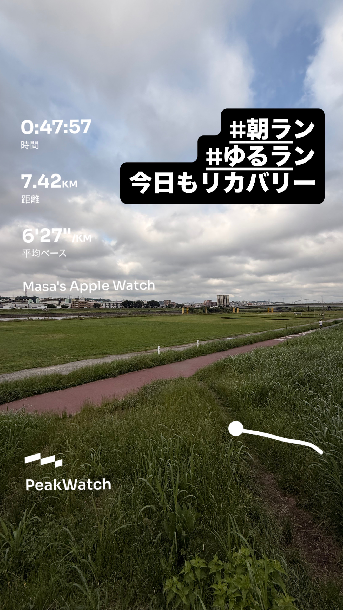
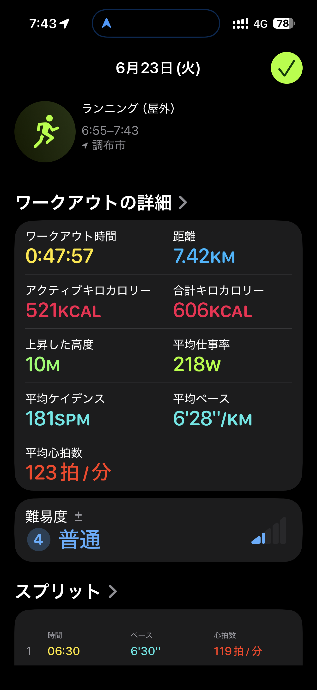
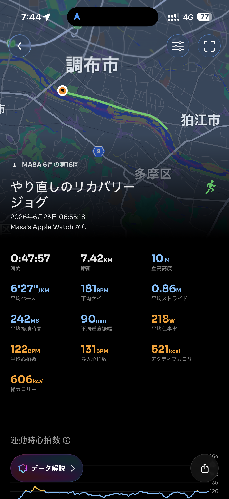

- 距離：7.42km
- 時間：0:47:57
- 平均ペース：平均6'27/km 最大4'21/km
- 平均心拍数：122拍/分
- 最大心拍数：131bpm
- 平均ケイデンス：181spm
- 平均ストライド：0.86m
- VO2Max：46.1（ワークアウトピーク：33.4）
- カロリー：アクティブ521/総計606kcal
- 使用シューズ：スーパーノヴァ
- 時間帯：6時頃
- 天候：6時頃 晴れ 気温18.4℃ 風速2.7m/s
- コース：調布市
- 補給：
- 睡眠：4時間50分/睡眠評価91%、睡眠スコア73点
- 今日の目的：やり直しのリカバリージョグ
- RPE：5 中程度
- コメント：#朝ラン #ゆるラン 今日もリカバリー
- 自分メモ：リカバリージョグやり直したよ！
- 心拍ゾーン：ゾーン1 80%/ゾーン2 16%
- ペースゾーン：簡単99%/スレッシュホールド1%
- トレーニング負荷：TRIMPexp59/ATL8/CTL1
- 心拍回復：心拍回復にはゾーン4+のデータが必要です

## 📊 ラップデータ
- 1km(6'30/119bpm/88cm/176spm)
- 2km(6'14/126bpm/90cm/180spm)
- 3km(6'16/124bpm/87cm/182spm)
- 4km(6'32/122bpm/83cm/183spm)
- 5km(6'34/123bpm/83cm/184spm)
- 6km(6'37/123bpm/82cm/182spm)
- 7km(6'28/123bpm/84cm/183spm)
- 8km(2'43/125bpm/87cm/182spm)

## 📝 コーチコメント
MASAさん、リカバリージョグお疲れ様でした！『やり直したよ！』というコメントとデータから、意識的にペースを落とし、心拍数を抑えたランニングを心がけたことがよく分かります。平均ペース6'27/km、平均心拍数122拍/分（最大131bpm）という数値は、リカバリーとしては非常に適切で、心拍ゾーンもほとんどがゾーン1（80%）とゾーン2（16%）に収まっており、身体への負担を最小限に抑えながら血行促進と疲労回復を図れた良いワークアウトだったと言えます。特に、ペースゾーンの「簡単99%」が示すように、まさに身体を休めることに集中できた理想的なリカバリーランだったと思います。また、平均ケイデンス181spmと平均ストライド0.86mは、無理なく脚を回転させながら効率よく進めている証拠です。RPEも『5 中程度』と、主観的にも心地よい運動強度だったようですね。トレーニングインパルス（TRIMPexp59/ATL8/CTL1）の数値は、今回のワークアウトが体への急激な負荷ではなく、現在のフィットネスレベルを維持・向上させるための積み重ねとして機能していることを示しています。VO2Maxも46.1と高い水準を維持できており、有酸素能力は良好です。ただし、睡眠データを見ると、合計睡眠時間4時間50分とやや短めであり、睡眠スコアも73点『普通』と出ているのが気になります。リカバリーの質をさらに高めるためには、十分な睡眠時間の確保が非常に重要です。特に次の目標レースである情熱ハーフマラソンでの1時間45分切り、横浜マラソンでのサブ4達成に向けては、トレーニングと合わせてリカバリー、特に睡眠の質を向上させることがパフォーマンス向上に直結します。可能な範囲で就寝時間を早める、睡眠環境を整えるなど、工夫を凝らしてみてください。今回のリカバリージョグは完璧でしたので、この調子で疲労を溜めずに、次のポイント練習に向けて身体を整えていきましょう！

## 📸 写真一覧

