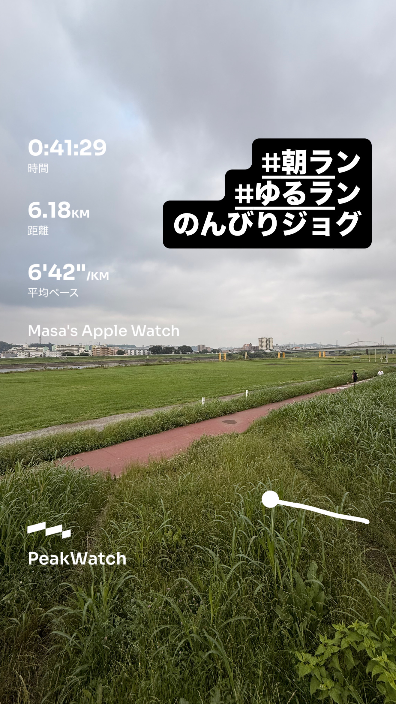
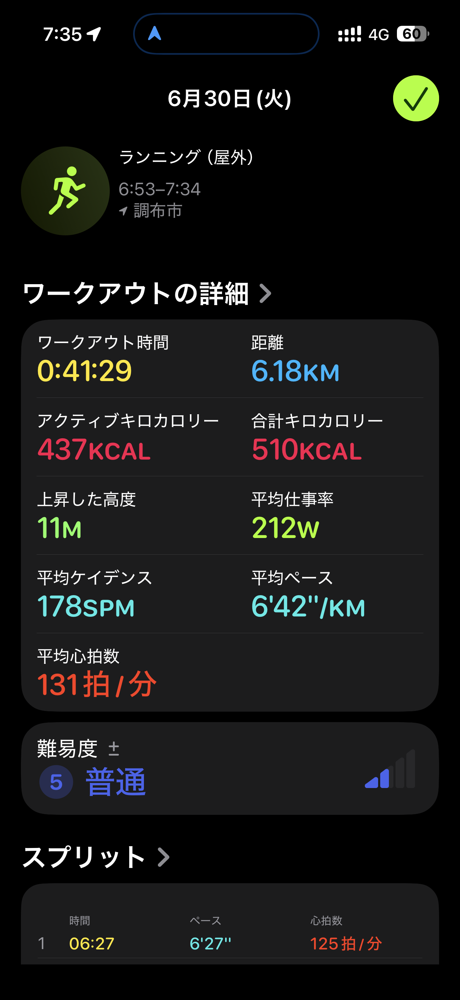
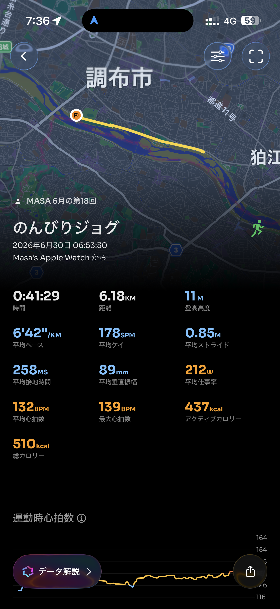

- 距離：6.18km
- 時間：0:41:29
- 平均ペース：平均6'42/km 最大4'47/km
- 平均心拍数：131拍/分
- 最大心拍数：139bpm
- 平均ケイデンス：178spm
- 平均ストライド：0.85m
- VO2Max：45.5（ワークアウトピーク：35.6）
- カロリー：アクティブ437/総計510kcal
- 使用シューズ：スーパーノヴァ
- 時間帯：7時頃
- 天候：7時頃 曇り 気温21.6℃ 風速1.8m/s
- コース：調布市
- 補給：
- 睡眠：2時間52分 睡眠スコア53
- 今日の目的：のんびりジョグ
- RPE：5 中程度
- コメント：#朝ラン #ゆるラン のんびりジョグ
- 自分メモ：低心拍でのんびりジョグ
- 心拍ゾーン：ゾーン3 15%/ゾーン2 79%/ゾーン1 3.3%

- トレーニング負荷：TRIMPexp68/ATL9/CTL1
- 心拍回復：心拍回復にはゾーン4+のデータが必要です

## 📊 ラップデータ
- 1km(6'27/130bpm/91cm/175spm)
- 2km(6'13/136bpm/92cm/179spm)
- 3km(6'56/129bpm/80cm/176spm)
- 4km(6'59/131bpm/80cm/178spm)
- 5km(6'54/132bpm/80cm/179spm)
- 6km(6'41/135bpm/84cm/177spm)
- 6.18km(6'49/135bpm/84cm/177spm)

## 📝 コーチコメント
MASAさん、いつもお疲れ様です！今回は「低心拍でのんびりジョグ」を意識されたとのこと、素晴らしいアプローチですね。PeakWatchのデータからも、平均心拍数が131bpmとゾーン2が79%を占めており、まさに理想的な有酸素運動のトレーニングになっています。このペースは、今後のハーフマラソンやフルマラソンでの目標達成に向けた土台作りに非常に重要です。有酸素能力の向上は、レース終盤での粘り強さやリカバリー能力を高めることに直結します。今回のRPEが「5 中程度」とのことですが、データから見ても無理のない範囲での運動だったことが伺えます。ワークアウトピークVO2が35.6、現在のVO2Maxが45.5とあり、この低強度トレーニングでも十分に心肺機能への刺激が与えられています。

ただ、いくつか改善点もあります。まず、睡眠データを見ると、合計睡眠時間が2時間52分と非常に短く、睡眠スコアも53と低い状態です。目標レースに向けてトレーニング強度を上げていく中で、リカバリーはパフォーマンス向上に不可欠です。適切な睡眠時間の確保と質の向上に努めましょう。就寝時刻の安定や、睡眠環境の整備なども効果的です。また、心拍回復データが「ゾーン4+のデータが必要」と表示されているため、今後はポイント練習やスピード練習でゾーン4以上の負荷をかけるトレーニングも取り入れ、心拍回復能力の評価もできるようにしていきましょう。現在のVO2Maxは45.5と年齢層の男性グループの中では比較的高いレベルにあり、さらに改善の余地があるとのこと。今後は、有酸素能力をさらに高めるために、週に1〜2回はインターバル走やテンポ走のような高強度のトレーニングを計画に組み込むことをお勧めします。例えば、ハーフマラソン1時間45分切りを目指す上では、レースペース（約4'59/km）よりも速いペースでの負荷も必要になります。横浜マラソンサブ4達成のためにも、ペース走なども取り入れ、レースペース感覚を養うことが重要です。

これまでのレース実績から見ても、MASAさんは着実にパフォーマンスを上げてきています。特に東日本国際親善マラソンでのハーフPB更新は素晴らしいです。次の情熱ハーフマラソンでの1時間45分切り、横浜マラソンでのサブ4達成に向けて、低心拍ジョグで築いた有酸素の土台の上に、徐々にスピードと持久力を高めるトレーニングを積み重ねていきましょう。睡眠の改善は最優先事項として意識してください。継続的な努力が目標達成に繋がることを信じています！

## 📸 写真一覧

