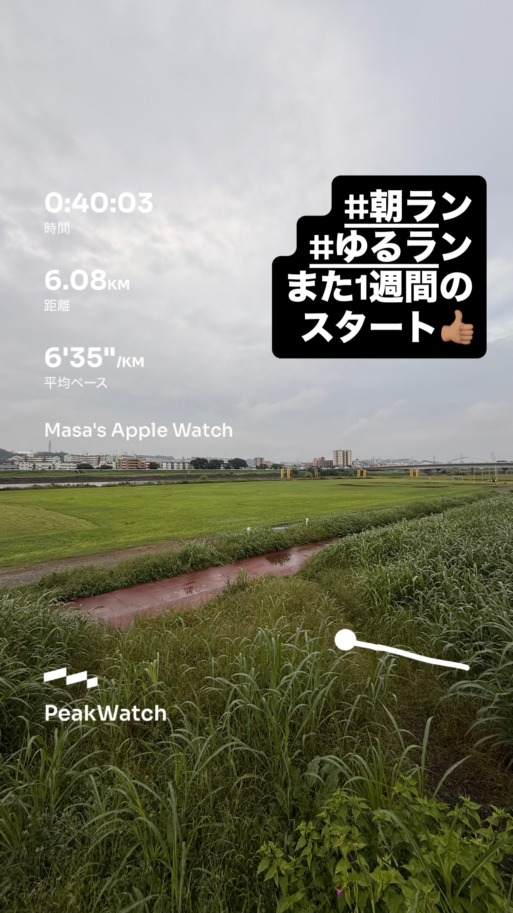
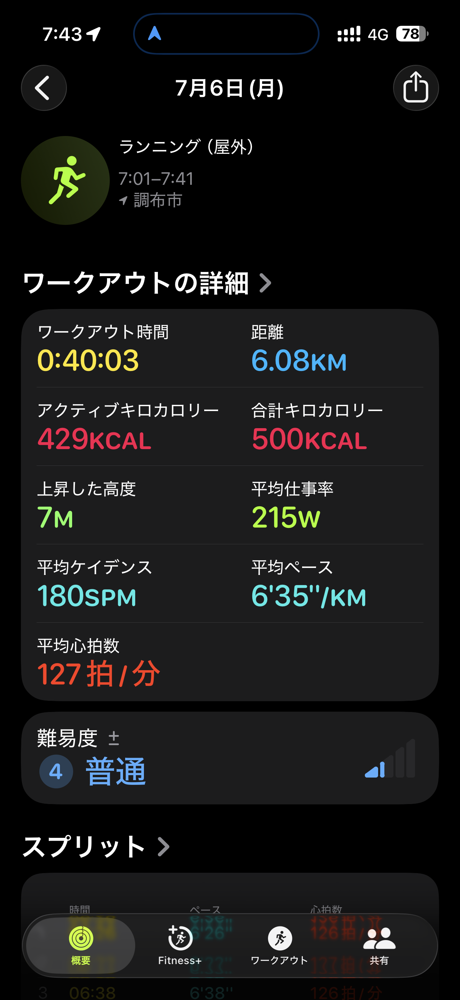
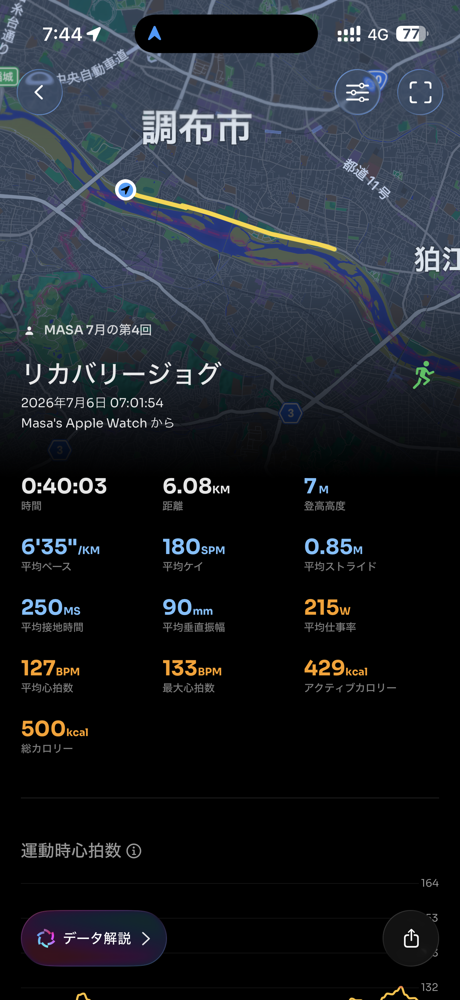

- 距離：6.08km
- 時間：0:40:03
- 平均ペース：平均6'35/km 最大4'49/km
- 平均心拍数：127拍/分
- 最大心拍数：133bpm
- 平均ケイデンス：180spm
- 平均ストライド：0.85m
- VO2Max：45.0（ワークアウトピーク：33.6）
- カロリー：アクティブ429/総計500kcal
- 使用シューズ：インフィニットプロ
- 時間帯：7時頃
- 天候：7時頃 曇り 気温20.9℃ 風速2.9m/s
- コース：調布市
- 補給：
- 睡眠：5時間26分 81点
- 今日の目的：リカバリージョグ
- RPE：5 中程度
- コメント：#朝ラン #ゆるラン また1週間のスタート
- 自分メモ：よし！リカバリージョグから始める月曜日！
- 心拍ゾーン：ゾーン1 1.1%/ゾーン2 99%/ゾーン3 0%/ゾーン4 0%/ゾーン5 0%

- トレーニング負荷：TRIMPexp54/ATL7/CTL1
- 心拍回復：心拍回復にはゾーン4+のデータが必要です

## 📊 ラップデータ
- 1km(6'26/127bpm/88cm/177spm)
- 2km(6'22/127bpm/86cm/180spm)
- 3km(6'38/126bpm/83cm/181spm)
- 4km(6'44/126bpm/82cm/181spm)
- 5km(6'42/128bpm/82cm/182spm)
- 6km(6'34/129bpm/84cm/181spm)
- 7km(7'41/129bpm/79cm/170spm)

## 📝 コーチコメント
MASAさん、月曜日のリカバリージョグお疲れ様でした！『よし！リカバリージョグから始める月曜日！』というコメントの通り、非常に良い内容でしたね。トータル6.08kmを40分03秒、平均ペース6'35/kmという、まさにリカバリーに最適な強度で走りきることができました。心拍数も平均127bpm、最大133bpmと、ほとんどが心拍ゾーン2で推移しており、有酸素運動に集中できたことを示しています。これは、心臓のポンプ能力向上と脂肪燃焼促進に効果的で、怪我のリスクを抑えつつ身体の回復を促す理想的なアプローチです。ケイデンス180spm、ストライド0.85mも安定しており、ランニングフォームも効率的です。RPEも『5 中程度』と主観的にも無理のない強度だったことが分かります。トレーニング負荷もTRIMPexp54、ATL7、CTL1と、まだ新しい週の始まりに過度な負担をかけない、非常にバランスの取れた数値です。前日の睡眠スコアが81点と高く、質の良い休息が取れていることも素晴らしいですね。ワークアウトピークVO2が33.6に対して、現在のVO2 Maxが45.0と非常に高い値を維持できています。これは、トレーニングの成果が着実に現れている証拠です。心拍回復データについては、今回はゾーン4以上の負荷がなかったため測定できませんでしたが、リカバリージョグの目的からすれば問題ありません。目標とするハーフマラソン1時間45分切り、フルマラソンサブ4に向けて、現在のトレーニングが順調に進んでいることを示しています。この調子で、無理なく継続していきましょう！

## 📸 写真一覧

