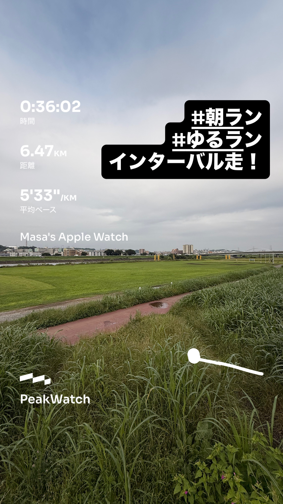
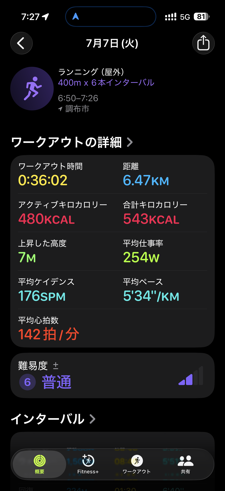
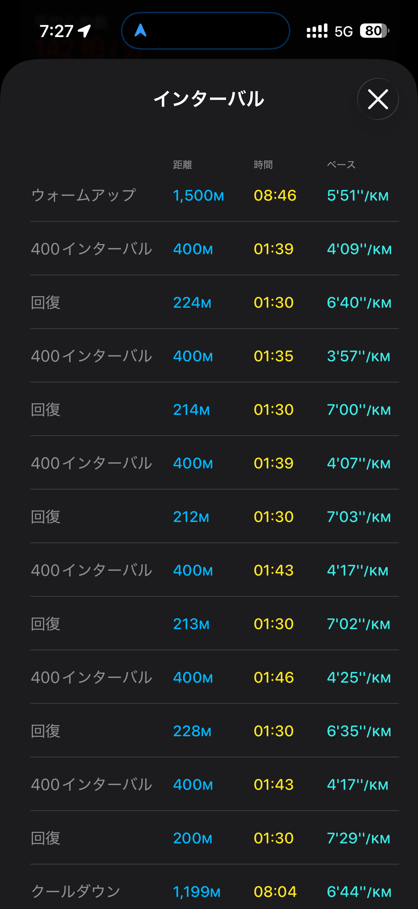

- 距離：6.47km
- 時間：0:36:02
- 平均ペース：平均5'33/km 最大3'18/km
- 平均心拍数：142拍/分
- 最大心拍数：167BPM
- 平均ケイデンス：176SPM
- 平均ストライド：1.02m
- VO2Max：45.3（ワークアウトピーク：42.1）
- カロリー：アクティブ480/総計543kcal
- 使用シューズ：マジックスピード4
- 時間帯：6時頃
- 天候：6時頃 曇り 気温19.8℃ 風速4.8m/s
- コース：調布市
- 補給：
- 睡眠：5時間37分 スコア普通(77点)
- 今日の目的：400m x 6本インターバル
- RPE：5 中程度
- コメント：#朝ラン #ゆるラン インターバル走！
- 自分メモ：スピ練はやっぱり楽しい！
- 心拍ゾーン：ゾーン5 24%/ゾーン4 19%/ゾーン3 43%/ゾーン2 10%/ゾーン1 1%/ゾーン0 3%

- トレーニング負荷：TRIMPexp89/ATL12/CTL2
- 心拍回復：優秀(20BPM)

## 📊 インターバルデータ
- ウォームアップ:1500M/08:46/5'51/km
- 400インターバル:400M/01:39/4'09/km
- 回復:224M/01:30/6'40/km
- 400インターバル:400M/01:35/3'57/km
- 回復:214M/01:30/7'00/km
- 400インターバル:400M/01:39/4'07/km
- 回復:212M/01:30/7'03/km
- 400インターバル:400M/01:43/4'17/km
- 回復:213M/01:30/7'02/km
- 400インターバル:400M/01:46/4'25/km
- 回復:228M/01:30/6'35/km
- 400インターバル:400M/01:43/4'17/km
- 回復:200M/01:30/7'29/km
- クールダウン:1199M/08:04/6'44/km

## 📊 ラップデータ
- 1km(5'49/125bpm/100cm/174spm)
- 2km(5'09/141bpm/111cm/176spm)
- 3km(4'58/149bpm/109cm/178spm)
- 4km(5'21/154bpm/108cm/184spm)
- 5km(4'45/154bpm/108cm/178spm)
- 6km(6'37/141bpm/86cm/175spm)
- 7km(3'18/134bpm/85cm/167spm)

## 📝 コーチコメント
MASAさん、お疲れ様です！『スピ練はやっぱり楽しい！』というコメントから、今回の400mインターバル走を心から楽しんで取り組めたことが伝わってきて、私も嬉しく思います。スピード練習をポジティブに捉えられることは、今後のトレーニング継続において非常に大きなモチベーションになりますね。

今回のワークアウトは、400mインターバルを6本という高強度な内容でしたが、平均ペース5'33/km、最大心拍数167BPM、そしてワークアウトピークVO2が42.1と、VO2Maxの93%に達する非常に効果的な負荷がかかっていました。特にインターバル中のペースは3'57/kmから4'25/kmと、高い集中力とスピードを維持できています。心拍数もゾーン4とゾーン5に多く滞在しており、心肺機能向上に大きく貢献していることがデータから読み取れます。

平均ケイデンス176SPM、平均ストライド1.02mという数値は、MASAさんの身長と走力から見て、効率的なフォームを維持できている証拠です。リカバリーの心拍回復も「優秀」と評価されており、身体の回復能力も高いことが伺えます。これは今後のレースに向けて非常に心強いデータですね。

目標レースの情熱ハーフマラソン（1時間45分切り）と横浜マラソン（サブ4）に向けて、現在のトレーニングは着実に効果を発揮していると言えるでしょう。特にハーフマラソンの自己ベストが1時間48分33秒であることを考えると、1時間45分切りは十分射程圏内です。フルのサブ4も同様に、このスピードと持久力を両立させるトレーニングが成功の鍵となります。

一点、睡眠データが「5時間37分」でスコアが「普通（77点）」と少し短めでした。高強度トレーニングの後は特に、身体の回復を促すためにも質の良い十分な睡眠が重要です。可能な範囲で、もう少し睡眠時間を確保できると、疲労回復がさらに進み、次回のトレーニングパフォーマンス向上にも繋がるでしょう。

この調子で、楽しみながら目標に向かって頑張っていきましょう！

## 📸 写真一覧

