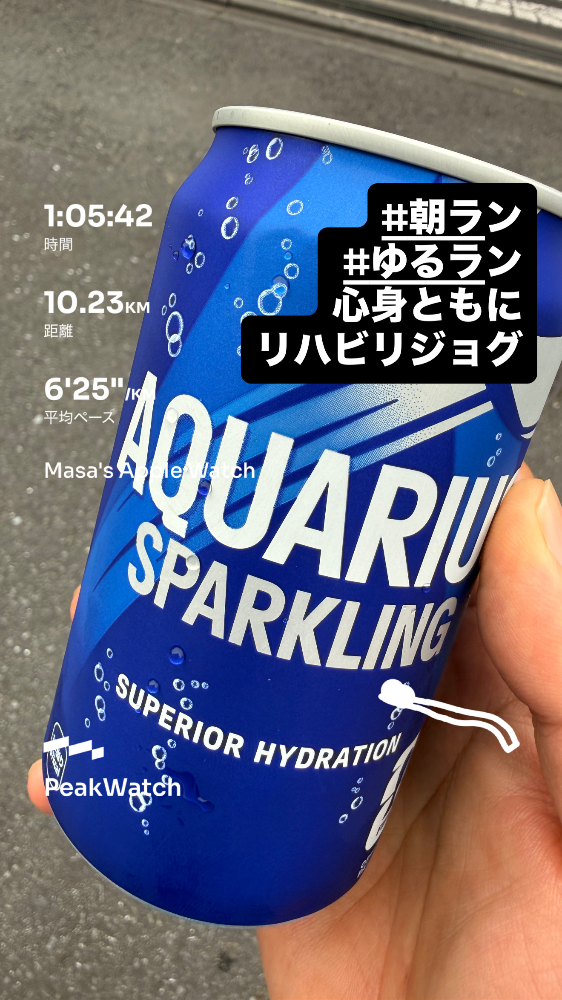
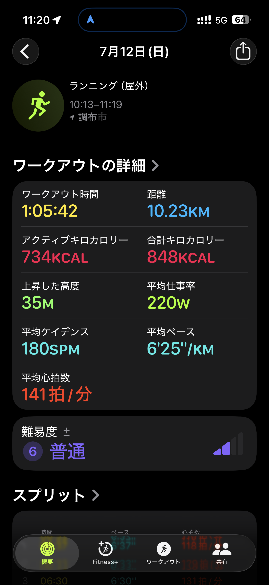
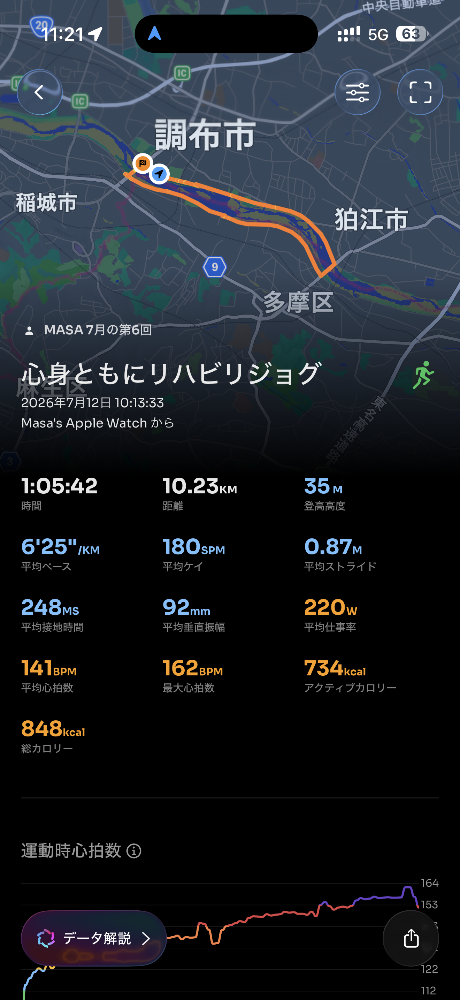

- 距離：10.23km
- 時間：1:05:42
- 平均ペース：平均6'25/km 最大5'41/km
- 平均心拍数：141拍/分
- 最大心拍数：162bpm
- 平均ケイデンス：180spm
- 平均ストライド：0.87m
- VO2Max：44.9（ワークアウトピーク：40.7）
- カロリー：アクティブ734/総計848kcal
- 使用シューズ：スーパーノヴァ
- 時間帯：10時頃
- 天候：10時頃 晴れ 気温27.4℃ 風速1.3m/s
- コース：調布市
- 補給：
- 睡眠：7時間31分 90点
- 今日の目的：心身ともにリハビリジョグ
- RPE：6 ややきつい
- コメント：#朝ラン #ゆるラン 心身ともにリハビリジョグ
- 自分メモ：カラダもココロも疲れてるけど、10km走れたよ
- 心拍ゾーン：ゾーン5 18%/ゾーン4 32%/ゾーン3 19%/ゾーン2 25%/ゾーン1 5%/ゾーン0 2%

- トレーニング負荷：TRIMPexp154/ATL22/CTL3
- 心拍回復：心拍数変化の差 16BPM (良い) / 心拍数の回復2分 149→133BPM

## 📊 ラップデータ
- 1km(6'37/120bpm/87cm/173spm)
- 2km(6'33/130bpm/86cm/177spm)
- 3km(6'30/131bpm/86cm/180spm)
- 4km(6'24/136bpm/86cm/182spm)
- 5km(6'25/139bpm/85cm/183spm)
- 6km(6'17/145bpm/85cm/185spm)
- 7km(6'16/149bpm/86cm/185spm)
- 8km(6'25/151bpm/87cm/180spm)
- 9km(6'09/154bpm/89cm/180spm)
- 10km(6'27/158bpm/87cm/178spm)
- 11km(1:41/7'07/155bpm/86cm/176spm)

## 📝 コーチコメント
MASAさん、10kmのリハビリジョグ、お疲れ様でした。心身ともに疲れている中、よく走り切りましたね。MASAさんのコメントから疲労感が伝わってきましたが、その状況で10kmを走り切ったことは素晴らしい精神力です。今回のワークアウトは「心身ともにリハビリジョグ」と銘打っている通り、平均ペース6'25/km、平均心拍数141bpmと、無理のない範囲で体を動かせたようです。心拍ゾーンの分布を見ると、ゾーン2（25%）とゾーン3（19%）で多くの時間を過ごしており、有酸素運動能力の維持・向上に良い刺激を与えられたでしょう。しかし、ゾーン4（32%）とゾーン5（18%）での時間も比較的長く、最大心拍数も162bpmを記録しています。リハビリジョグとしてはやや強度の高い部分もあったようですので、疲労が蓄積している場合は、もう少し心拍ゾーンを低めに抑える意識も大切です。睡眠スコアが90点と非常に高く、就寝時刻も平均より1時間1分早かったとのことで、疲労回復には良い条件が整えられていますね。TRIMPexp154、ATL22、CTL3というトレーニングインパルスデータを見ると、このワークアウトは比較的大きな負荷だったことがうかがえます。CTL（フィットネス）が3とまだ低い状態ですので、現在の疲労度を考慮しつつ、無理なくトレーニングを継続していくことが重要です。心拍回復データも「良い」評価を得ており、基本的な心肺機能は保たれているようです。MASAさんの今後の目標レースに向けて、まずは疲労回復を最優先に考え、ウォーキングやストレッチなどの軽いアクティビティを取り入れながら、積極的な休養に努めてください。完全に回復したと感じたら、今回のランニングで得られた感覚を忘れずに、再度トレーニングプランを見直していきましょう。次のワークアウトでは、心拍ゾーン2～3をメインにした『リカバリージョグ』を、距離を短めにして実施することを推奨します。頑張りすぎずに、ご自身の体の声に耳を傾けることを忘れないでくださいね。

## 📸 写真一覧

