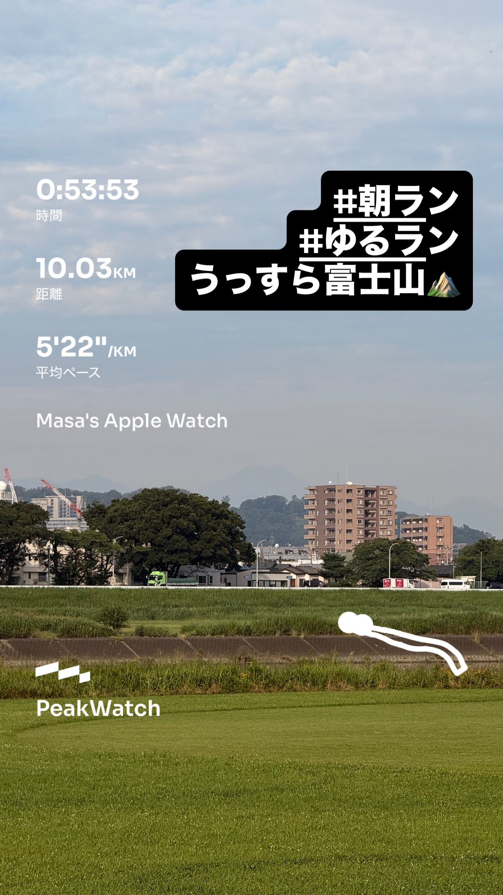
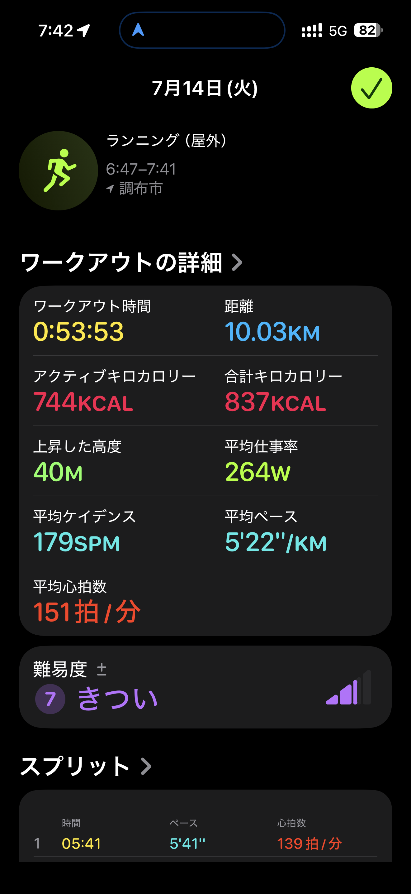
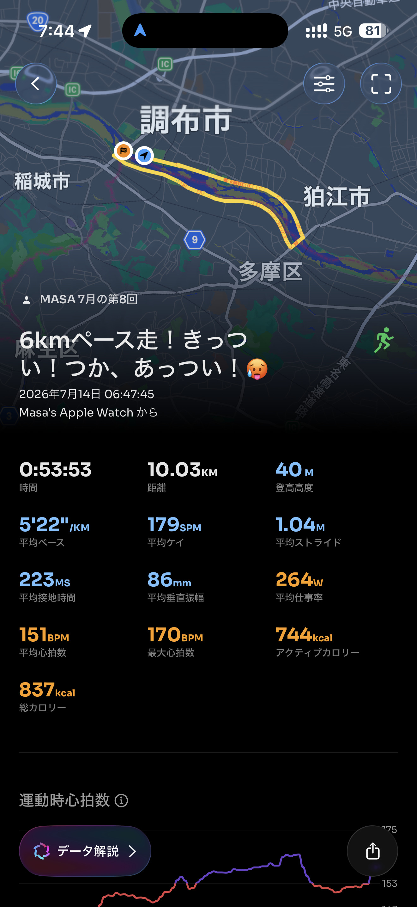

- 距離：10.03km
- 時間：0:53:53
- 平均ペース：平均5'22/km 最大4'02/km
- 平均心拍数：151拍/分
- 最大心拍数：170bpm
- 平均ケイデンス：179spm
- 平均ストライド：1.04m
- VO2Max：44.3（ワークアウトピーク：42.6）
- カロリー：アクティブ744/総計837kcal
- 使用シューズ：マジックスピード4
- 時間帯：6時頃
- 天候：6時頃 快晴 気温24.6℃ 風速3.9m/s
- コース：調布市
- 補給：
- 睡眠：睡眠時間: 5時間36分 スコア: 70(普通)
- 今日の目的：6kmペース走！きっつい！つか、あっつい！
- RPE：6 ややきつい
- コメント：#朝ラン #ゆるラン うっすら富士山⛰️
- 自分メモ：2kmアップ、6kmペース走、あと1km追加したかったけど、無理だったのでダウン2km。暑いし、ま難しいですな😓
- 心拍ゾーン：ゾーン5 42%/ゾーン4 38%/ゾーン3 16%/ゾーン2 5%/ゾーン1 0%/ゾーン0 0%

- トレーニング負荷：TRIMPexp164/ATL23/CTL3
- 心拍回復：心拍数変化の差18BPM 159→141BPM

## 📊 ラップデータ
- 1km(5'41/134bpm/102cm/173spm)
- 2km(5'21/140bpm/105cm/177spm)
- 3km(4'50/147bpm/115cm/183spm)
- 4km(5'02/148bpm/109cm/181spm)
- 5km(4'59/152bpm/109cm/182spm)
- 6km(4'56/157bpm/109cm/186spm)
- 7km(5'01/159bpm/107cm/185spm)
- 8km(5'05/162bpm/108cm/176spm)
- 9km(6'11/155bpm/93cm/177spm)
- 10km(6'30/154bpm/87cm/173spm)
- 11km(0'17/160bpm/94cm/136spm)

## 📝 コーチコメント
MASAさん、お疲れ様でした！今日のランニングデータ、詳しく確認しました。10.03kmを53分53秒、平均ペース5'22/km、心拍数151bpm、最大心拍数170bpmと、かなり強度が高いワークアウトでしたね。特に心拍ゾーン分布を見ると、ゾーン5とゾーン4で合計80%という非常に高い割合を占めており、ほぼ無酸素運動の領域に集中したトレーニングになっています。RPEも「6 ややきつい」とのこと、暑い中でこの強度を維持したのは大変だったと思います。

6kmのペース走として、4km〜8kmのラップを見ると、5'00/km前後の良いペースで維持できています。目標とするハーフPB1時間45分切り（平均4'59/km）やフルマラソンサブ4（平均5'40/km）に向けて、このペース感は非常に重要です。特にこの暑い時期に、目標ペースに近い走りができたことは自信になりますね。

一方で、MASAさんのコメントで「2kmアップ、6kmペース走、あと1km追加したかったけど、無理だったのでダウン2km。暑いし、ま難しいですな」とありました。暑さの中でのトレーニングは、目標設定やペース維持が本当に難しいですよね。無理に距離やペースを上げようとすると、熱中症のリスクだけでなく、疲労が蓄積しやすくなり、今後のトレーニングにも影響が出てしまいます。

今回のデータを見ると、心拍回復が「良い」と評価されていますし、現在のVO2Maxも44.3と高いレベルを維持できています。これはMASAさんの基礎的なフィットネスが高い証拠です。しかし、トレーニングの焦点が無酸素運動に大きく偏りすぎている点が少し気になります。目標としているハーフマラソンやフルマラソンでは、有酸素能力の向上が非常に重要になります。今後は、もう少しペースを抑えて、心拍ゾーン3（有酸素運動領域）をメインにしたロングジョグも取り入れていくと、有酸素能力を効率的に鍛えることができますよ。

暑い時期は、無理せず、体調と相談しながらトレーニングを進めることが何よりも大切です。水分補給をこまめに行い、日中の暑い時間帯は避けて、朝早い時間や夕方以降に走るなどの工夫も取り入れていきましょう。もし体調が優れない場合は、思い切って休むこともトレーニングの一環です。MASAさんの目標達成に向けて、今後も一緒に頑張りましょう！

## 📸 写真一覧

