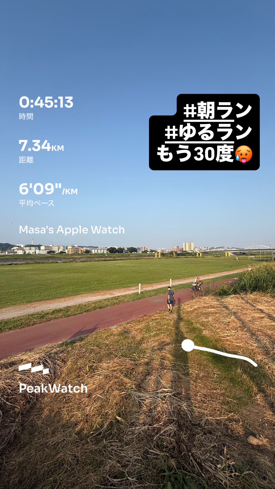
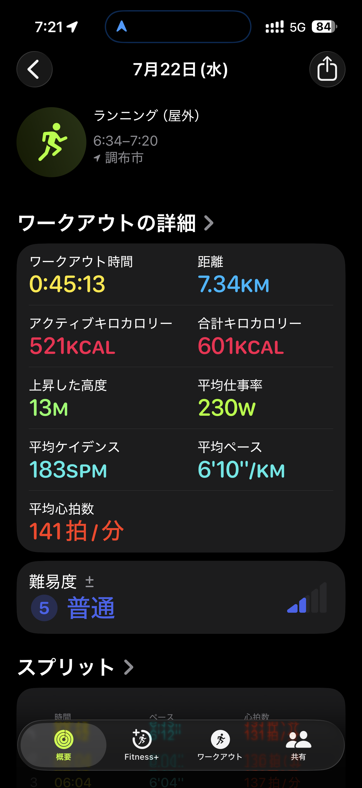
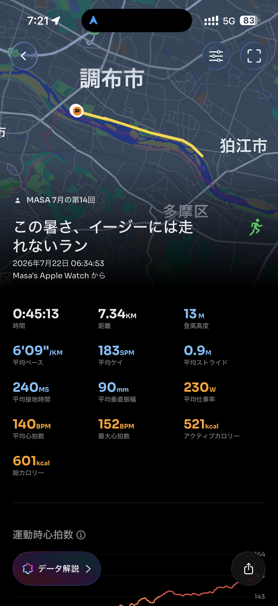

- 距離：7.34km
- 時間：0:45:13
- 平均ペース：平均6'09/km 最大4'16/km
- 平均心拍数：140拍/分
- 最大心拍数：152BPM
- 平均ケイデンス：183SPM
- 平均ストライド：0.9m
- VO2Max：45.1（ワークアウトピーク：37.9）
- カロリー：アクティブ521/総計601kcal
- 使用シューズ：スーパーノヴァ
- 時間帯：6時頃
- 天候：6時頃 快晴 気温26℃ 風速2.4m/s
- コース：調布市
- 補給：
- 睡眠：6時間9分/81点
- 今日の目的：
- RPE：5 中程度
- コメント：#朝ラン #ゆるラン もう30度🥵 この暑さ、イージーには走れないラン
- 自分メモ：暑いよ。イージーも難しい😓
- 心拍ゾーン：ゾーン4 38%/ゾーン3 55%/ゾーン2 6%/ゾーン1 1%

- トレーニング負荷：TRIMPexp96/ATL13/CTL2
- 心拍回復：心拍数変化の差 14BPM 中程度 (心拍数の回復2分 151→137BPM)

## 📊 ラップデータ
- 1km(6'12/131bpm/92cm/179spm)
- 2km(6'04/136bpm/90cm/184spm)
- 3km(6'04/137bpm/90cm/184spm)
- 4km(6'10/139bpm/89cm/184spm)
- 5km(6'09/143bpm/88cm/185spm)
- 6km(6'08/137bpm/90cm/183spm)
- 7km(6'16/144bpm/86cm/185spm)
- 8km(6'09/148bpm/89cm/183spm)

## 📝 コーチコメント
Masaさん、猛暑の中でのランニング、本当にお疲れ様でした。30度を超える環境でのランニングは、まさに「イージーには走れない」というMasaさんのコメントが示す通り、身体への負担が非常に大きいものです。今回のデータを見ると、平均ペース6'09/km、平均心拍数140拍/分、最大心拍数152BPMと、かなり高い強度でのワークアウトだったことが伺えます。心拍ゾーン分布では、ゾーン3が55%、ゾーン4が38%を占めており、ほぼ有酸素運動の強度上限に近いゾーンでの活動が大部分を占めています。これは、暑さによって心拍数が通常よりも上がりやすかったことを示していますね。平均ケイデンス183spm、平均ストライド0.9mと、比較的効率の良い走り方を維持できていますが、終盤にかけて心拍数が上昇している点を見ると、暑さによる疲労が蓄積していたことが分かります。このような状況下でのランニングは、熱中症のリスクを高めるだけでなく、回復にも時間がかかりますので、十分な水分補給とクールダウンを忘れずに行ってください。RPE（主観的運動強度）が「5 中程度」と申告されていますが、客観的なデータからはもっと高い負荷がかかっていたと推測されます。無理は禁物です。現在のVO2Maxが45.1と高水準を維持しており、カーディオパフォーマンスも良い状態です。しかし、暑い時期は無理にペースを上げず、心拍数を抑えたイージーランを意識することが大切です。心拍回復データを見ると、2分間で14BPM回復しており「中程度」の評価です。これも暑さの影響でいつもより回復に時間がかかった可能性も考えられます。睡眠時間は6時間9分、スコアも81点と比較的良好ですが、疲労回復のためにはもう少し確保できると理想的です。これからの時期は特に、早朝や夕方など涼しい時間帯を選んで、無理のない範囲でランニングを継続しましょう。もし身体が重いと感じたり、疲労感が強い場合は、思い切って休む勇気も必要です。横浜マラソン、湘南国際マラソンという目標レースに向けて、体調管理を最優先に考えていきましょう。

## 📸 写真一覧

