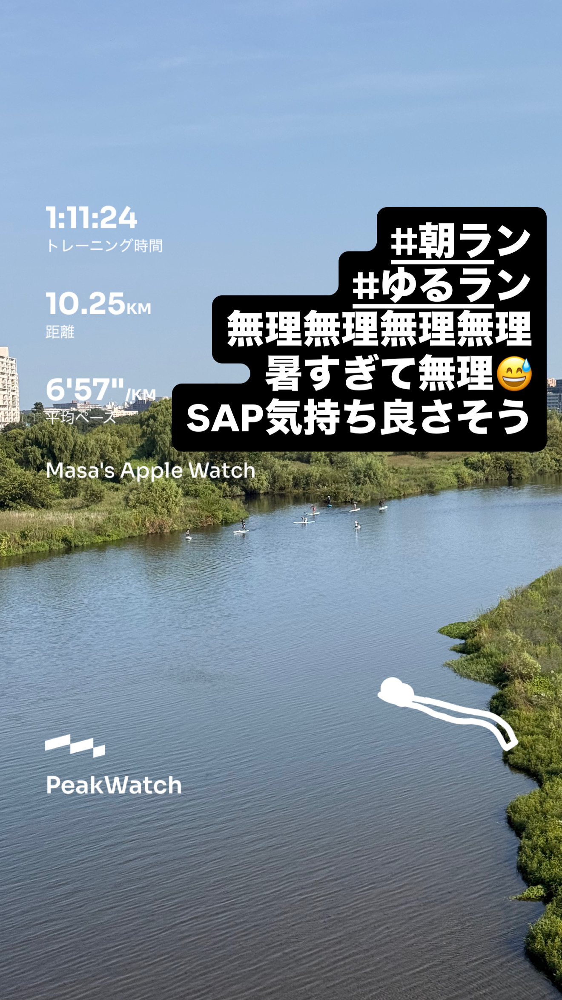
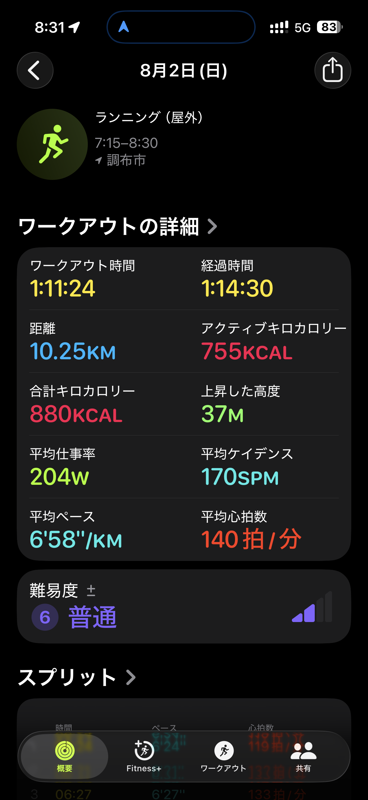
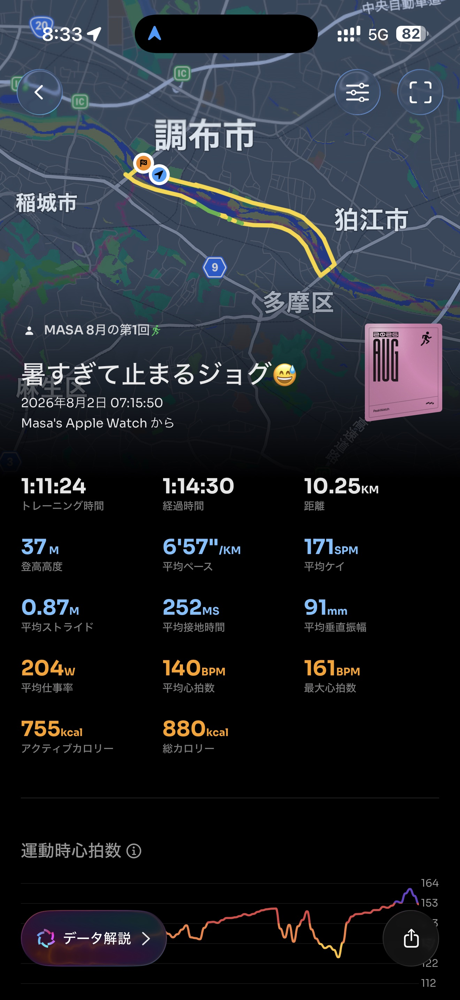

- 距離：10.25km
- 時間：1:11:24
- 平均ペース：平均6'58/km 最大4'43/km
- 平均心拍数：140拍/分
- 最大心拍数：161bpm
- 平均ケイデンス：170spm
- 平均ストライド：0.87m
- VO2Max：46.3（ワークアウトピーク：41.0）
- カロリー：アクティブ755/総計880kcal
- 使用シューズ：スーパーノヴァ
- 時間帯：7時頃
- 天候：7時頃 晴れ 気温26.7℃ 風速1.3m/s
- コース：調布市
- 補給：
- 睡眠：5時間18分、スコア86点
- 今日の目的：暑すぎて止まるジョグ
- RPE：6 ややきつい
- コメント：#朝ラン #ゆるラン 無理無理無理無理無理 暑すぎてて無理 SAP気持ち良さそう
- 自分メモ：暑すぎる、これはもう何時スタートにすればいいんだ？そして睡眠時間削りそう🥵
- 心拍ゾーン：ゾーン5 5%/ゾーン4 33%/ゾーン3 39%/ゾーン2 19%/ゾーン1 0%/ゾーン0 5%

- トレーニング負荷：TRIMPexp152/ATL21/CTL3

## 📊 ラップデータ
- 1km(6'24/125bpm/88cm/176spm)
- 2km(6'21/132bpm/88cm/179spm)
- 3km(6'27/133bpm/86cm/180spm)
- 4km(6'31/136bpm/85cm/179spm)
- 5km(6'49/137bpm/86cm/176spm)
- 1-5平均(6'30/133bpm/87cm/178spm)
- 6km(6'28/144bpm/88cm/178spm)
- 7km(6'26/149bpm/87cm/179spm)
- 8km(9'47/136bpm/92cm/137spm)
- 9km(7'39/149bpm/82cm/178spm)
- 10km(6'47/156bpm/84cm/174spm)
- 6-10平均(7'15/147bpm/87cm/169spm)
- 11km(1'42/6'40)

## 📝 コーチコメント
MASAさん、お疲れ様でした！この暑さの中、10.25kmを走り切ったのは素晴らしいですね。特に、平均ペース6'58/km、平均心拍数140bpmというのは、暑さによる体への負担を考慮すると、無理なく継続できている良い指標だと思います。心拍ゾーンを見ても、ゾーン3が39%と最も長く、有酸素運動として効果的に取り組めています。最大心拍数161bpm、最大ワット333Wと、一時的に負荷の高い区間もあったようですが、全体的には「ややきつい」というRPEの評価も、現在の状況をよく表していると感じます。VO2Maxも46.3と非常に良好なレベルを維持しており、心肺機能の高さがうかがえます。

今回のランニングコメントで「暑すぎて無理」とあったように、現在の環境はランニングには非常に厳しいですね。Masaさんのコメント「暑すぎる、これはもう何時スタートにすればいいんだ？そして睡眠時間削りそう」へのアドバイスですが、まず「何時スタートにすればいいか」という点については、今日の7時15分スタートでも既に暑さを感じているようですので、これ以上早い時間帯、例えば5時台〜6時台のスタートも検討してみてください。もちろん、睡眠時間を削るのは本末転倒なので、早朝ランに切り替える場合は、その分夜の就寝時刻を早めることを徹底し、質の良い睡眠を確保することが最優先です。今回の睡眠データは5時間18分でスコア86点とまずまずですが、理想は7〜8時間確保したいところです。

暑い時期は無理にペースを上げる必要はありません。今日の「暑すぎて止まるジョグ」のように、無理だと感じたら立ち止まって休憩する、水分補給をする、ペースを落とすといった判断は非常に重要です。ラップデータを見ても、8km地点で一時的にペースが落ちているのは、体が暑さに反応してペースを調整した結果だと考えられます。このような体の声に耳を傾けることが、故障なくトレーニングを継続する秘訣です。

横浜マラソンでのサブ4達成、湘南国際マラソンでの目標達成に向けて、夏場のトレーニングは「暑さに慣れる」「体力を維持する」ことを主眼に置きましょう。具体的なアドバイスとしては、

1.  **時間帯の調整:** 可能であれば早朝（5時台〜6時台）の涼しい時間帯に走る。
2.  **水分・塩分補給:** ランニング前、中、後の水分・塩分補給は意識的に行う。今日の「アクエリアススパークリング」は良い選択ですね。
3.  **クールダウン:** ランニング後はシャワーやクールダウン体操で体をしっかり冷やす。
4.  **無理しない:** 暑さ指数が高い日は無理せず、距離を短くしたり、室内トレーニング（トレッドミル、筋トレなど）に切り替えたりする柔軟性を持つ。
5.  **睡眠の質:** 睡眠時間確保と質向上のための工夫（寝室の温度調整、カフェイン摂取の制限など）を引き続き行ってください。

これらを意識しながら、秋からの本格的な走り込みに向けて、夏を乗り切りましょう！

## 📸 写真一覧

