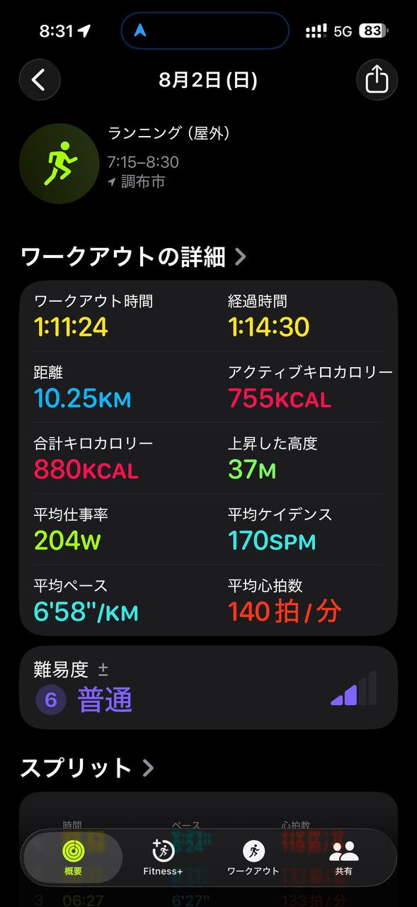

- 距離：10.25km
- 時間：1:11:24
- 平均ペース：平均6'58/km
- 平均心拍数：140拍/分
- 最大心拍数：
- 平均ケイデンス：170spm
- 平均ストライド：
- VO2Max：
- カロリー：アクティブ755/総計880kcal
- 使用シューズ：スーパーノヴァ
- 時間帯：7時頃
- 天候：7時頃 晴れ 気温26.9℃ 風速1.9m/s
- コース：調布市
- 補給：
- 睡眠：
- 今日の目的：ランニング(屋外)
- RPE：5 普通
- コメント：
- 自分メモ：

## 📝 コーチコメント
Masaさん、おはようございます！今朝の調布市での10.25kmランニング、お疲れ様でした。1時間11分24秒というワークアウト時間で、平均ペース6分58秒/kmは、非常に安定していて素晴らしいですね。平均心拍数140拍/分、平均ケイデンス170spmというデータから、無理なく効率的に走れていることが伺えます。特に、難易度が「普通」と評価されている点も、現在のMasaさんの走力に対して適切な負荷だったことを示しています。上昇高度が37mとあまり起伏のないコースだったことも、この安定したペースを維持できた要因の一つかもしれませんね。アクティブカロリーも755kcalとしっかり消費できており、運動効果も十分です。前回のハーフマラソンPB達成から少し間が空きましたが、今回の10kmをこのペースで走り切れたことは、サブ4という目標達成に向けて非常に良い兆候です。特に、横浜マラソンに向けて、この距離とペースを継続的に取り組むことで、走力維持と向上に繋がるでしょう。次の練習では、もし可能であれば心拍ゾーンのデータも確認できると、より詳しいアドバイスができます。これからのトレーニングも、怪我なく楽しく続けていきましょう！

## 📸 写真一覧
