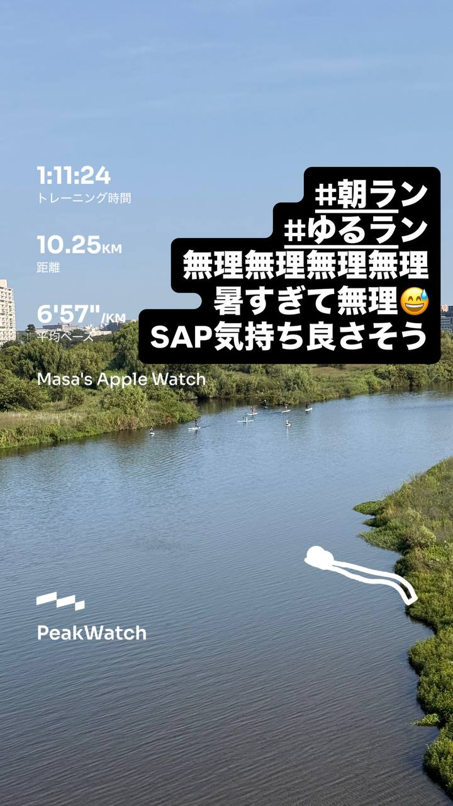
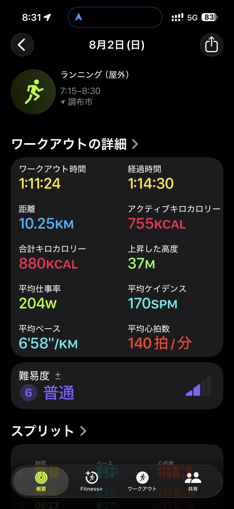
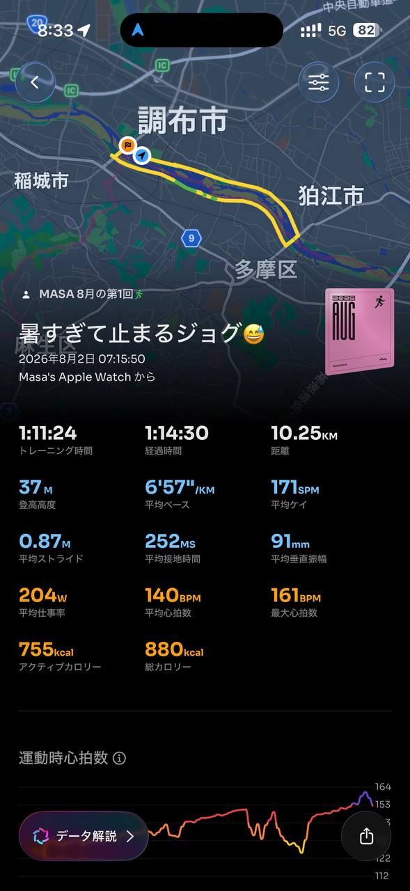

- 距離：10.25km
- 時間：1:11:24
- 平均ペース：平均6'58/KM 最大4'43/KM
- 平均心拍数：140拍/分
- 最大心拍数：161BPM
- 平均ケイデンス：170SPM
- 平均ストライド：0.87M
- VO2Max：46.3（ワークアウトピーク：41.0）
- カロリー：アクティブ755/総計880KCAL
- 使用シューズ：スーパーノヴァ
- 時間帯：7時頃
- 天候：7時頃 晴れ 気温26.9℃ 風速1.9m/s
- コース：調布市
- 補給：
- 睡眠：6時間1分/86点
- 今日の目的：暑すぎて止まるジョグ
- RPE：6 ややきつい
- コメント：#朝ラン #ゆるラン 無理無理無理無理無理 暑すぎて無理 SAP気持ち良さそう
- 自分メモ：
- 心拍ゾーン：ゾーン5 5.5%/ゾーン4 33%/ゾーン3 39%/ゾーン2 19%/ゾーン1 1.0%/ゾーン0 0.5%

- トレーニング負荷：TRIMPexp152/ATL21/CTL3

## 📊 ラップデータ
- 1km(6'24/125bpm/88cm/176spm)
- 2km(6'21/132bpm/88cm/179spm)
- 3km(6'27/133bpm/86cm/180spm)
- 4km(6'31/136bpm/85cm/181spm)
- 5km(6'49/137bpm/86cm/176spm)
- 6km(6'28/144bpm/88cm/178spm)
- 7km(6'26/149bpm/87cm/179spm)
- 8km(9'47/136bpm/92cm/137spm)
- 9km(7'39/149bpm/82cm/178spm)
- 10km(6'47/156bpm/84cm/174spm)
- 11km(1'42)

## 📝 コーチコメント
Masaさん、おはようございます！今日のワークアウトお疲れ様でした。厳しい暑さの中、10.25kmを1時間11分24秒、平均ペース6'58/kmで走り切ったのは素晴らしいですね。特に、コメントで「暑すぎて無理」とあったにも関わらず、最後まで走り抜いた粘り強さは評価に値します。ワークアウトの難易度が「普通」と評価されている点や、RPEが「6 ややきつい」という自己評価も、今日のコンディションと内容を考えると妥当だと思います。心拍データを見ると、ゾーン3とゾーン4で合計72%を占めており、これは有酸素運動能力の向上に寄与する良いトレーニングができたことを示しています。特に、現在のVO2Maxが46.3と非常に良好なレベルにある中で、ワークアウトピークVO2が41.0を記録しているのは、高い強度での運動にも対応できている証拠です。平均ケイデンス170spm、平均ストライド0.87mは、Masaさんのフォームが効率的であることを示しています。ラップデータを見ると、特に8km地点でペースが大きく落ち込み、心拍数も一時的に下がっていることから、この区間で一度休憩を挟んだか、あるいはペースを大幅に落として回復を図ったようですね。暑い日のランニングでは無理は禁物なので、このような自己判断はとても重要です。トレーニングインパルス（TRIMPexp）が152と高い値を示しており、これまでのATL（疲労）が21、CTL（フィットネス）が3なので、今回のワークアウトが体への負荷になったことがうかがえます。しかし、疲労回復には十分な睡眠が不可欠です。昨晩は6時間1分睡眠で睡眠スコアも86点と良好でしたので、しっかりと身体を休めることができたのは好材料です。運動後は水分補給をしっかり行い、クールダウンとストレッチも忘れずに行ってください。次回のランニングに向けて、疲労をしっかり抜きつつ、無理のない範囲で継続していきましょう。素晴らしいランニングでした！

## 📸 写真一覧

