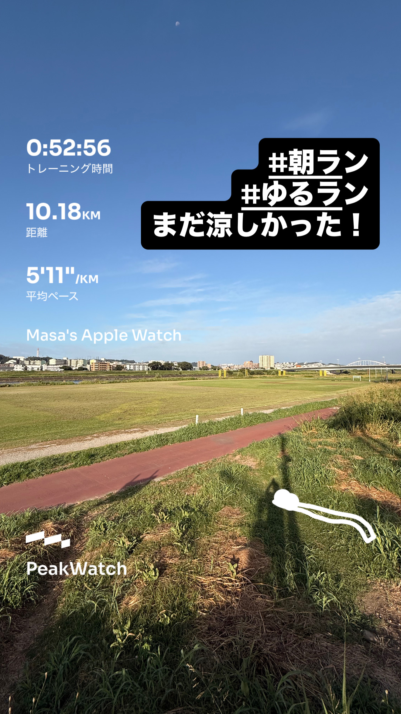
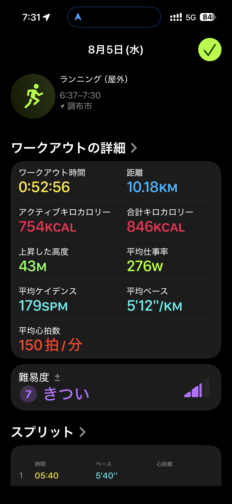
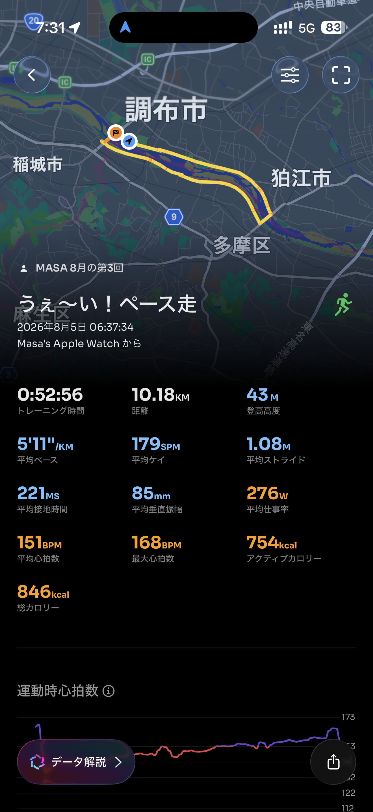

- 距離：10.18km
- 時間：0:52:56
- 平均ペース：平均5'12/km 最大3'45/km
- 平均心拍数：151拍/分
- 最大心拍数：168bpm
- 平均ケイデンス：179spm
- 平均ストライド：1.08m
- VO2Max：46.3（ワークアウトピーク：43.2）
- カロリー：アクティブ754/総計846kcal
- 使用シューズ：マジックスピード4
- 時間帯：6時頃
- 天候：6時頃 晴れ 気温21.6℃ 風速6.6m/s
- コース：調布市
- 補給：
- 睡眠：5時間31分 評価90%(普通79点)
- 今日の目的：ペース走
- RPE：7 きつい
- コメント：#朝ラン #ゆるラン まだ涼しかった！
- 自分メモ：10kmペースラン！涼しいけど、ちょっと暑さも戻ってきたかな？
- 心拍ゾーン：ゾーン5 39%/ゾーン4 44%/ゾーン3 12%/ゾーン1 0%/ゾーン0 6%

- トレーニング負荷：TRIMPexp153/ATL21/CTL3
- 心拍回復：心拍数変化の差 5BPM (悪い)

## 📊 ラップデータ
- 1km(5'40/149bpm/102cm/172spm)
- 2km(5'14/143bpm/109cm/179spm)
- 3km(5'07/144bpm/109cm/181spm)
- 4km(5'04/148bpm/110cm/181spm)
- 5km(5'04/150bpm/110cm/181spm)
- 6km(5'12/150bpm/106cm/179spm)
- 7km(4'59/154bpm/110cm/180spm)
- 8km(5'16/154bpm/105cm/180spm)
- 9km(5'02/157bpm/109cm/182spm)
- 10km(5'08/160bpm/107cm/180spm)
- 11km(6'05/162bpm/103cm/169spm)

## 📝 コーチコメント
MASAさん、10kmペース走お疲れ様でした！朝の涼しい時間帯に、調布市でのトレーニング、素晴らしいですね。平均ペース5'12/kmで、この距離を走り切れたのは良いパフォーマンスです。RPEが「7 きつい」と評価されていますが、これは高強度なトレーニングである「ペース走」としては妥当な感覚でしょう。心拍ゾーンを見ると、ゾーン4が44%、ゾーン5が39%と、かなり高い心拍域でのトレーニングができています。これは心肺機能の向上に非常に効果的で、無酸素運動と高強度有酸素運動がバランス良く行われていることが示されています。VO2Maxも46.3と良好な値を維持しており、ワークアウトピークVO2も43.2と高い値を示していますね。今回のトレーニング負荷は、スピードと持久力の両面を向上させるために重要な負荷だったと言えます。ラップごとのペースを見ると、ほとんどのラップで5分台をキープできており、特に7km地点で4'59とペースアップできているのは素晴らしい集中力です。最後の1kmのペースが少し落ちていますが、これは高強度で走り続けた結果なので心配ありません。一点気になったのは心拍回復で、心拍数変化の差が5BPMと「悪い」評価でした。これは疲労が溜まっている可能性や、トレーニング後のクーリングダウンが不十分だった可能性も考えられます。今後のトレーニングでは、クーリングダウンをしっかり行い、心拍回復の改善を目指しましょう。また、前日の睡眠時間が5時間31分と少し短かったようです。睡眠はリカバリーに非常に重要ですので、可能であればもう少し長く睡眠時間を確保できるよう意識してみてください。MASAさんのコメントで「涼しいけど、ちょっと暑さも戻ってきたかな？」とのことでしたが、高強度なトレーニングだったことを考えると、体感的な暑さは当然だと思います。引き続き、天候や体調と相談しながら、目標である横浜マラソンでのサブ4達成に向けて頑張っていきましょう！

## 📸 写真一覧

