# 🏃‍♂️ 2025-06-20 のランログ

- 距離：6.44km
- 時間：00:38:05
- 平均心拍数：138
- 時間帯：6:38〜
- 天候：晴れ
- コース：河川敷多摩川コース
- 補給：なし
- 睡眠：6時間
- 今日の目的：リカバリー、軽めのラン
- コメント：ワラーチでととのうラン

## 📝 コーチコメント：
暑さの中でもしっかりとリズムを保った5kmラン。フォームは安定しており、心拍数も低めにコントロールできていたのが素晴らしい。ラストで少し上げられたのも成長の証。明日しっかり休んで、次の一歩に備えましょう！

## 📸 写真一覧
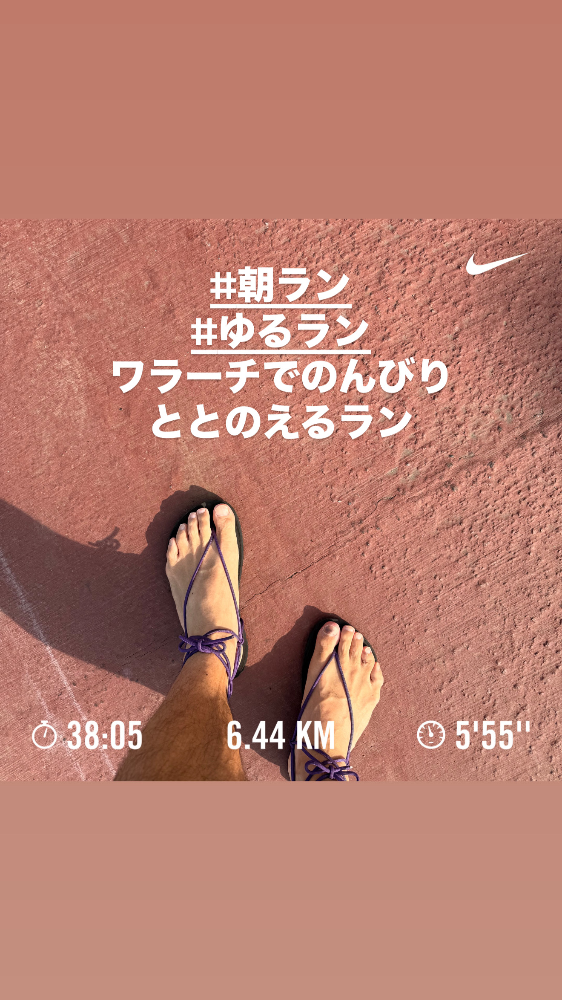
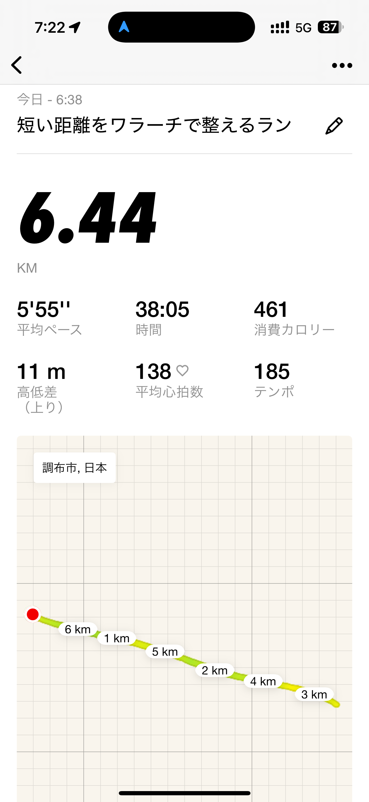
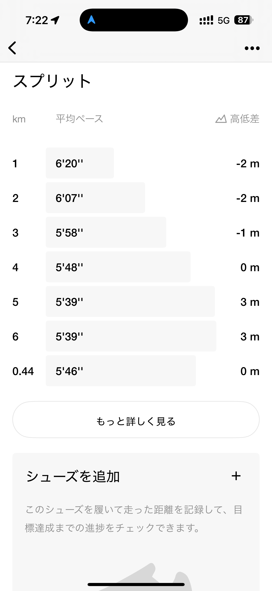
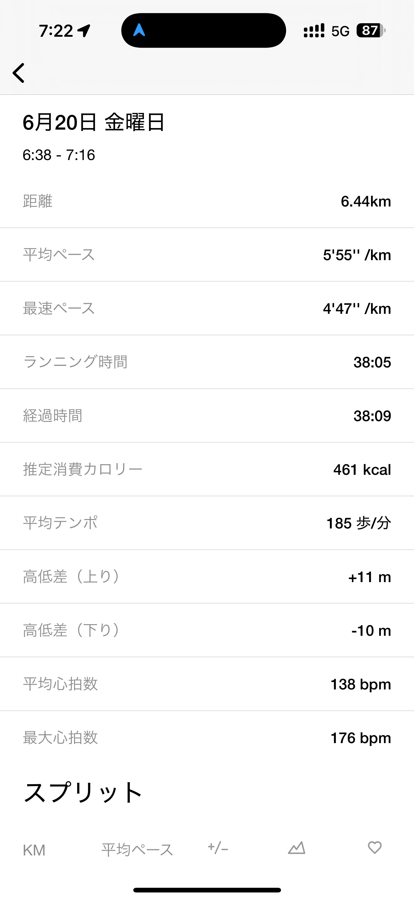
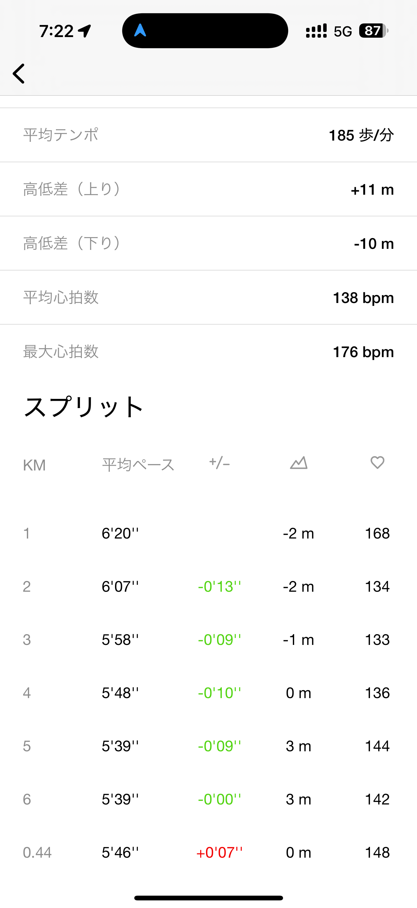
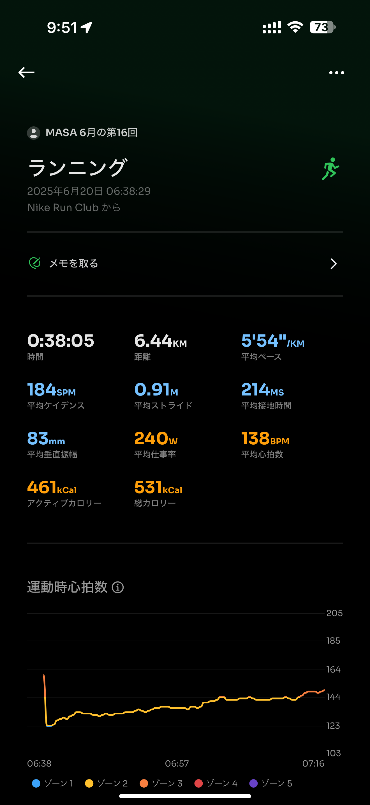
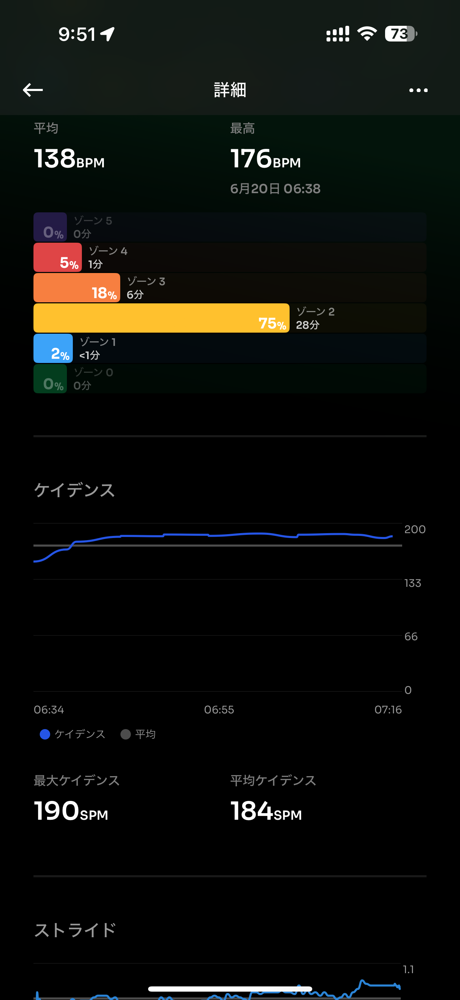
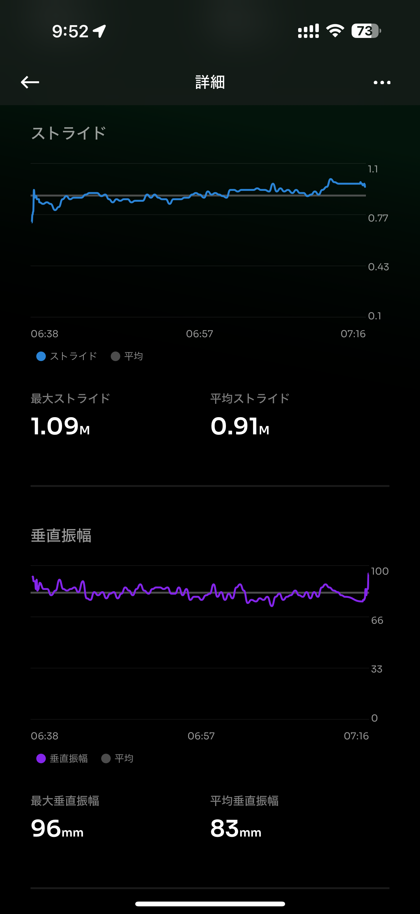
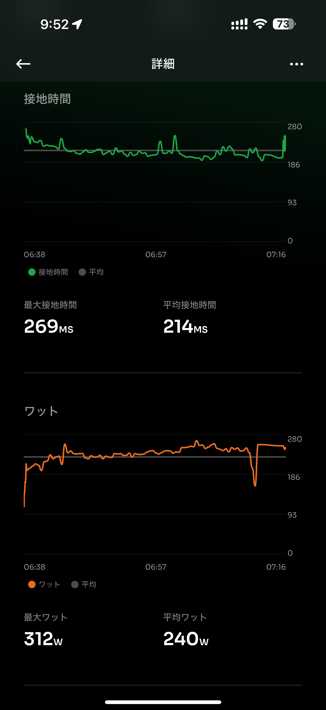
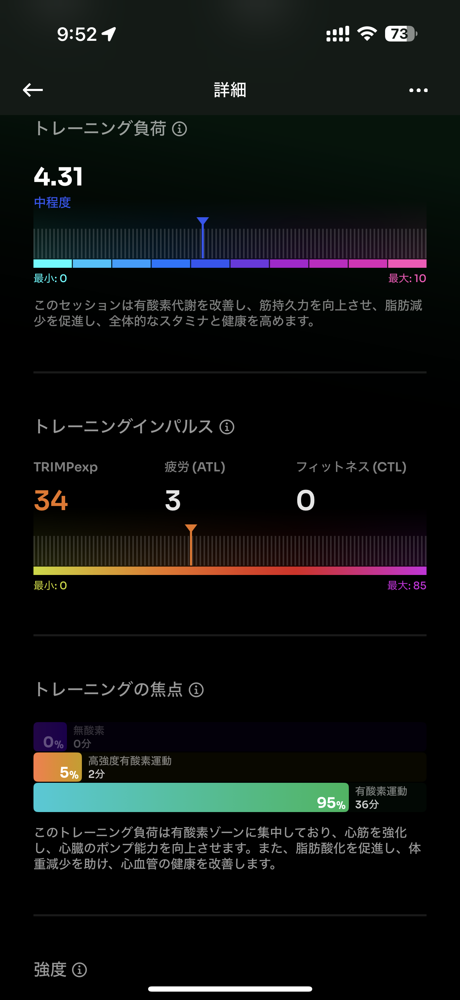
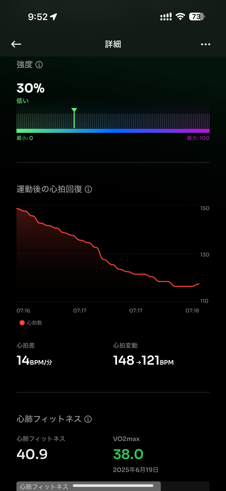
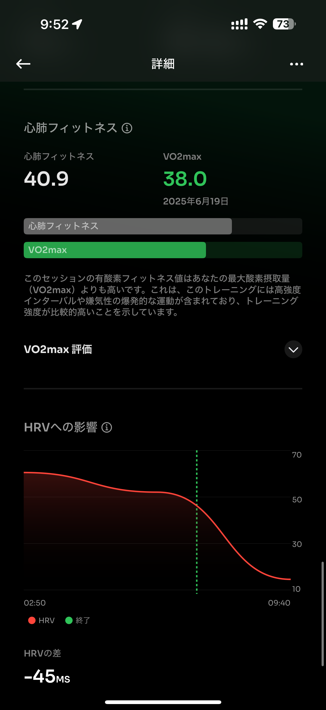
