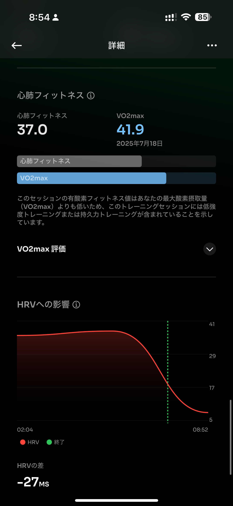

# 🏃‍♂️ 2025-07-22 のランログ

- 距離：10.03km
- 時間：01:01:12
- 平均心拍数：145
- 時間帯：06:21~
- 天候：晴れ
- コース：多摩川河川敷（5kmで折り返した）
- 補給：なし
- 睡眠：6時間8分
- 今日の目的：3日間ランオフ後のEペースジョグ
- コメント：ちょっとペース上がりすぎたっぽい・・・・

## 📝 コーチコメント：
ランオフ明けの10km、暑い中見事な走り！心肺能力は維持できていますが、HRV低下は疲労のサイン。引き続き回復を優先し、暑さ対策を徹底しましょう。

## 📸 写真一覧

