# 🏃‍♂️ 2025-07-27 のランログ

- 距離：16.34km
- 時間：01:40:48
- 平均心拍数：142
- 時間帯：5:52~
- 天候：晴れ
- コース：多摩川河川敷（稲城大橋経由）
- 補給：水
- 睡眠：5時間
- 今日の目的：5時台にスタート
- コメント：なんとか5時台にスタートはできた。

## 📝 コーチコメント：
暑い中16kmロングジョグ見事完遂！長距離でのペースアップも可能になり、走力は着実に向上。高負荷後の回復を最優先し、疲労を徹底的に抜き去りましょう！
今日のEペース走は、「疲労をためない有酸素ベースの構築」という観点で、
今週の最も理想的な“つなぎの一手”になりました。VO2maxに直結するほどの強度ではないものの、
トレーニング負荷も適度に乗り、フォーム・心拍・HRVともに理想的な結果です。
この暑さの中でここまで丁寧な走りができるのは、
春から積み重ねてきた基礎力と意識の高さゆえだと思います。

## 📸 写真一覧
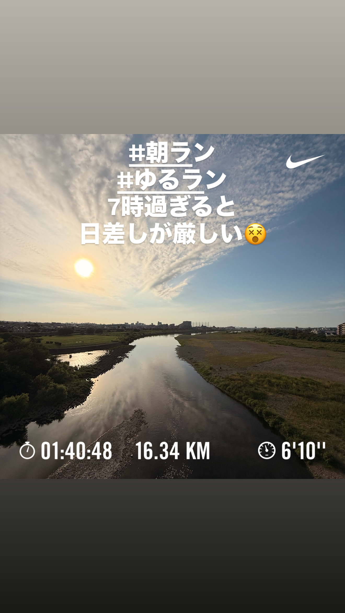
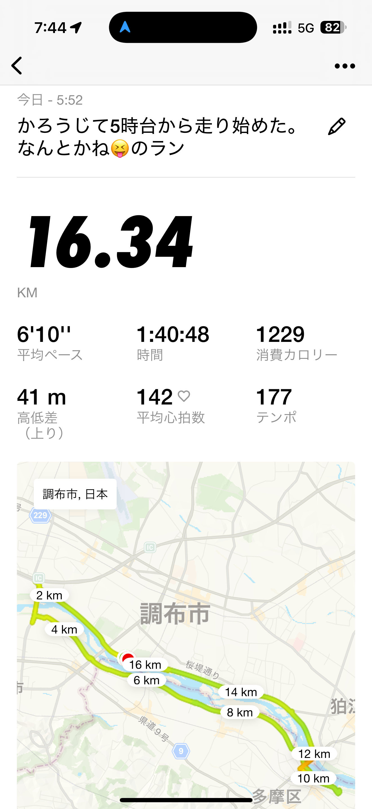
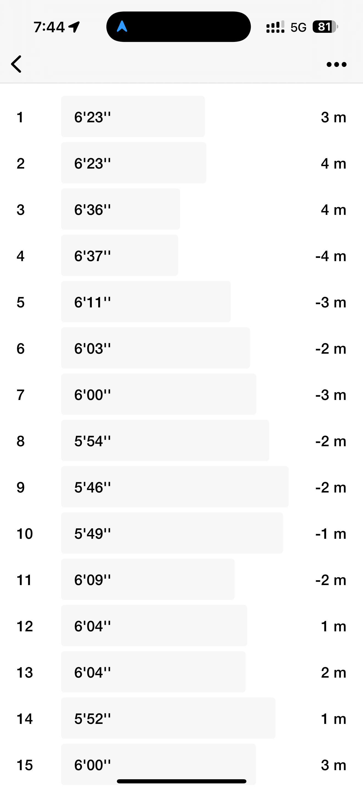
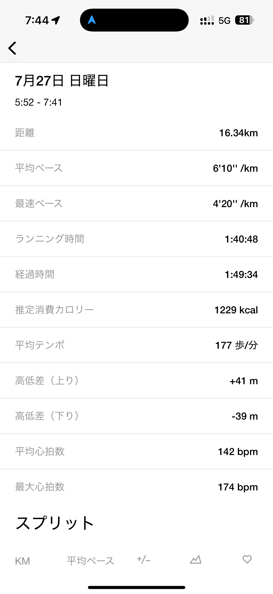
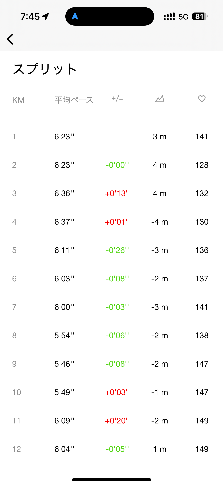
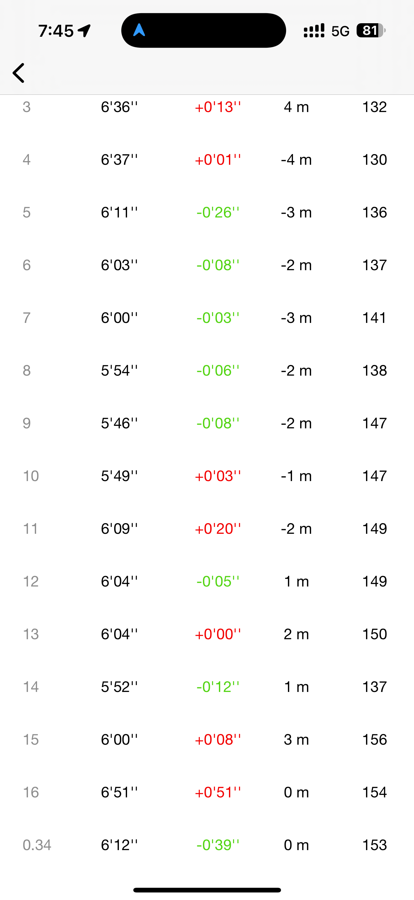
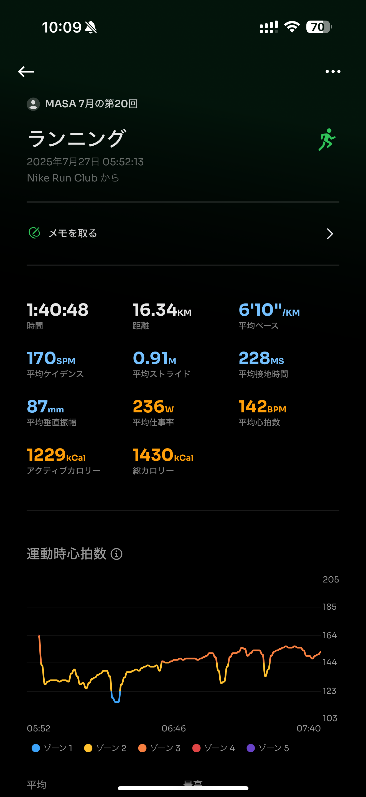
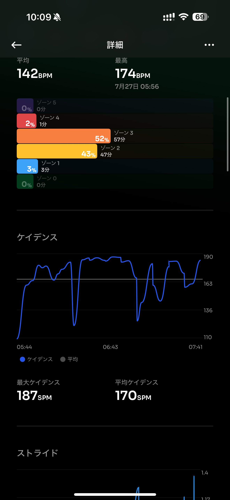
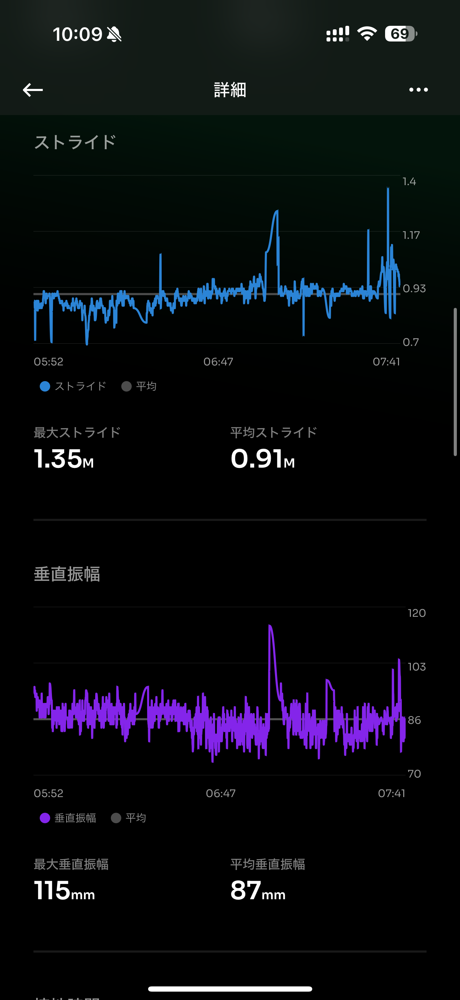
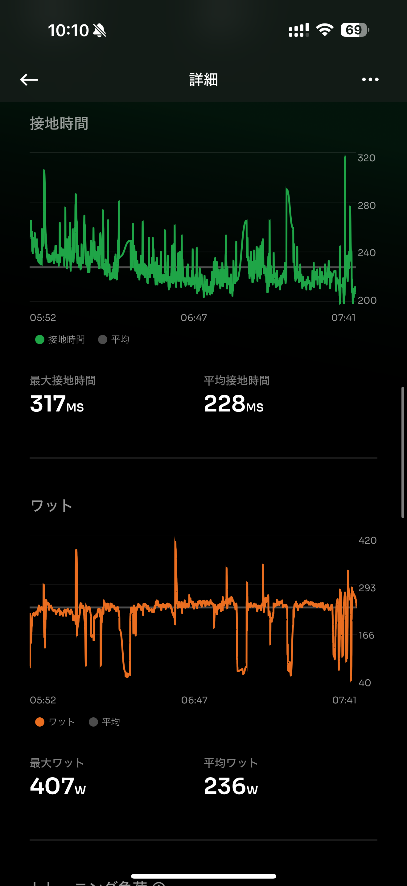
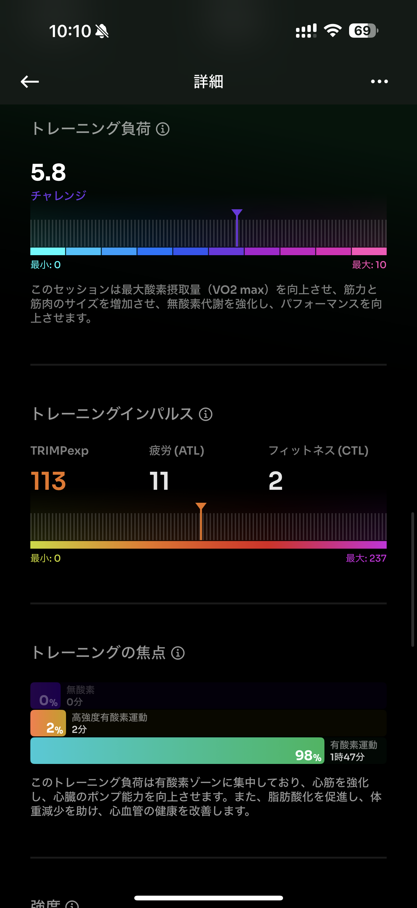
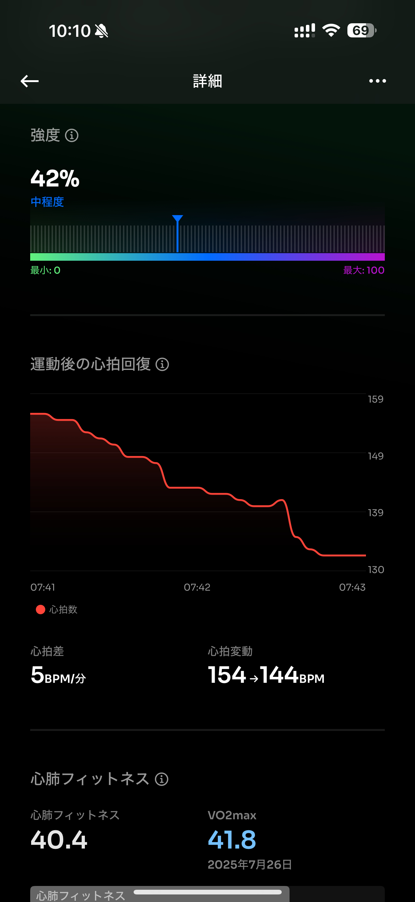
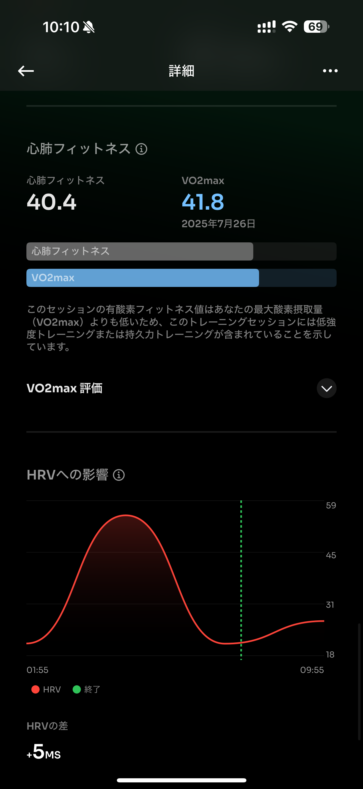
