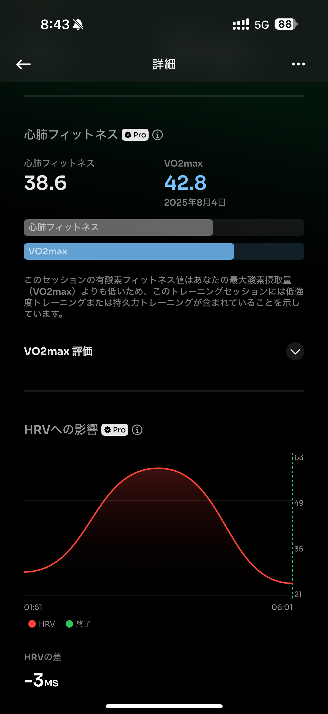

# 🏃‍♂️ 2025-08-05-01 のランログ

- 距離：7.02km
- 時間：00:38:28
- 平均心拍数：148
- 時間帯：6:28~
- 天候：晴れ
- コース：多摩川河川敷（折り返し）
- 補給：なし
- 睡眠：6時間
- 今日の目的：おニューのシューズの試し履き
- コメント：テンポ上がりすぎました

## 📝 コーチコメント：
Boston 12の推進力をしっかり活かした走り。今はまだスピードに脚がついていないが、順応すれば大きな武器になります！
新しいシューズでのビルドアップ走、非常に質の高いトレーニングができました。しっかり身体を回復させ、次のランニングに備えましょう。

## 📸 写真一覧

