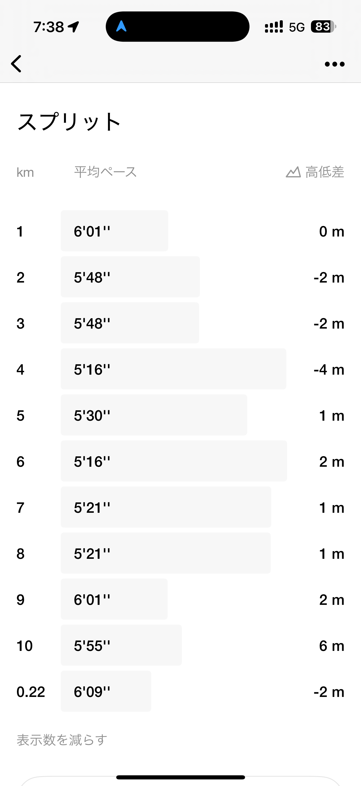
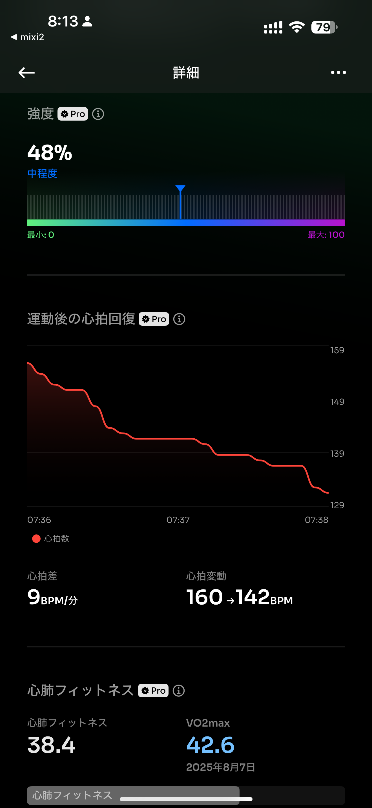

# 🏃‍♂️ 2025-08-08-01 のランログ

- 距離：10.22km
- 時間：00:57:40
- 平均心拍数：147
- 時間帯：6:38~
- 天候：晴れ
- コース：多摩川河川敷（周回コース）
- 補給：なし
- 睡眠：5時間25分
- 今日の目的：テンポ走（アップ、ダウンジョグあり）
- コメント：3kmアップ、5kmテンポ走、2kmダウン。成功！

## 📝 コーチコメント：
テンポ走の目的を完璧に果たし、心肺機能にしっかり負荷をかけられた素晴らしいトレーニングです。この負荷と回復のサイクルを続けて、目標達成に向けて着実に進んでいきましょう。
今日の走りは、まるで一定リズムで刻む精密機械。秋の本番で持続できる脚と心肺が着実に育っています。

## 📸 写真一覧

