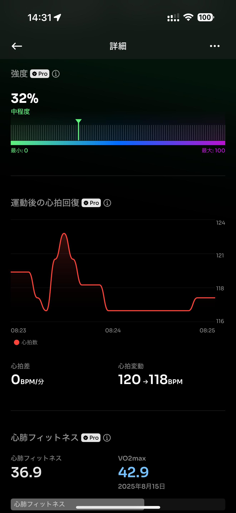

- 距離：8.50km
- 時間：00:53:01
- 平均心拍数：138
- 時間帯：7:23~
- 天候：晴れ
- コース：多摩川河川敷（二子玉手前で挫折）
- 補給：ジェル、塩タブ
- 睡眠：5時間
- 今日の目的：20kmロング走
- コメント：挫折・・・

## 📝 コーチコメント：
今日は「ロング走失敗」と感じたかもしれないけど、走力不足ではなく体調要因による途中失速です。
むしろ6kmまでのペース・心拍数は理想的なEペースレンジ（5:30〜6:00/km）に収まっていて、トレーニング効果はしっかりあります。

## 📸 写真一覧

