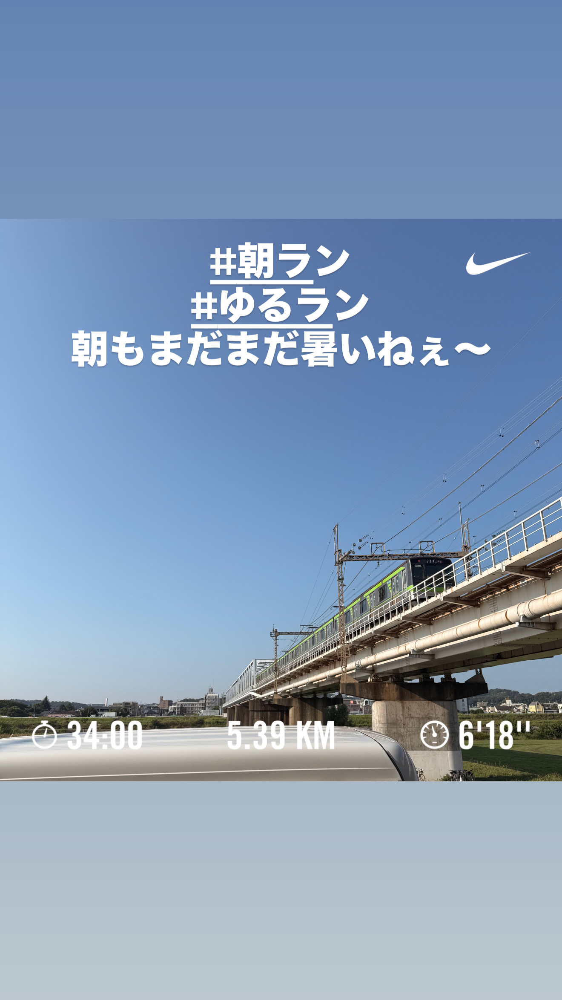
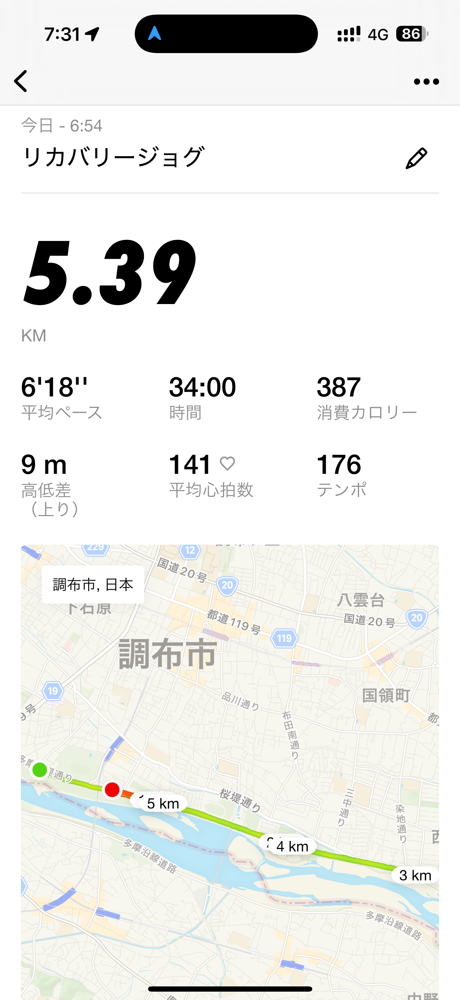
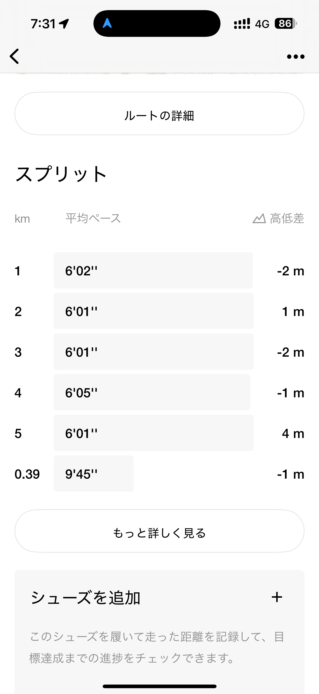
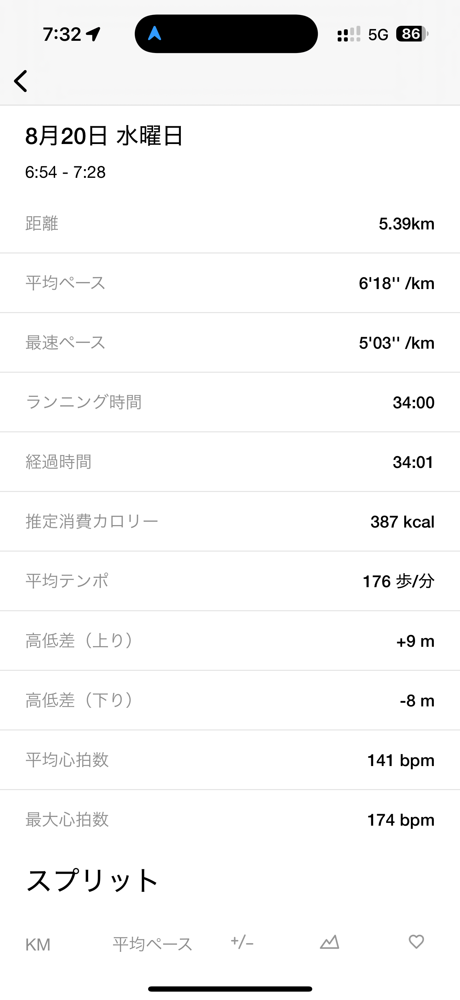
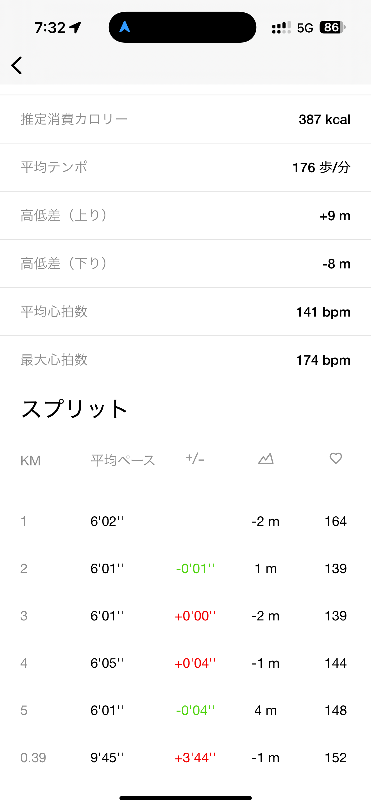
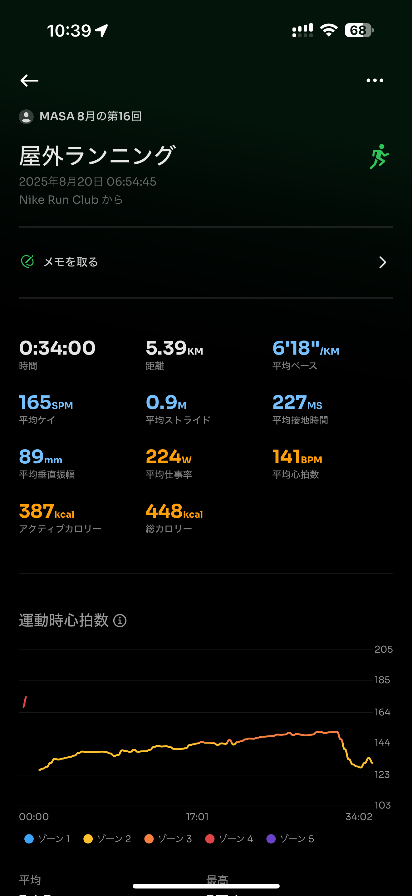
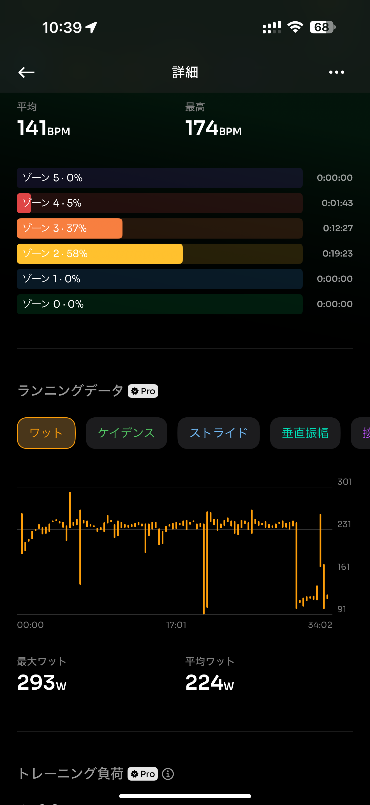
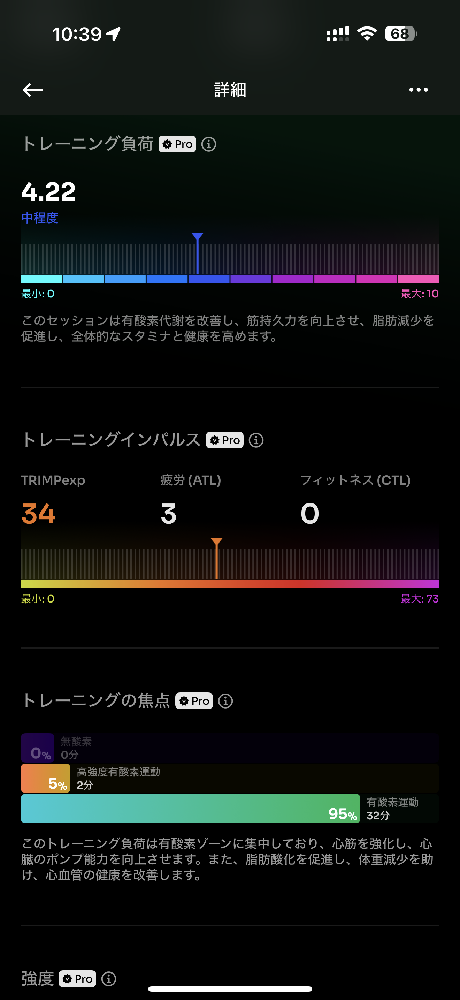
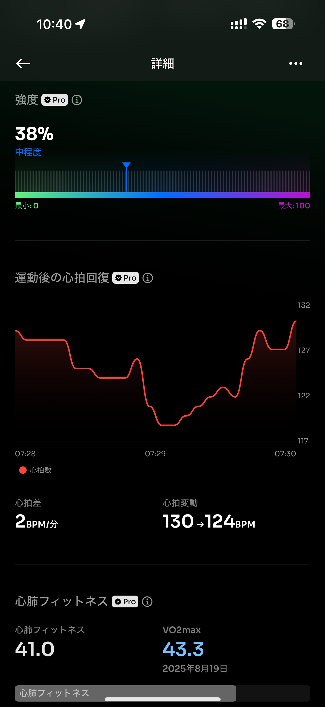
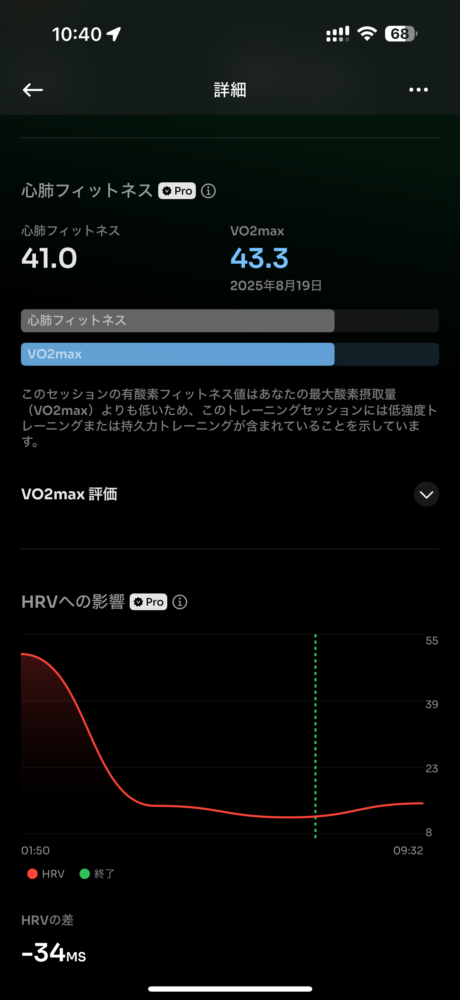

- 距離：5.39km
- 時間：00:34:00
- 平均心拍数：141
- 時間帯：6:54~
- 天候：晴れ
- コース：多摩川河川敷（折り返し）
- 補給：なし
- 睡眠：4時間50分
- 今日の目的：リカバリージョグ
- コメント：太ももまだパンパン

## 📝 コーチコメント：
リカバリーとしてちょうど良い負荷で、有酸素の土台を積めた安定したジョグでした！

## 📸 写真一覧

