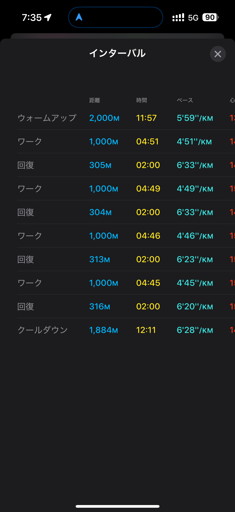
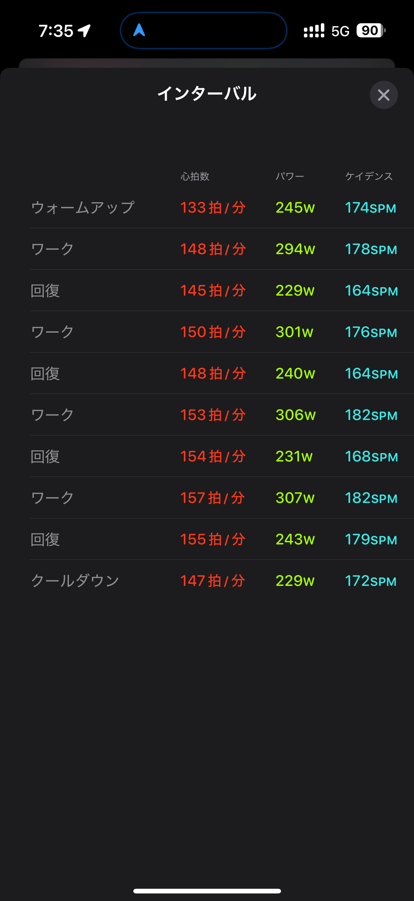
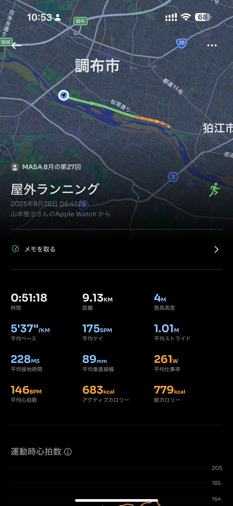
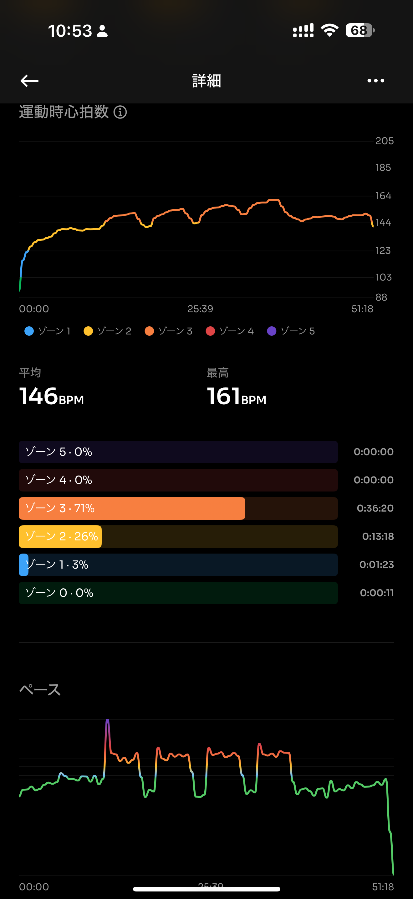
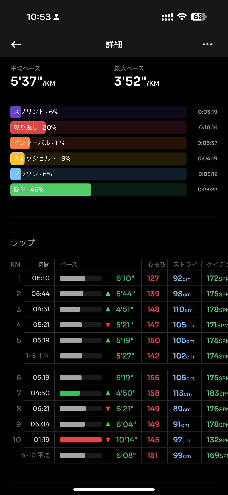
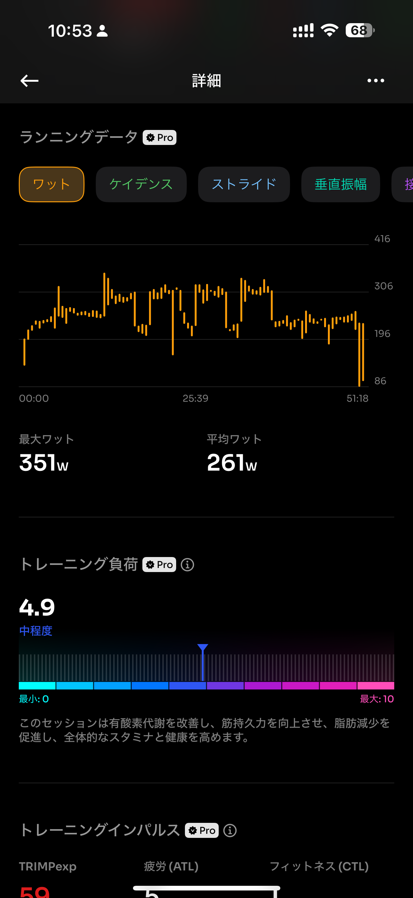
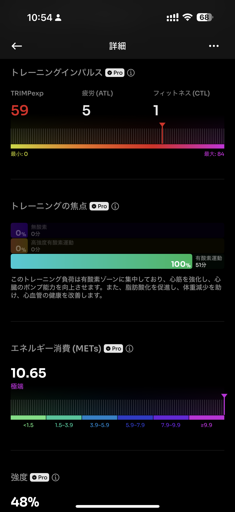
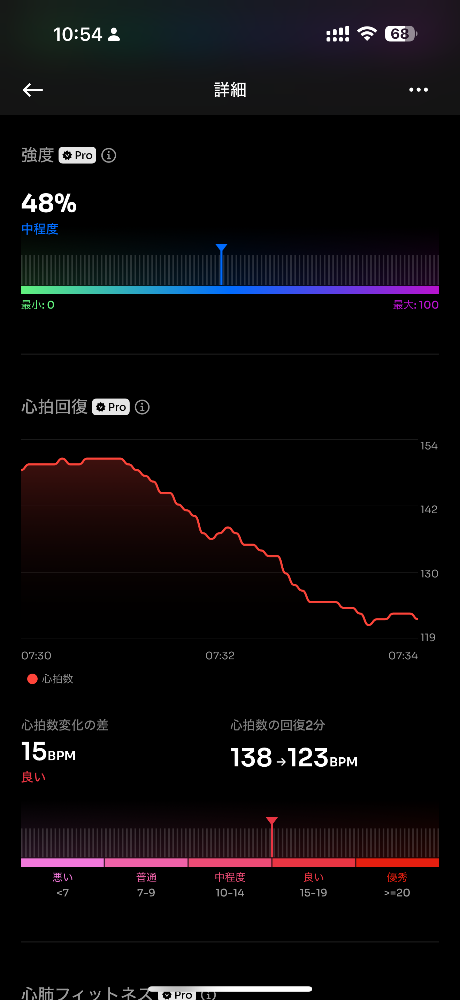
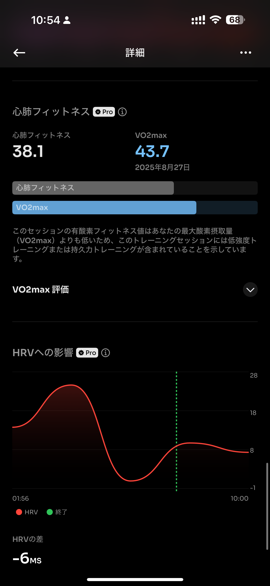

- 距離：9.13km
- 時間：00:51:18
- 平均心拍数：146
- 時間帯：6:41~
- 天候：晴れ
- コース：多摩川河川敷
- 補給：なし
- 睡眠：悪い
- 今日の目的：1000mインターバル4セット
- コメント：走れた！

## 📝 コーチコメント：
今日のインターバルは「狙った通りの負荷を正確にコントロールできた」理想的な内容でした！
特にペースの安定感（誤差±3秒/km以内）と、最後にしっかり上げ切れたことは大きな収穫です。

## 📸 写真一覧

