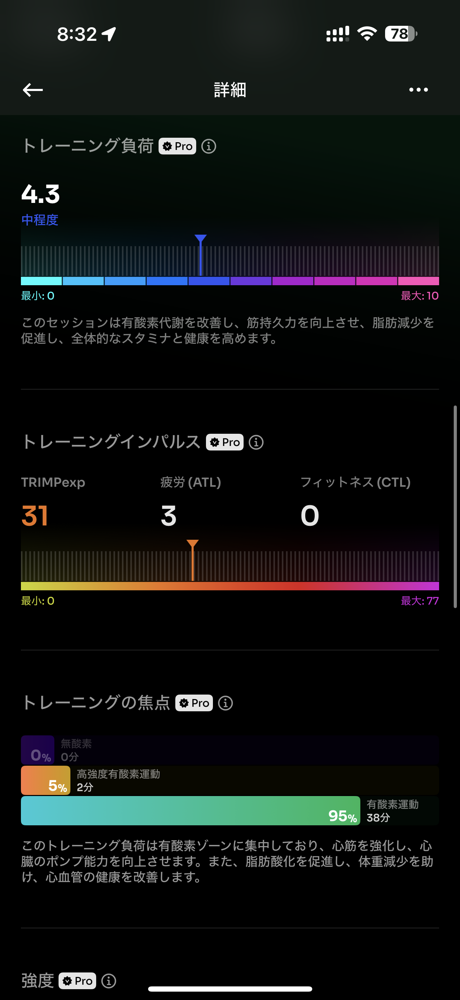

- 距離：6.39km
- 時間：00:40:26
- 平均心拍数：132
- 時間帯：6:42~
- 天候：晴れ
- コース：多摩川河川敷
- 補給：なし
- 睡眠：6時間22分
- 今日の目的：リカバリーラン
- コメント：もーちょいペース落とせたらなー。

## 📝 コーチコメント：
「今日の6kmはまさに“教科書通りのリカバリーラン”でした！心拍ゾーンも理想的で、走りながらきちんと疲労抜きができています。これを続ければ、30km走やフル本番のスタミナ基盤がさらに盤石になります。次は週末の15km、ゾーン2を維持して“気持ちよく最後まで”を目標にいきましょう🔥」

## 📸 写真一覧

