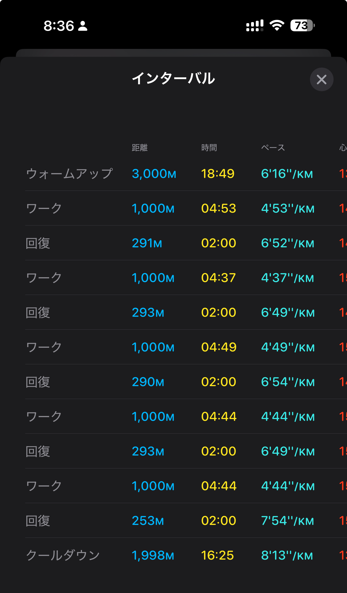

- 距離：11.72km
- 時間：01:10:54
- 平均心拍数：141
- 時間帯：06:34~
- 天候：曇りのち雨
- コース：多摩川河川敷
- 補給：なし
- 睡眠：5時間35分
- 今日の目的：1000mインターバル5セット
- コメント：やり切った！やり切ったぞー！

## 📝 コーチコメント：
今日は文句なしに「質の高いスピード刺激」になったね！✨
・ペース維持、心拍のコントロール、フォーム（ストライド拡大とピッチの維持）、すべてバランスが良い。
・特に 最後の2本をほぼ同じペースで走り切った安定感 は大きな自信につながる。
・30km走に向けた「脚のスピード耐性」「有酸素持久力の強化」にしっかり効いているよ。

## 📸 写真一覧

