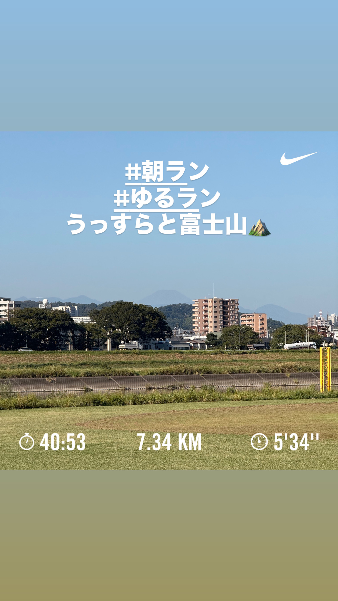
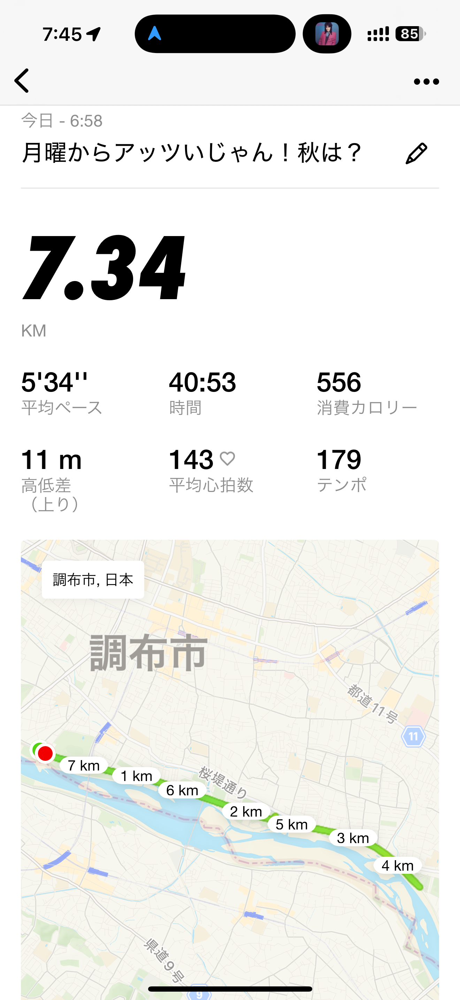
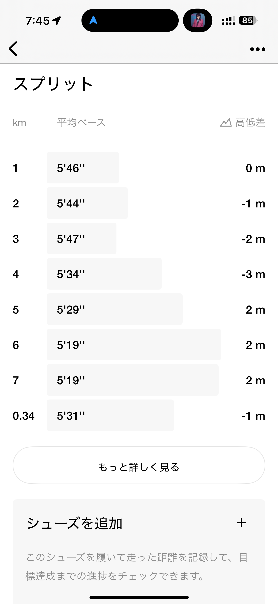
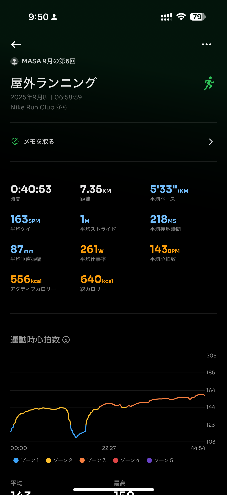
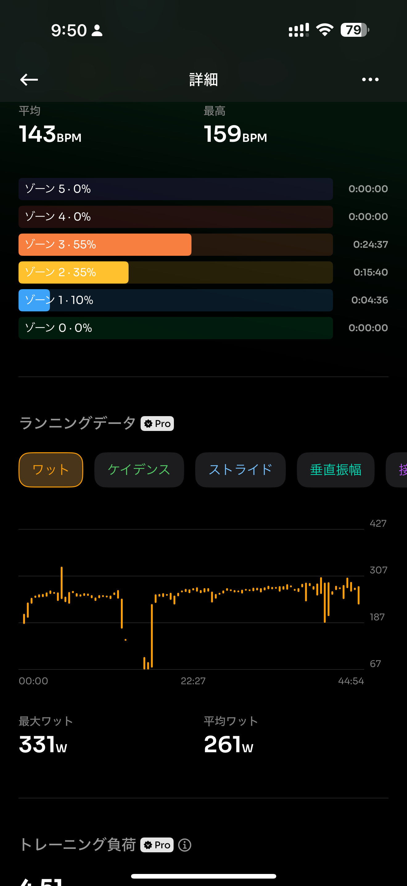
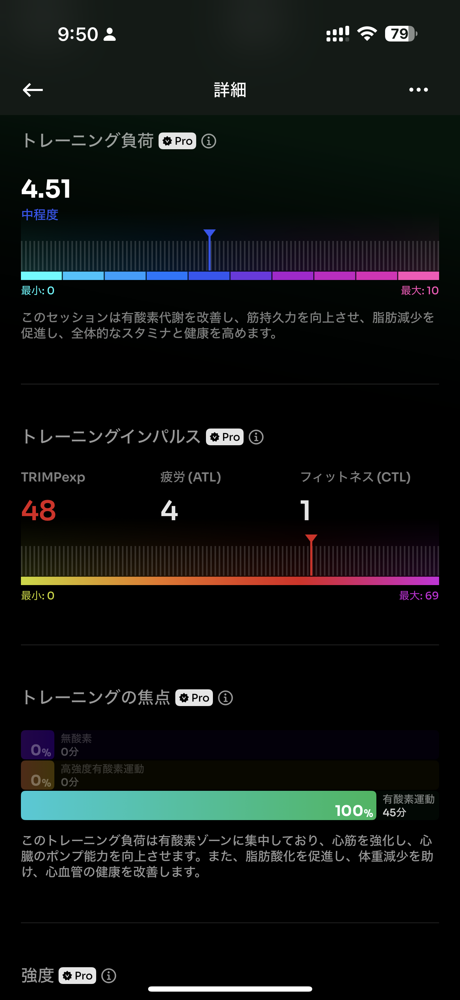
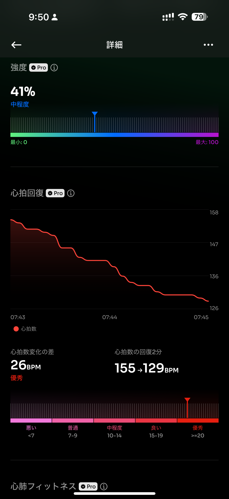
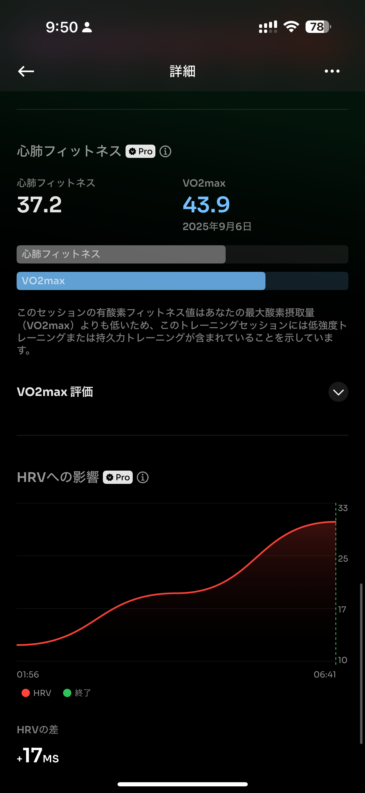

- 距離：7.34km
- 時間：00:40:53
- 平均心拍数：143
- 時間帯：6:58~
- 天候：晴れ
- コース：多摩川河川敷
- 補給：なし
- 睡眠：4時間42分
- 今日の目的：ジョグ
- コメント：とにかくジョグ

## 📝 コーチコメント：
今日のジョグは「身体をゆるめて走る」意識がとても良かったです 👍
土曜の30km走に向けて、ちょうどいいリズムで体を整えられました。暑さの中でも余裕を持って走れているのは、この夏の積み重ねの成果ですね。

## 📸 写真一覧

