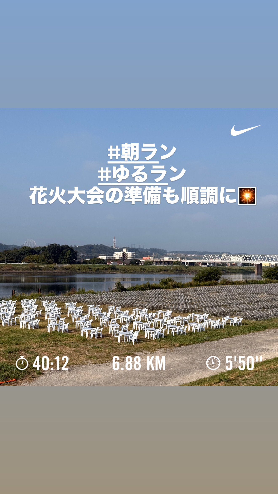
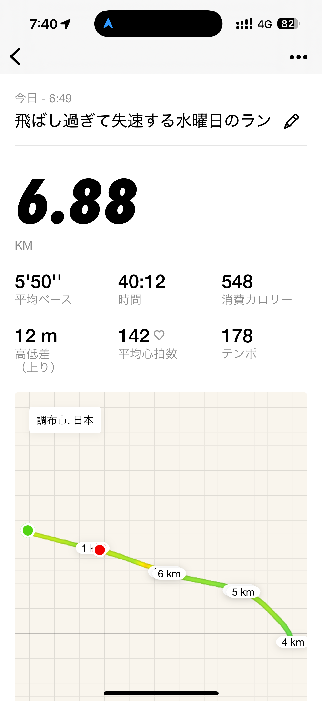
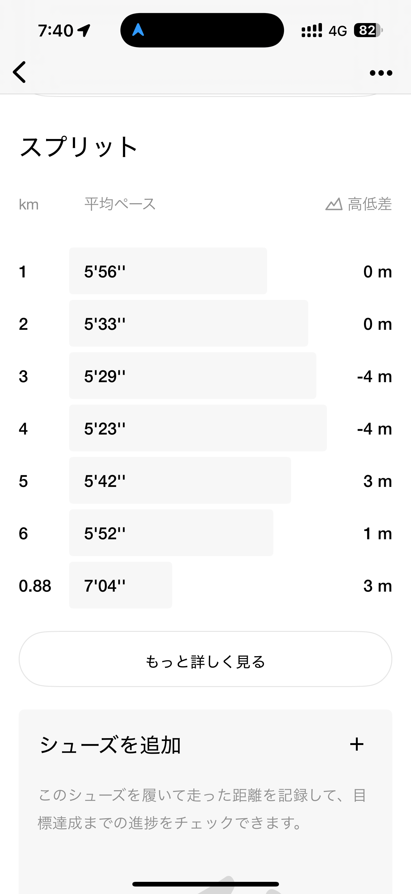
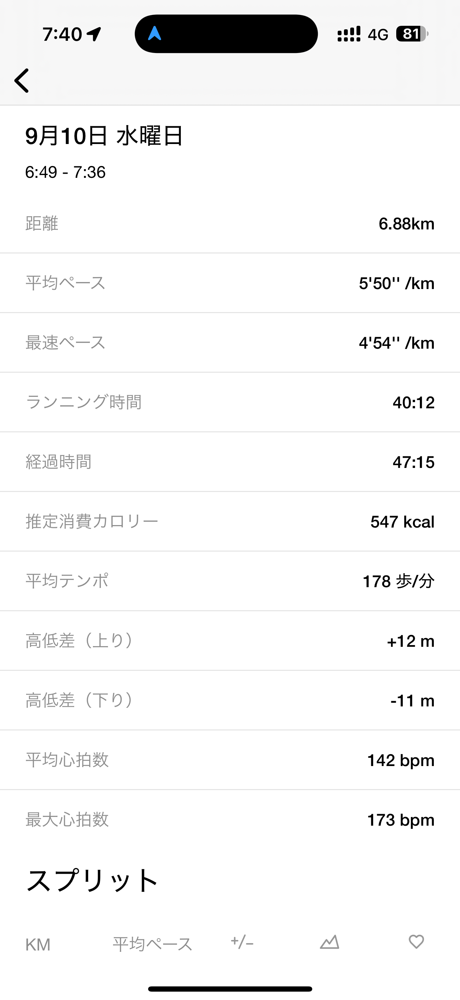
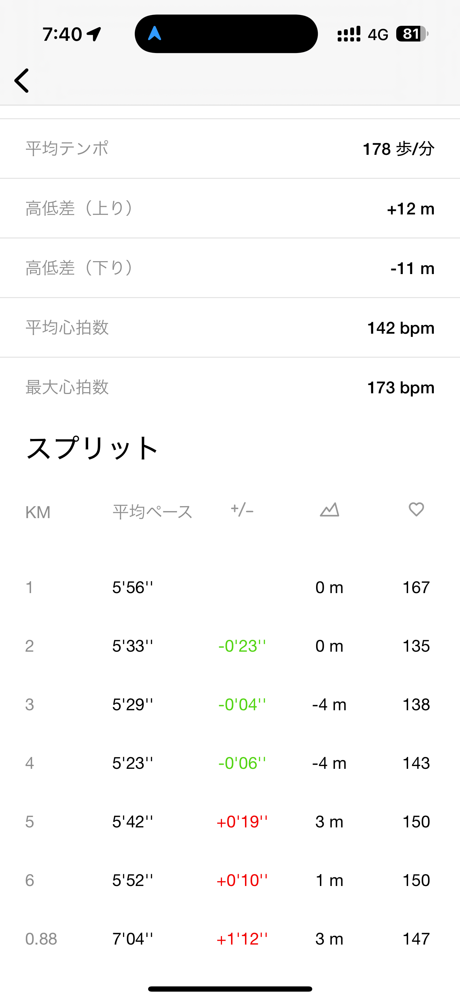
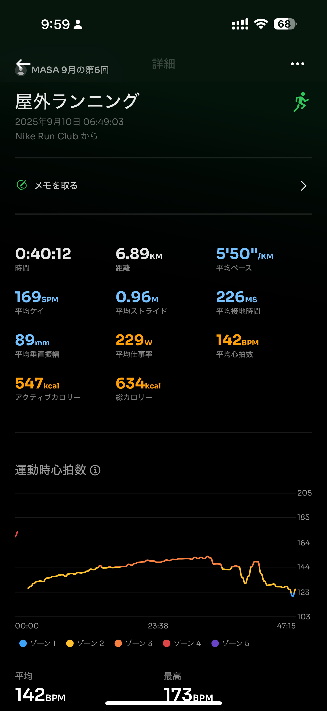
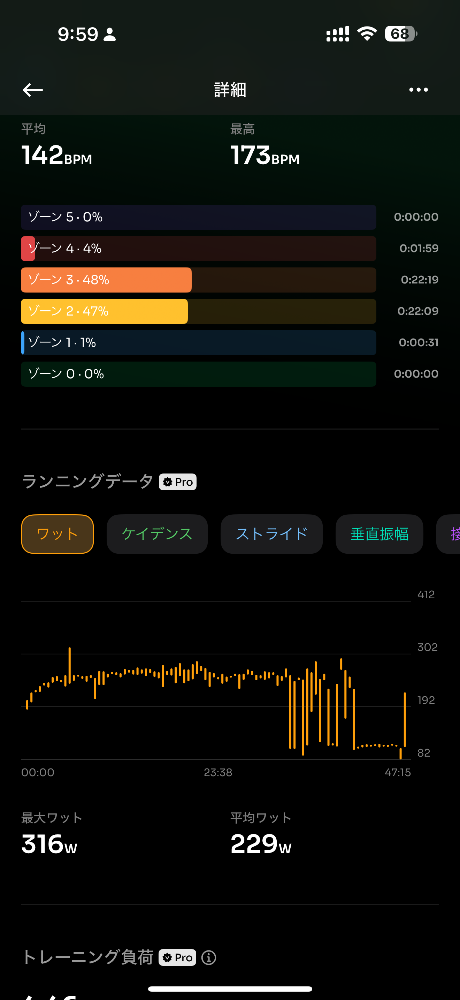
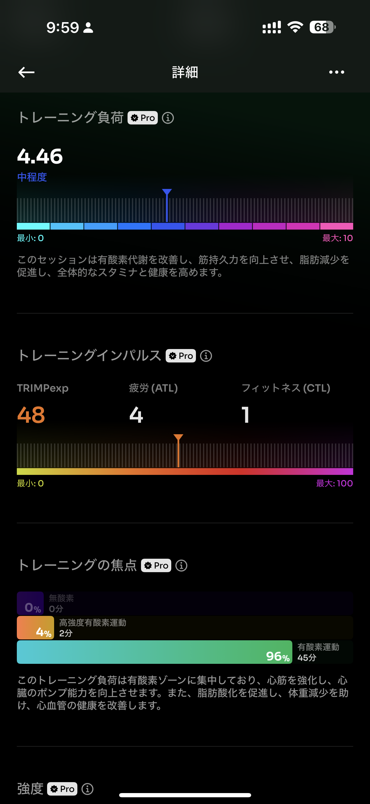
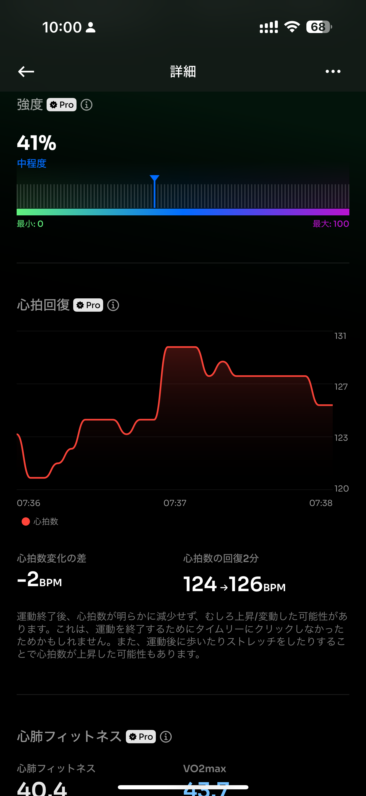
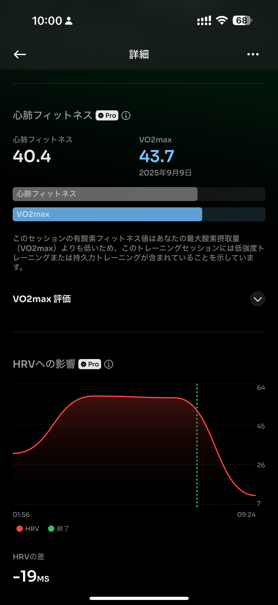

- 距離：6.88km
- 時間：00:40:12
- 平均心拍数：142
- 時間帯：6:49~
- 天候：晴れ
- コース：多摩川河川敷
- 補給：なし
- 睡眠：5時間53分
- 今日の目的：8kmぐらいジョグ
- コメント：ぜんぜん途中で失速してだめだった

## 📝 コーチコメント：
前半ビルドアップでリズム良し、終盤の失速も許容範囲で有酸素ジョグとして十分◎

## 📸 写真一覧

