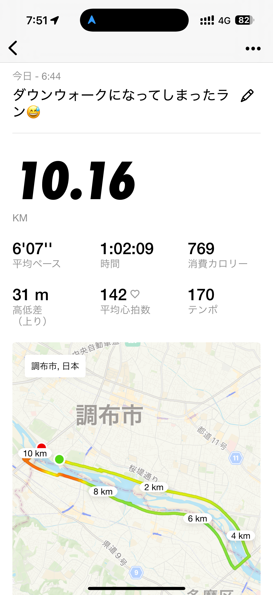
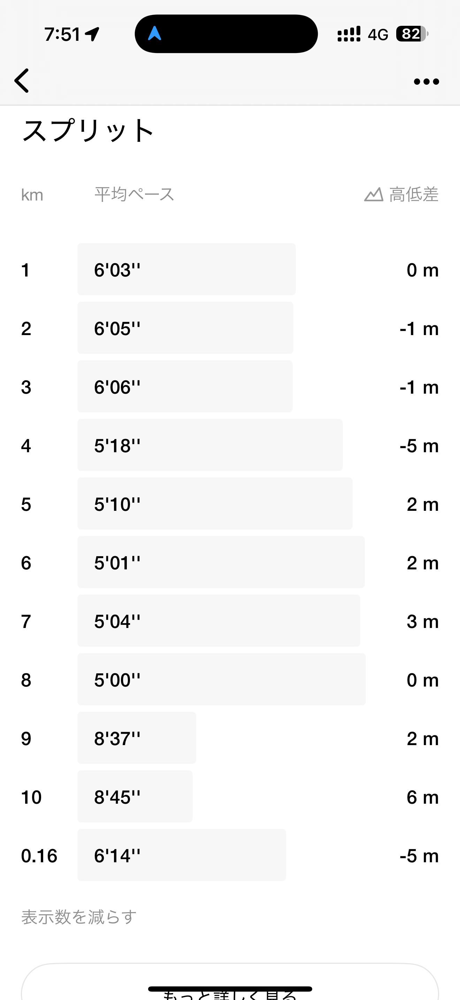
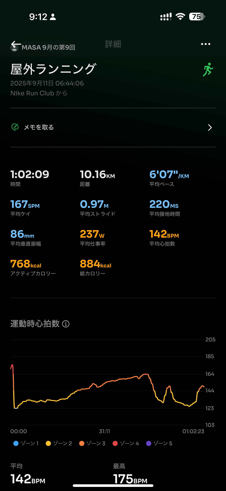
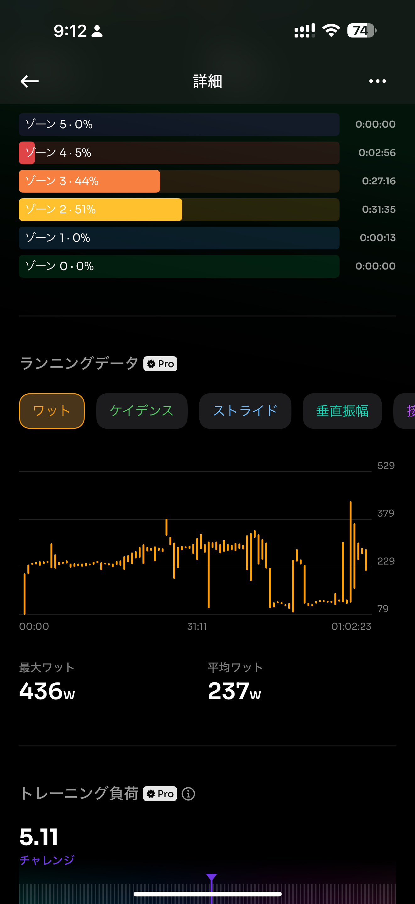
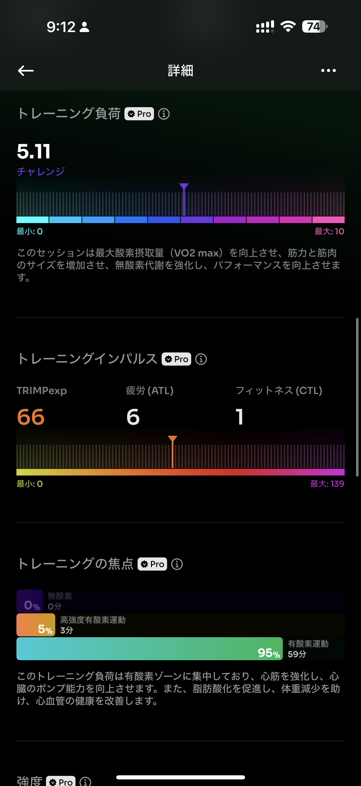
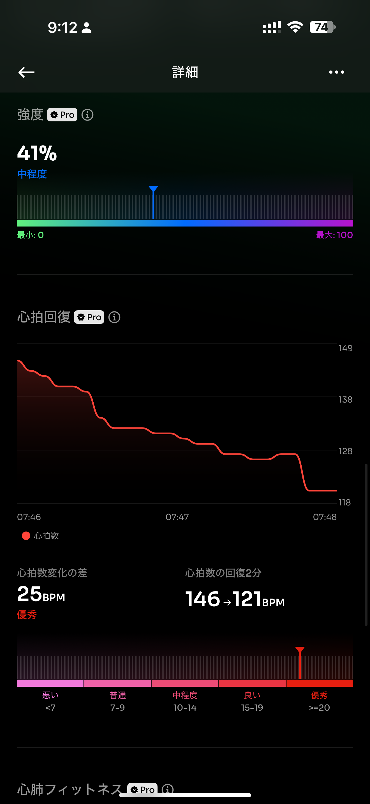
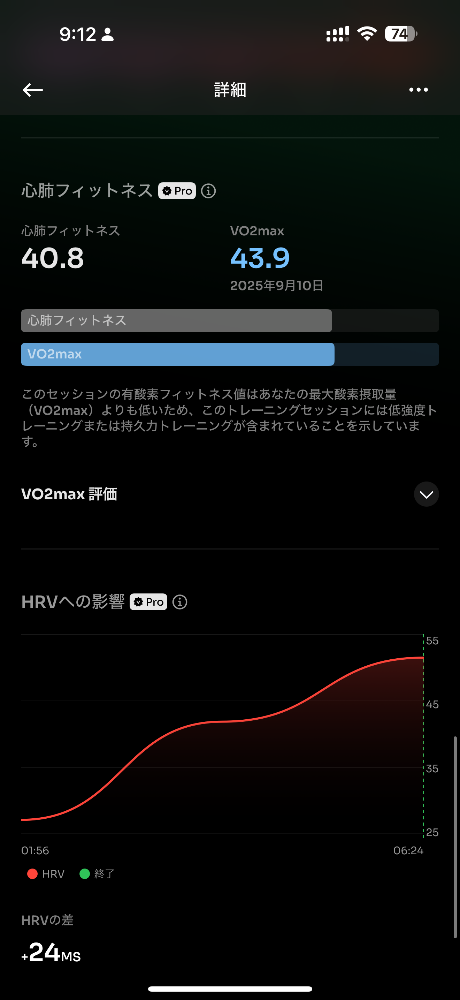

- 距離：10.16km
- 時間：01:02:09
- 平均心拍数：142
- 時間帯：6:44~
- 天候：晴れ
- コース：多摩川河川敷一周
- 補給：なし
- 睡眠：5時間57分
- 今日の目的：閾値走5km
- コメント：閾値走はできた。ダウンがウォークになってしまったｗ

## 📝 コーチコメント：
閾値区間をきれいに5分前後で揃えられ、理想的なアップ〜メイン〜ダウンの流れでした！✨

## 📸 写真一覧

