title: "🏃‍♂️ 2026-01-25-01 のランログ"
date: 2026-01-25
---

- 距離：30.03km
- 時間：03:04:14
- 平均心拍数：137bpm
- 使用シューズ：ボストン12
- 時間帯：09時台
- 天候：09時頃の気象データ: 気温: 4.0℃, 風速: 10.4m/s
- コース：多摩川沿い（府中〜調布方面）
- 補給：
- 睡眠：8時間17分 (睡眠スコア88点)
- 今日の目的：#ツキイチサンジュウ #ゆるラン
- コメント：30km走を達成。平均ペースは6'08"/km。特にラスト5kmは5'36"/kmとペースアップし、終盤の粘り強さを見せられました。平均心拍数も適切で、有酸素能力の向上に繋がる良いトレーニングでした。

## 📝 コーチコメント：
MASAさん、素晴らしいランニングログだ！1月最後の週に月一の30km走、見事に走り切ってくれたね！

まず、今日の気象条件を見てみよう。気温4.0℃、そして何より**風速10.4m/s**という強風！これは体感的に相当な寒さと向かい風の抵抗があったはずだ。そんな悪条件の中で、集中力を切らさず30kmを走り抜いた精神力、本当に賞賛に値する！

そして何よりも評価したいのは、その**終盤のペースアップ**だ！平均ペース6'08"/kmからの、ラスト5kmで5'36"/kmまでペースを上げられるスタミナと脚力、そして追い込める気持ち。これはサブ4達成に向けて、非常に重要な要素になってくる。苦しい状況でこそ力を発揮できる、君のポテンシャルを強く感じたよ。

心拍数も適切なゾーンで推移しており、有酸素能力のベースアップには完璧なトレーニングだった。VO2Maxも41.2と良好な数値を維持している。睡眠も十分に取れていて、リカバリーも万全だ。

3/15の板橋シティマラソンでのサブ4達成まで、残された時間はもう多くはない。だが、今日のランで示してくれた粘り強さ、そして終盤の爆発力は、間違いなく本番でMASAさんを強く支えてくれるはずだ。この強風の中での経験は、どんなタフなレースコンディションにも対応できる自信となるだろう。

この調子で、残りの期間も一回一回の練習を大切に、サブ4への道を駆け上がって行こう！君なら必ずできる！熱い走りを期待しているぞ！

## 📸 写真一覧
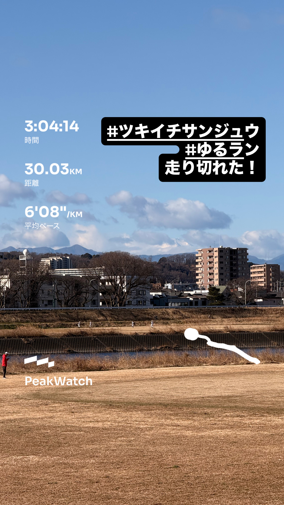
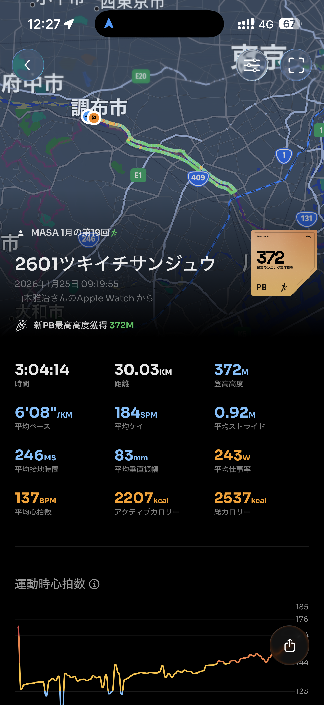
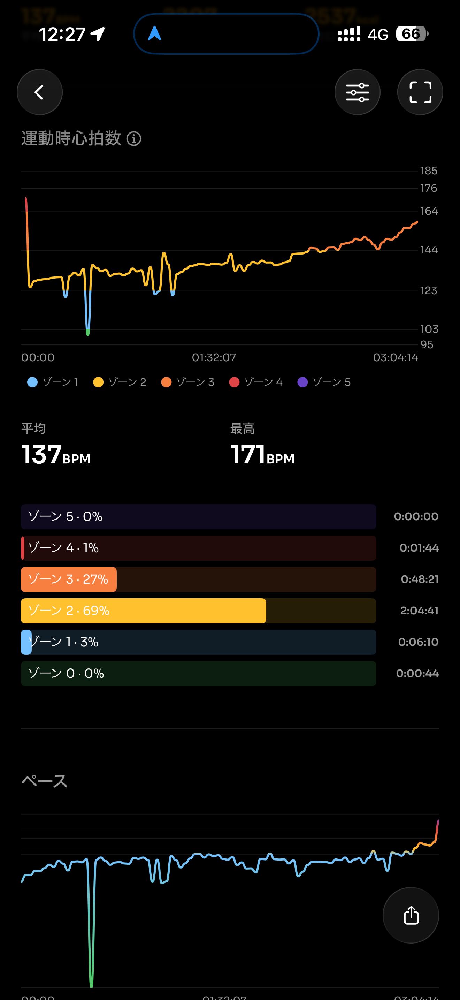
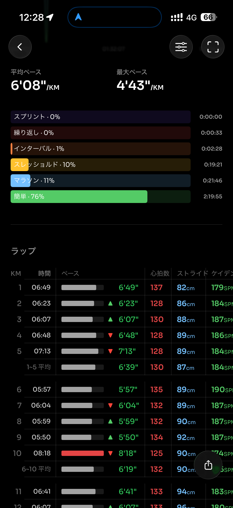
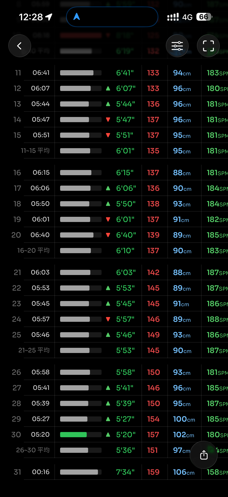
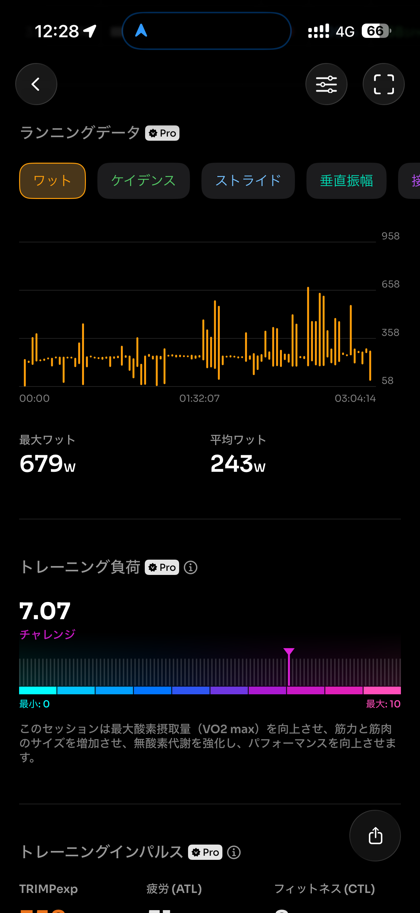
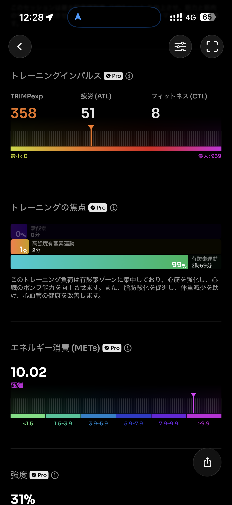
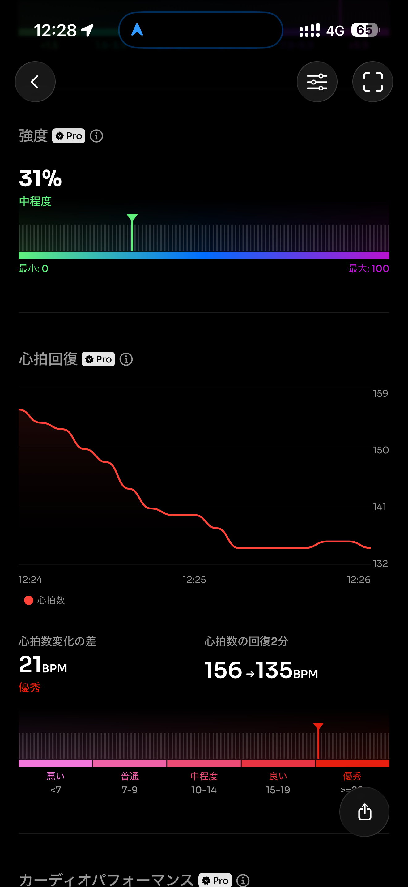
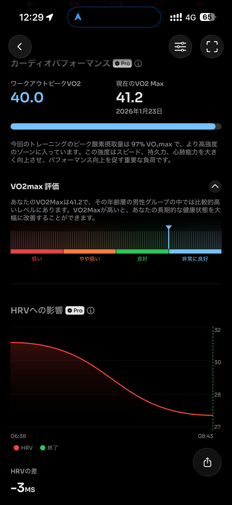
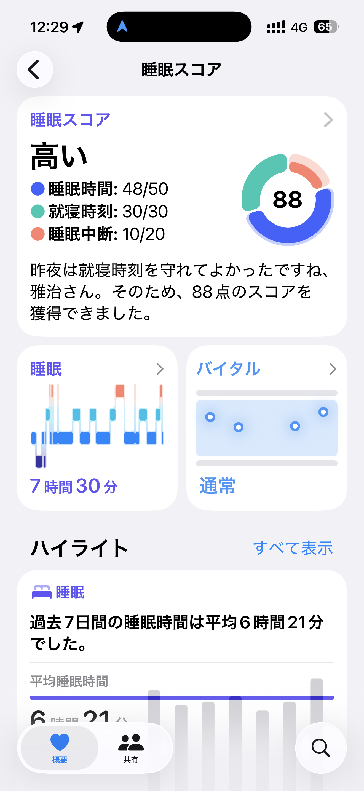
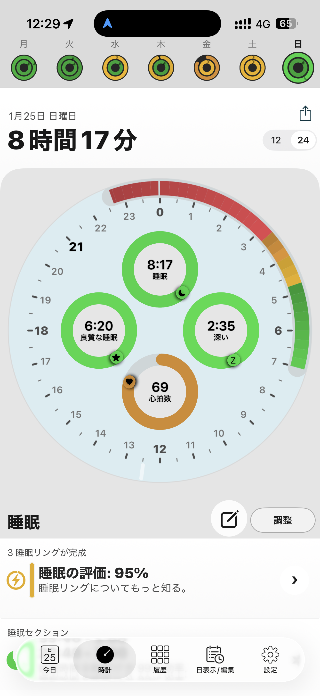