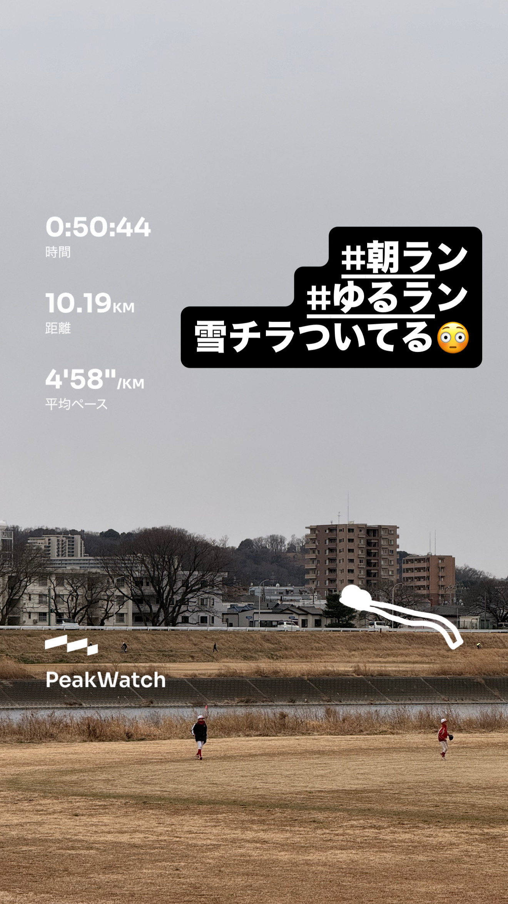
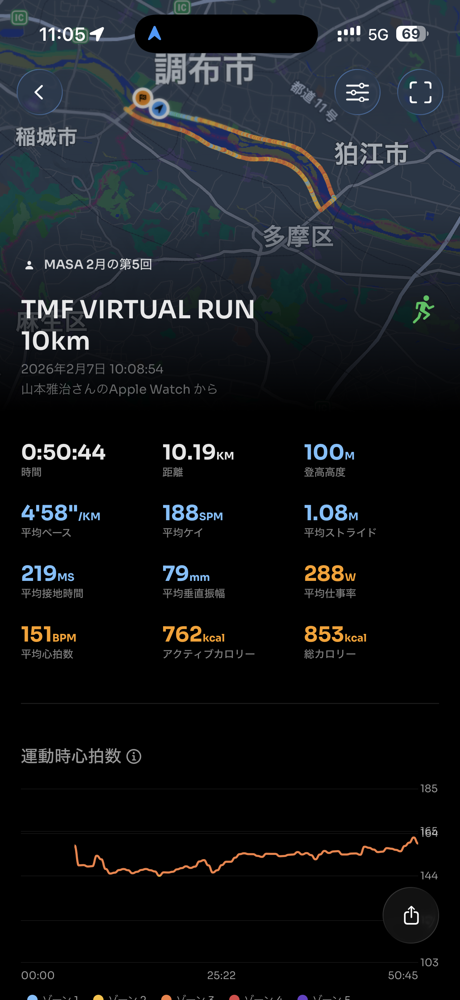
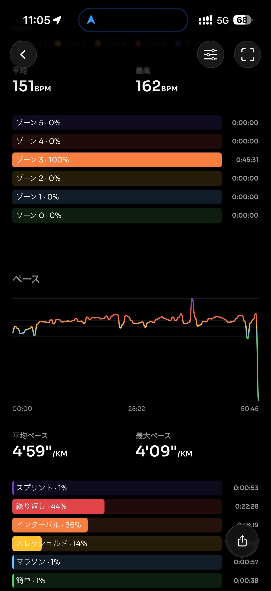
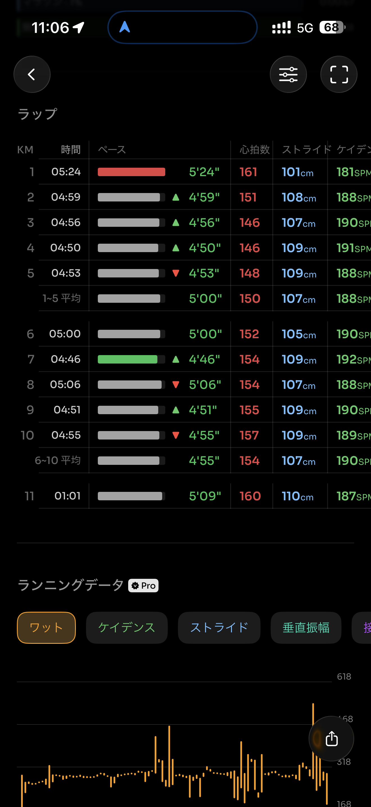
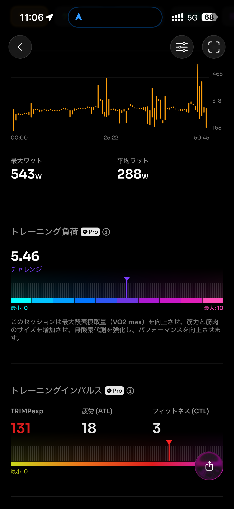
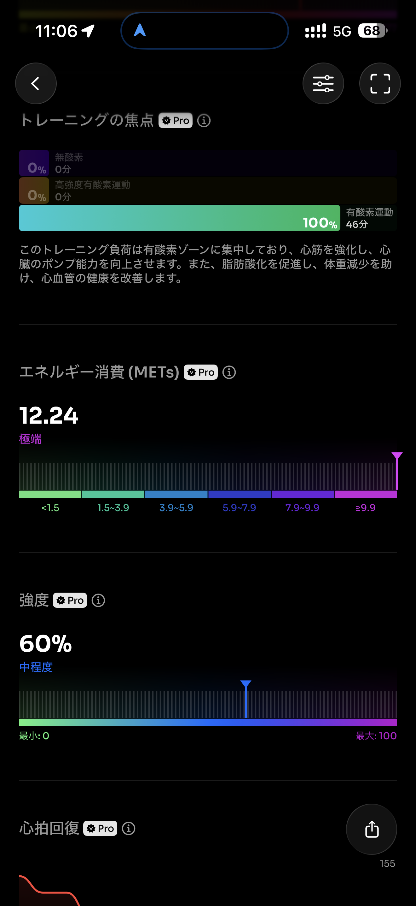
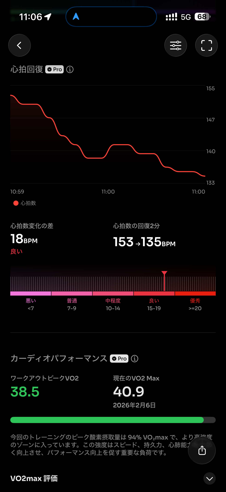
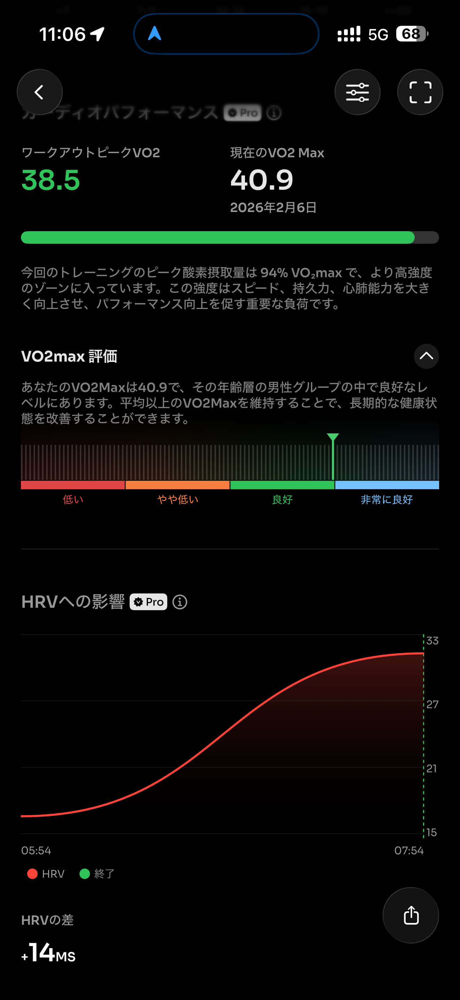
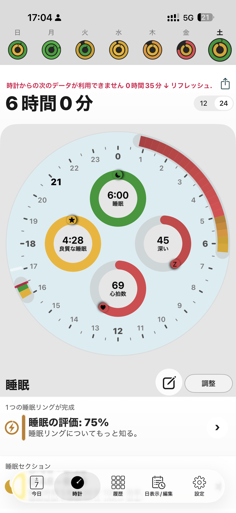
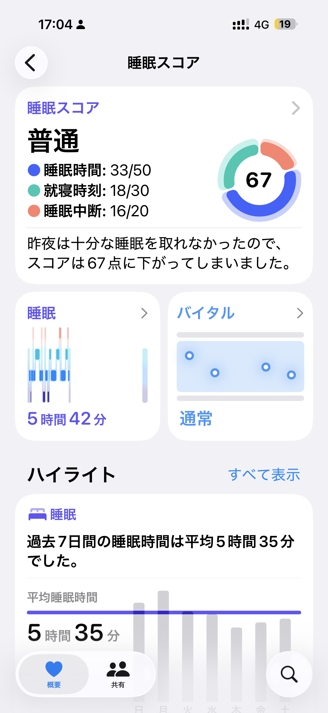

- 距離：10.19km
- 時間：0:50:44
- 平均心拍数：151BPM
- 使用シューズ：マジックスピード4
- 時間帯：10時
- 天候：10時頃: 気温: 2.5℃, 風速: 10.7m/s
- コース：TMF VIRTUAL RUN 10km
- 補給：不明
- 睡眠：6時間0分
- 今日の目的：不明
- コメント：雪チラついてる🥶

## 📝 コーチコメント
板橋シティマラソンでのサブ4達成、素晴らしい目標ですね！まず、現在のランニングデータを見ると、平均ペースが4'58"/km。サブ4達成には、平均ペースを5'40"/km程度に保つ必要があります。

そこで、練習メニューを見直しましょう。週に1回、15〜20kmの距離走を取り入れ、目標ペースを意識してください。次に、インターバルトレーニングでスピード強化を図りましょう。400m×5〜8本を、全力に近いスピードで走り、間に短い休憩を挟むのが効果的です。

また、筋力トレーニングも重要です。体幹を鍛えることで、フォームが安定し、効率的な走りが可能になります。プランクやスクワットなどを取り入れましょう。

最後に、疲労回復も忘れずに。質の高い睡眠を確保し、栄養バランスの取れた食事を心がけてください。レース2週間前からは、疲労を蓄積させないように、練習量を調整しましょう。頑張ってください！

## 📸 写真一覧

