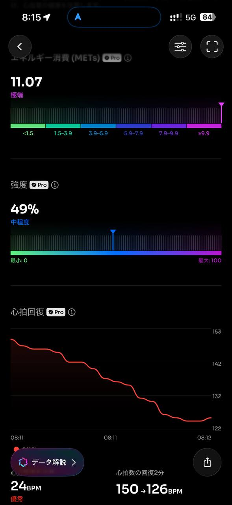

- 距離：
- 時間：
- 平均心拍数：
- 使用シューズ：スーパーノヴァ
- 時間帯：朝
- 天候：取得失敗
- コース：
- 補給：
- 睡眠：
- 今日の目的：
- コメント：

## 📝 コーチコメント
MASAさん、おはようございます！
ニューイヤーハーフマラソンでの1時間57分台、素晴らしい記録ですね！
直近の目標である板橋Cityマラソンに向けて、良い状態をキープできていますね。
過去の横浜マラソンでは4時間25分台でしたが、今回の目標に向けて、さらにペース配分を意識した練習を取り入れてみましょう。
特に30km走を重点的に行い、後半のペースダウンを防ぐ戦略を立てるのがおすすめです。
情熱ハーフマラソンや豊洲ハーフマラソンの経験も活かし、自信を持ってスタートラインに立ってください！
応援しています！

## 📸 写真一覧
