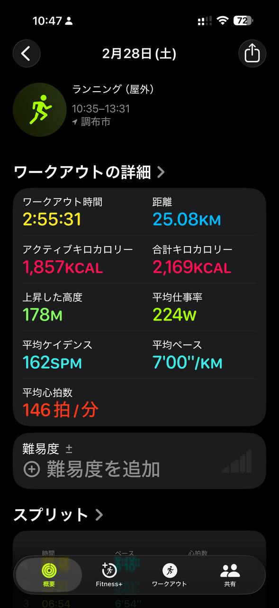

- 距離：25.08km
- 時間：2:55:31
- 平均心拍数：146拍/分
- 使用シューズ：スーパーノヴァ
- 時間帯：午前
- 天候：10時頃 晴れ 気温15.9℃ 風速9.3m/s
- コース：調布市
- 補給：
- 睡眠：
- 今日の目的：
- コメント：

## 📝 コーチコメント
MASAさん、素晴らしいランニングですね！25kmを3時間弱で走破されるとは、スタミナも十分です。平均心拍数も146と安定しており、効率の良いランニングができている証拠でしょう。3月の板橋Cityマラソンに向けて、着々と準備が進んでいますね。過去のレース実績を見ると、ハーフマラソンでは1時間57分台、フルマラソンでは4時間25分台を記録されています。目標レースに向けて、ペース配分や給水など、具体的な戦略を立てて練習に取り組むと、自己ベスト更新も夢ではありません。特に、30km走など、長距離を走る練習を取り入れると、後半の失速を防ぐことができるでしょう。頑張ってください！

## 📸 写真一覧
