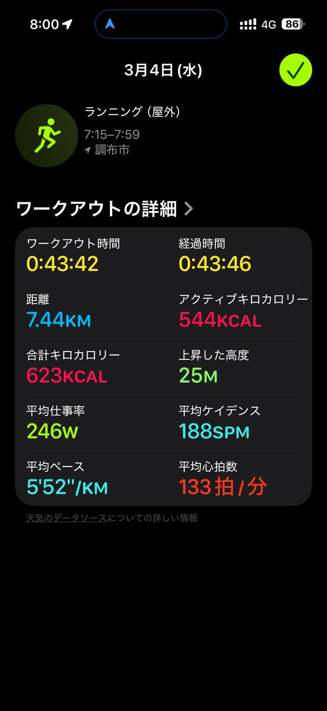

- 距離：7.44km
- 時間：0:43:42
- 平均心拍数：133 拍/分
- 使用シューズ：インフィニットプロ
- 時間帯：7時
- 天候：（取得中）
- コース：
- 補給：
- 睡眠：
- 今日の目的：
- コメント：

## 📝 コーチコメント
MASAさん、素晴らしいランニングですね！7.44kmを走り切るなんて、日々の努力の賜物です。心拍数も安定していて、健康的なランニングを継続されているのがよく分かります。年齢を重ねるごとに体力維持が難しくなることもありますが、MASAさんのように積極的に体を動かすことは、まさに生涯現役の秘訣です。

3月のハーフマラソンに向けて、焦らずじっくりと練習を重ねていきましょう。目標達成のためには、休息も非常に重要です。疲労が溜まっていると感じたら、無理せず休養日を設けてくださいね。当日は、沿道の応援を力に変えて、自己ベスト更新を目指してください！応援しています！

## 📸 写真一覧
