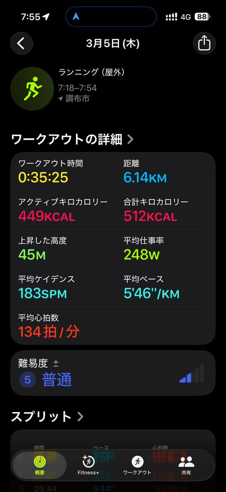

- 距離：6.14km
- 時間：0:35:25
- 平均心拍数：134拍/分
- 使用シューズ：スーパーノヴァ
- 時間帯：朝
- 天候：7時頃 快晴 気温5.4℃ 風速20.3m/s
- コース：調布市
- 補給：
- 睡眠：（睡眠データの写真が添付されていません）
- 今日の目的：
- コメント：

## 📝 コーチコメント
MASAさん、3月5日のランニングお疲れ様でした！板橋Cityマラソンに向けて良い練習になっていますね。6.14kmを35分25秒、平均ペース5分46秒/kmは、まずまずのペースです。平均心拍数が134拍/分と比較的安定しているので、ジョギングペースとしては適切でしょう。直近のハーフマラソンの記録から考えると、フルマラソンに向けてもう少しペースを上げていく必要がありそうです。インターバルトレーニングやペース走を取り入れて、心肺機能を強化していきましょう。特に、目標レースである板橋Cityマラソンまで残り少ないので、疲労を考慮しながら計画的に練習を進めてください。睡眠時間をしっかり確保し、疲労回復に努めることも重要です。頑張ってください！

## 📸 写真一覧
