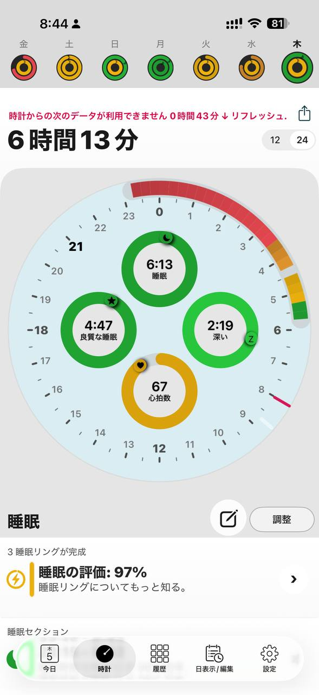

- 距離：6.14km
- 時間：0:35:25
- 平均心拍数：134
- 使用シューズ：スーパーノヴァ
- 時間帯：朝
- 天候：取得失敗
- コース：調布市
- 補給：
- 睡眠：6時間13分, 97%
- 今日の目的：
- コメント：

## 📝 コーチコメント
MASAさん、調布市での朝ランお疲れ様でした！6.14kmを35分で走破、平均心拍数134BPMと、良いペースで走れていますね。VO2Maxも41.7と良好な状態を維持されており、3月の板橋Cityマラソンに向けて順調な仕上がりを感じます。睡眠も6時間以上確保されており、質の高い睡眠を維持できていることも素晴らしいです。ハーフマラソンの自己ベストに近い記録も出ており、今回の練習での心拍数の上がり具合から見ても、フルマラソンでの目標達成も期待できます。レースまであと少し、体調を整えつつ、自信を持って臨んでください！応援しています！

## 📸 写真一覧

