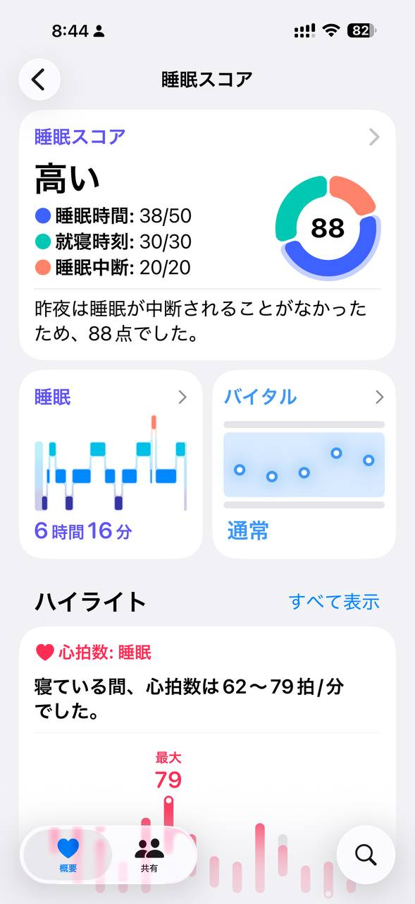
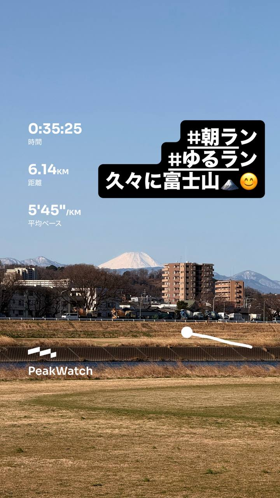
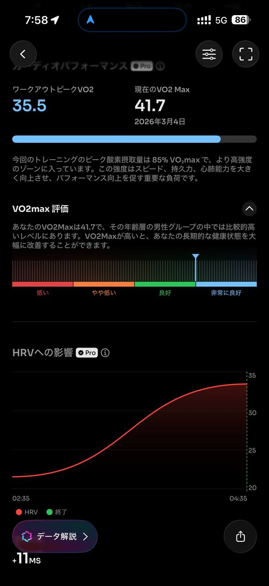
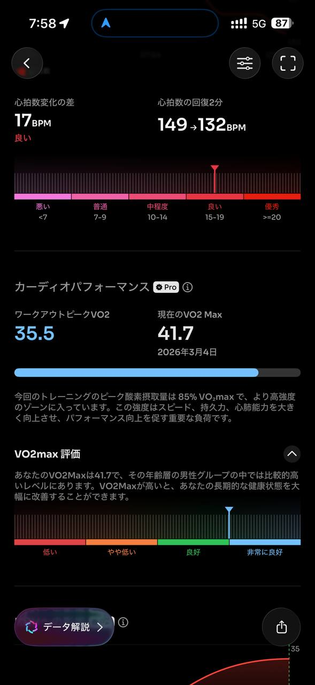
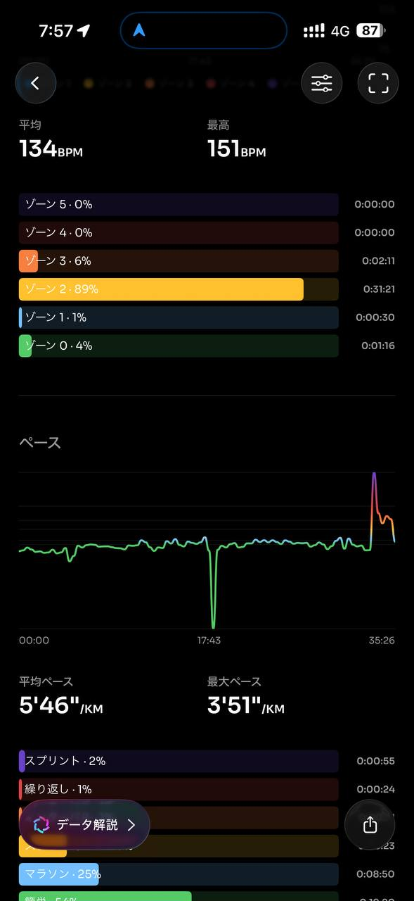
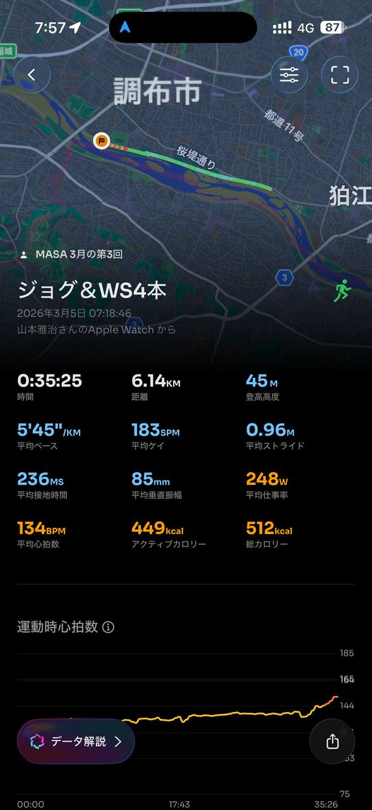

- 距離：6.14km
- 時間：0:35:25
- 平均心拍数：134
- 使用シューズ：スーパーノヴァ
- 時間帯：朝
- 天候：取得失敗
- コース：調布市
- 補給：
- 睡眠：睡眠時間:6時間13分, 睡眠スコア:97%
- 今日の目的：
- コメント：

## 📝 コーチコメント
MASAさん、3月5日の調布市でのジョギング＆WS4本、お疲れ様でした！距離6.14kmを35分25秒、平均心拍数134で走られたんですね。VO2maxも41.7と良好な状態をキープされていますね。心肺機能も向上しているのが伺えます。ラップデータを見ると、ペースが安定しているので、良いトレーニングになったのではないでしょうか。直近の目標レースである板橋Cityマラソンに向けて、距離を伸ばす練習と疲労を溜めないように睡眠をしっかりとるようにしてください。睡眠時間は6時間13分とれていますが、睡眠スコア97%と高いので睡眠の質は良いようです。この調子で頑張ってください！

## 📸 写真一覧

