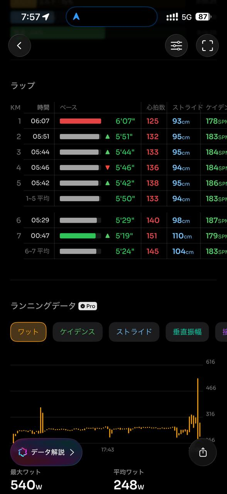
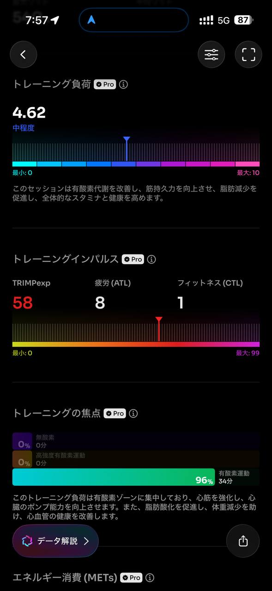
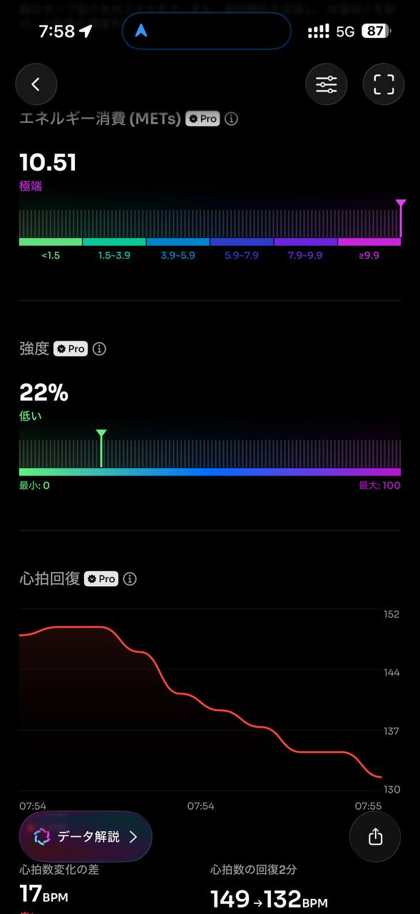

- 距離：6.14km
- 時間：0:35:25
- 平均心拍数：134拍/分
- 使用シューズ：スーパーノヴァ
- 時間帯：7時頃
- 天候：7時頃 快晴 気温5.4℃ 風速20.3m/s
- コース：調布市
- 補給：
- 睡眠：6時間13分 スコア:97
- 今日の目的：
- コメント：

## 📝 コーチコメント
MASAさん、データ確認しました。富士山を眺めながらの朝ラン、気持ちよさそうですね！直近のランニングデータを見ると、平均ペースが5'45"/km、平均心拍数も134bpmと、ウォーミングアップや疲労抜きには最適な強度です。特に心拍数がゾーン2に集中しており、有酸素能力の向上に効果的なトレーニングが出来ていることが分かります。

ラップごとのデータを見ると、後半にペースアップしており、良い刺激になっていますね。VO2maxも年齢層の平均より高い数値を示しており、心肺機能も良好です。トレーニング負荷も中程度で、疲労の蓄積も少ないと考えられます。

睡眠データも確認しましたが、睡眠時間・質ともに良好ですね。睡眠中の心拍数も安定しており、リカバリーも順調です。

3月15日の板橋Cityマラソンに向けて、この調子で調整していきましょう。今後は、もう少し強度を高めた練習も取り入れ、レースペースでのランニングも意識的に行うと良いでしょう。特に30km走などで、後半のペース維持を意識した練習を取り入れることをお勧めします。引き続きデータを確認しながら、最適なプランを立てていきましょう！

## 📸 写真一覧

