- 距離：6.23km
- 時間：0:36:19
- 平均心拍数：134BPM
- 使用シューズ：インフィニットプロ
- 時間帯：朝
- 天候：(解析中)
- コース：
- 補給：
- 睡眠：6時間9分
- 今日の目的：
- コメント：

## 📝 コーチコメント
MASAさん、おはようございます！2026年3月6日のランニング、お疲れ様でした！6.23kmを36分19秒、平均心拍数134BPMという記録、素晴らしいですね。朝の清々しい空気の中、インフォニットプロを履いてのランニングは、きっと気持ちよかったことでしょう。

平均心拍数が安定しているところを見ると、リラックスして走れているのがよくわかります。ランニングは心身のリフレッシュに最適ですから、これからも無理なく続けてくださいね。

ハーフマラソン完走に向けて、着々と準備を進めているMASAさんを心から応援しています！目標に向かって努力する姿は、周りの人にも良い影響を与えます。これからも、健康に気を付けて、ランニングを楽しんでください！応援しています！

## 📸 写真一覧
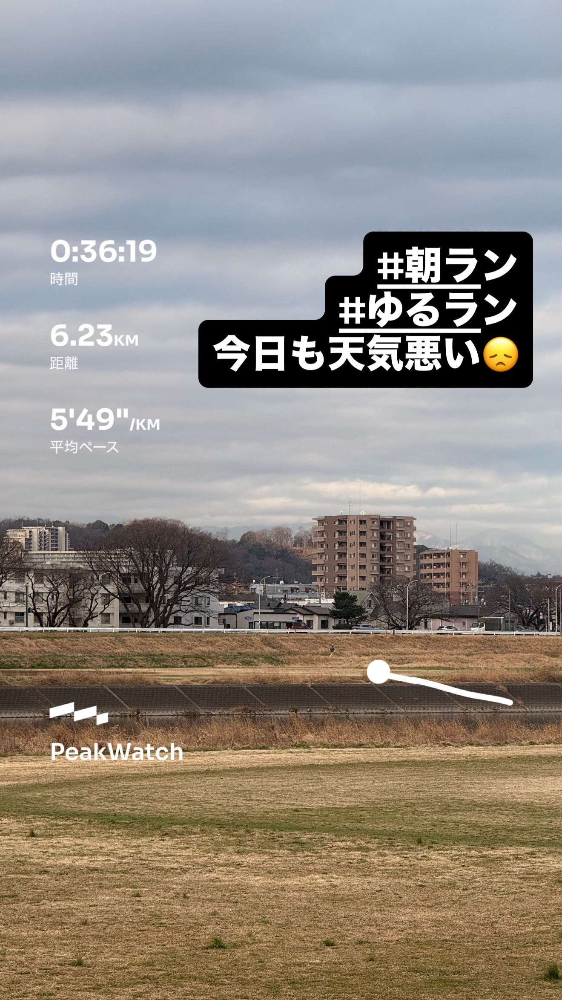
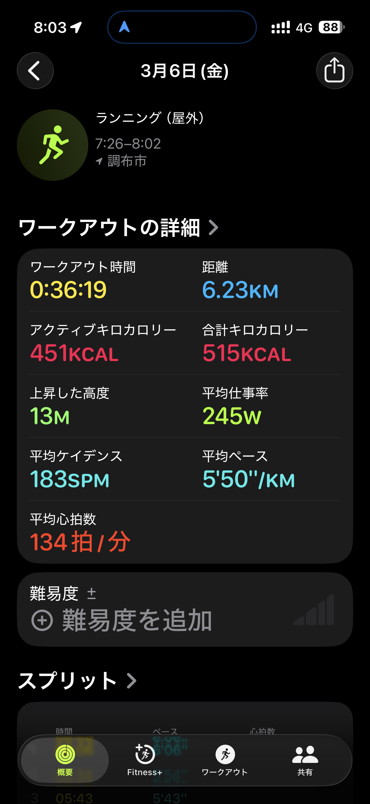
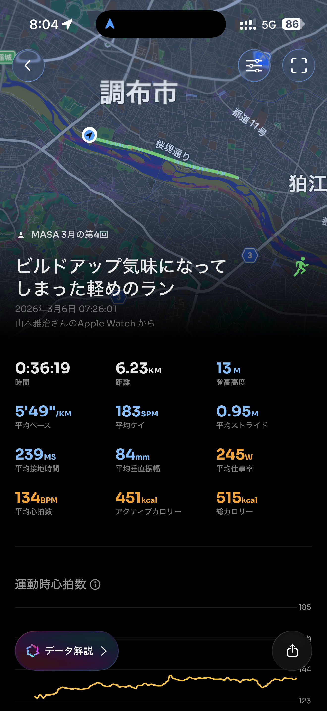
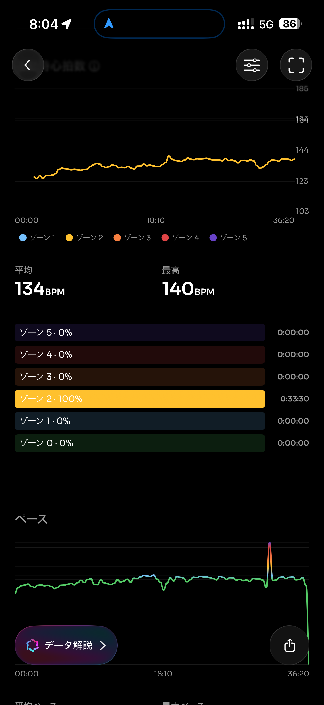
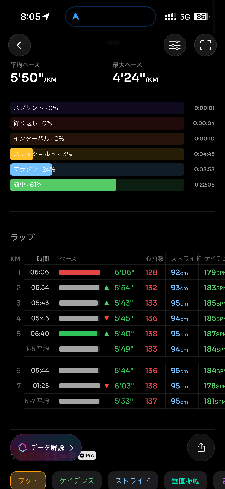
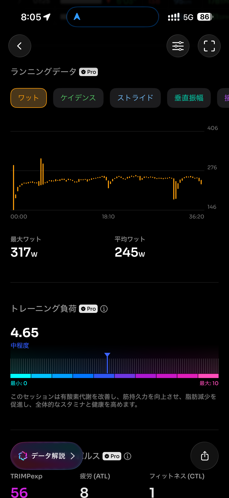
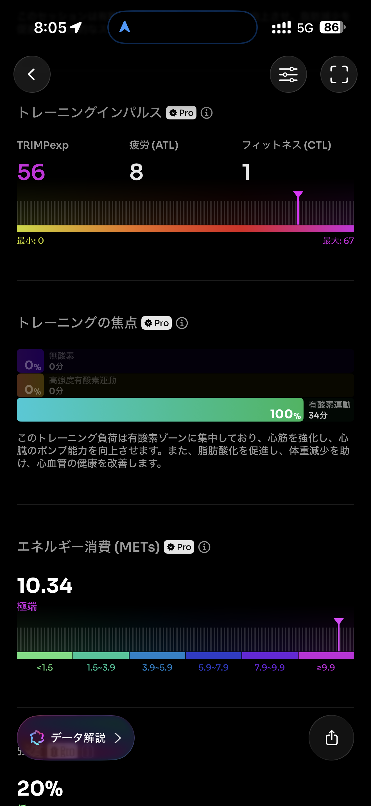
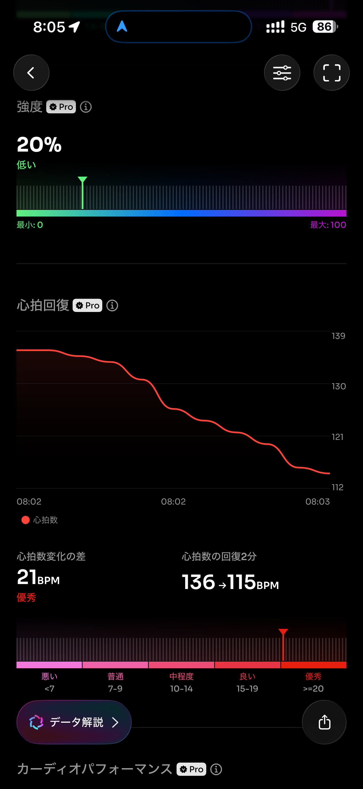
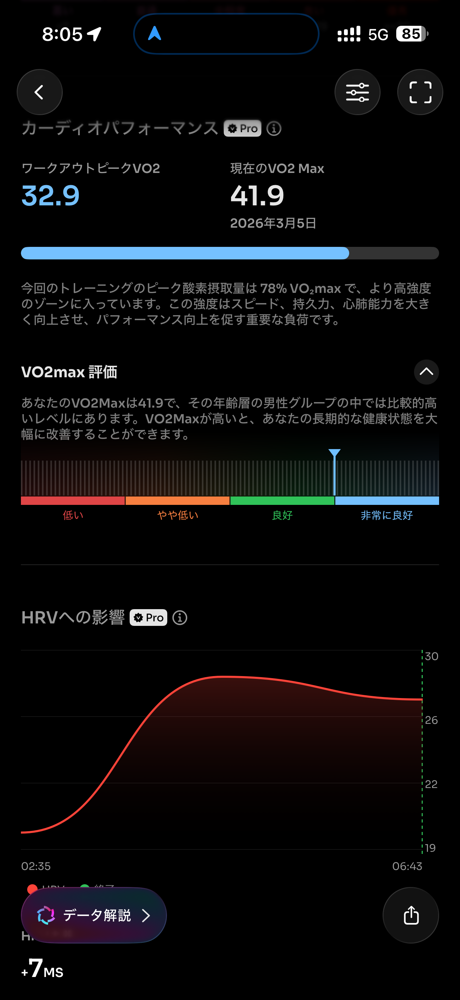
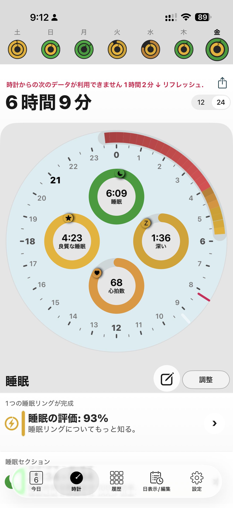
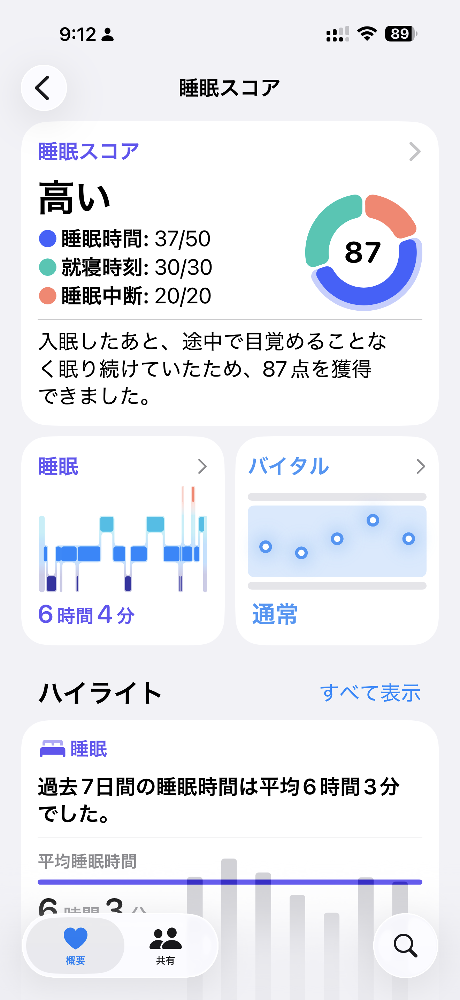
