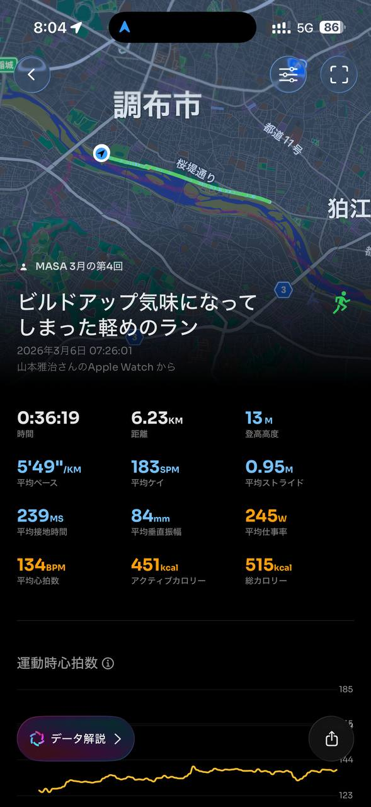
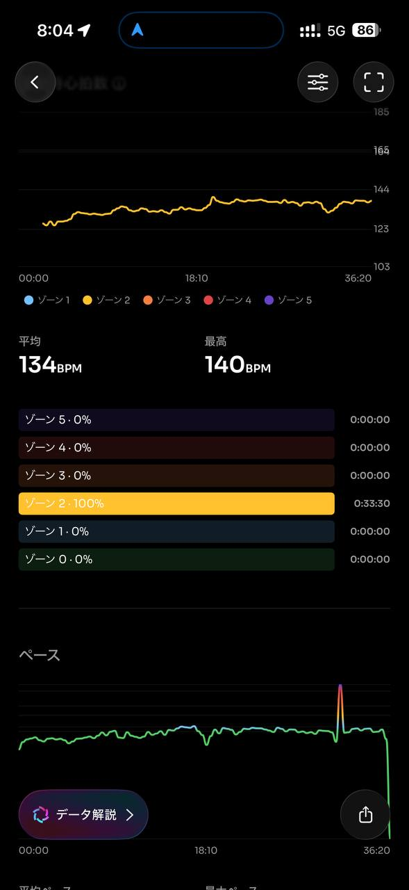
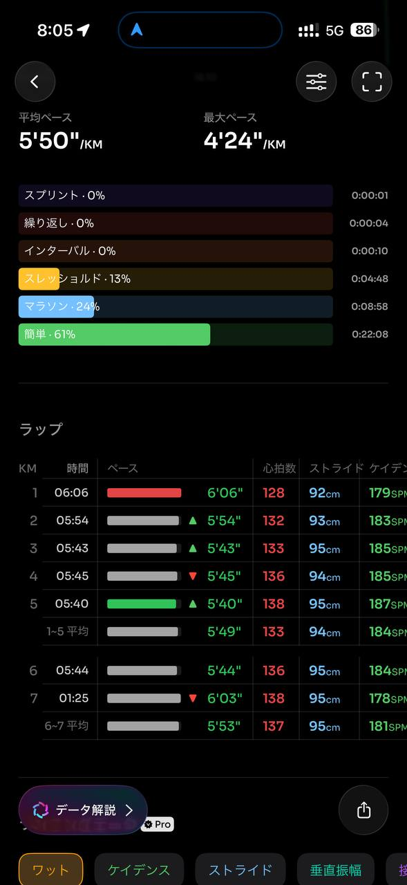
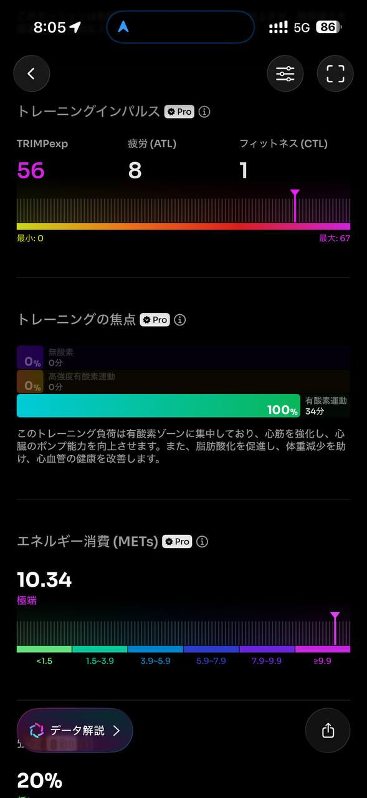
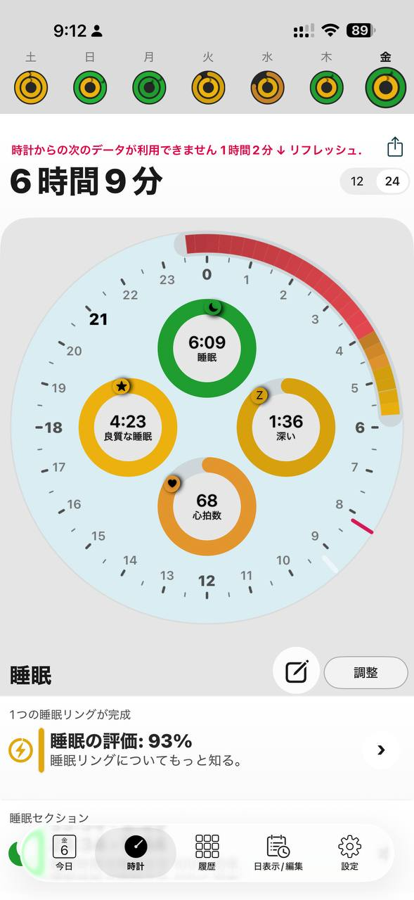
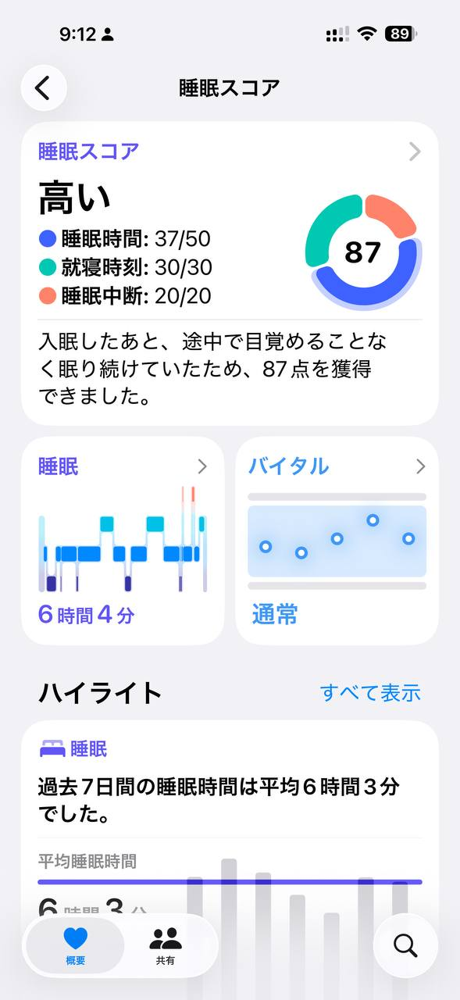

- 距離：6.23km
- 時間：0:36:19
- 平均心拍数：134拍/分
- 使用シューズ：インフィニットプロ
- 時間帯：7時頃
- 天候：7時頃 快晴 気温3.4℃ 風速5.8m/s
- コース：調布市
- 補給：
- 睡眠：6時間4分, 87
- 今日の目的：
- コメント：

## 📝 コーチコメント
MASAさん、データ確認しました。板橋Cityマラソンに向けて、順調に調整が進んでいるようですね！

3月6日のランニングデータを見ると、6.23kmを平均5'50"/kmペースで走られていますね。心拍数も平均134bpmとゾーン2に収まっており、有酸素運動能力の向上が期待できる良い練習です。ビルドアップ気味に走られたとのことですが、心拍数の上がり方も安定しており、余裕を持ってペースを上げられているのが分かります。

VO2Maxも41.9まで向上しており、以前より高いレベルに到達しています。これはフルマラソンに向けて非常に良い兆候です。トレーニング強度は20%と低めですが、心拍回復が優れていることから、疲労も溜まっていない状態だと考えられます。

睡眠データも良好で、睡眠スコア87は高い評価ですね。過去7日間の平均睡眠時間も6時間3分と確保できており、トレーニングとリカバリーのバランスが取れています。

直近のレースに向けて、この調子で練習を継続していきましょう。レース2週間前からはテーパリング（練習量の調整）を行い、疲労を抜き、万全の状態でスタートラインに立てるようにしましょう。応援しています！

## 📸 写真一覧

