- 距離：42.02km
- 時間：4:26:20
- 平均心拍数：149拍/分
- 使用シューズ：ボストン12
- 時間帯：9時頃
- 天候：9時頃 快晴 気温9.6℃ 風速7.2m/s
- コース：板橋区
- 補給：
- 睡眠：6時間26分 スコア79
- 今日の目的：板橋Cityマラソン
- コメント：#板橋cityマラソン 撃沈

## 📝 コーチコメント
MASAさん、板橋Cityマラソン、お疲れ様でした！完走おめでとうございます！写真からレースの混雑具合が伝わってきますね。4時間26分42秒、平均ペース6'20"/kmという記録、過去のフルマラソンと比較すると若干遅いですが、今回は「撃沈」とのことなので、苦しいレースだったことが伺えます。

データを見ると、30km以降のペースダウンが顕著ですね。原因はいくつか考えられます。まず、レース中の心拍数の推移を見ると、20km付近から徐々に上昇し、30km以降はかなり高い状態が続いています。これは、エネルギー切れや脱水症状、またはペース配分の失敗などが考えられます。また、睡眠時間が平均5時間34分と短くなっている点も気になります。睡眠不足はパフォーマンス低下に繋がります。

今回のレースを振り返り、良かった点と改善点を整理しましょう。特に、30km以降の失速を防ぐために、レースペースの見直し、エネルギー補給のタイミング、水分補給の徹底、そして十分な睡眠時間の確保を意識して練習に取り組んでいきましょう。次回のレースに向けて、一緒に頑張っていきましょう！

## 📸 写真一覧
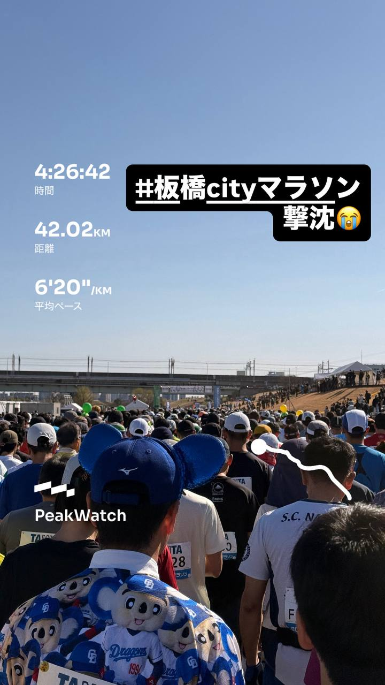
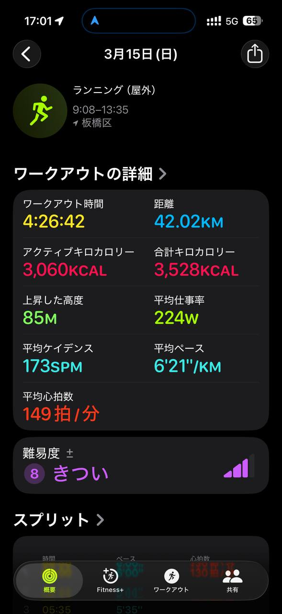
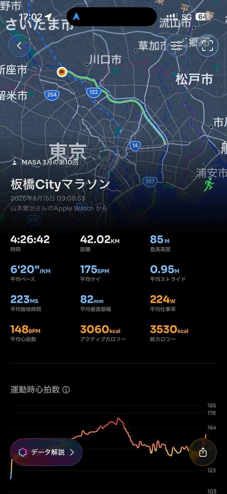
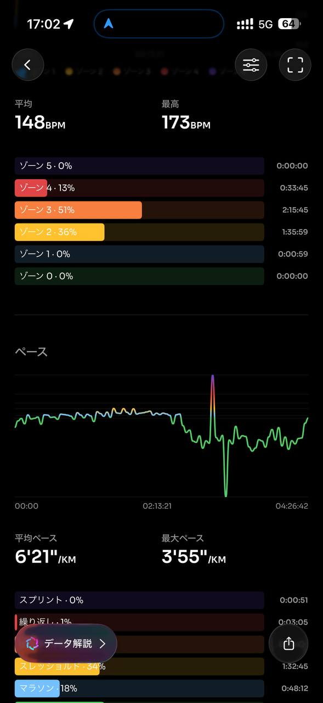
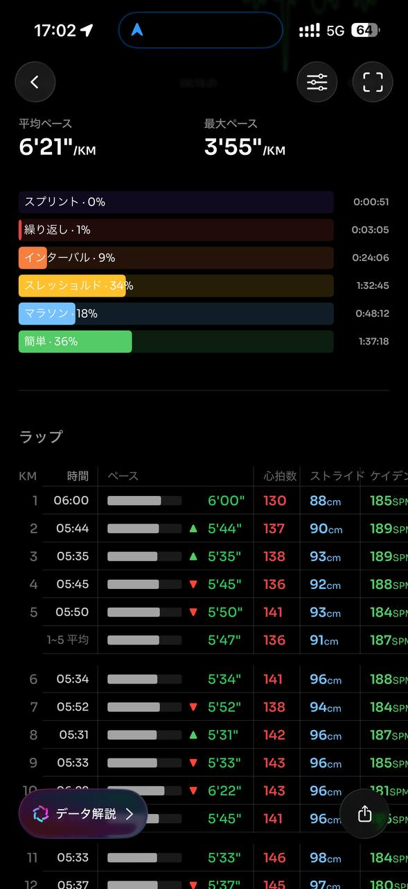
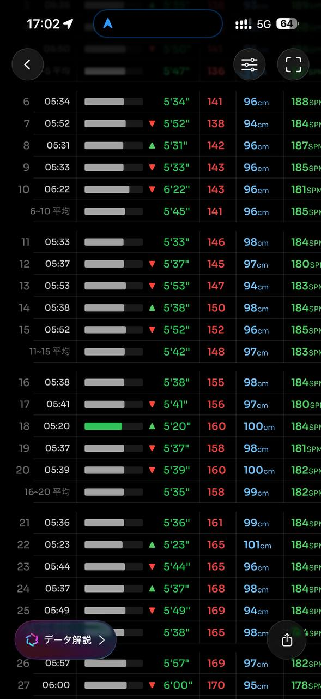
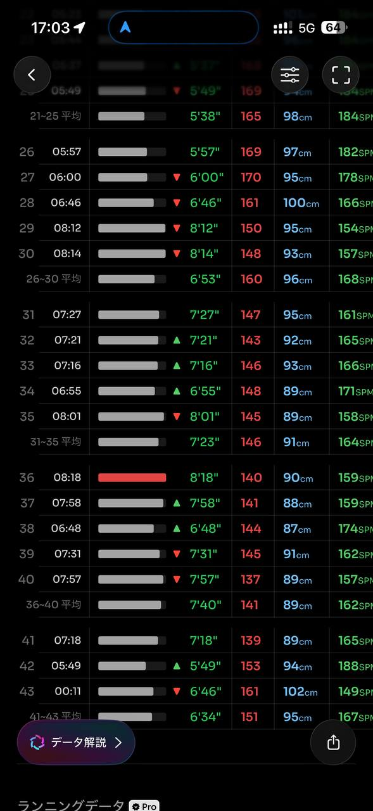
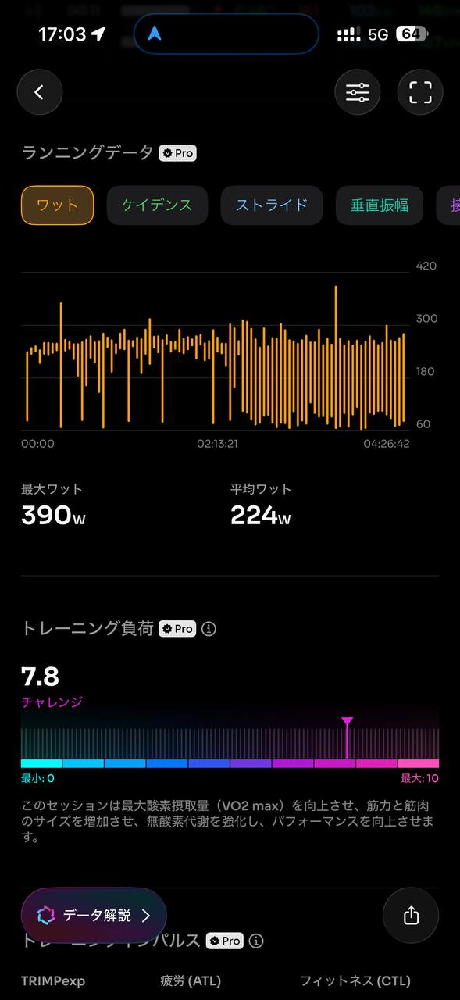
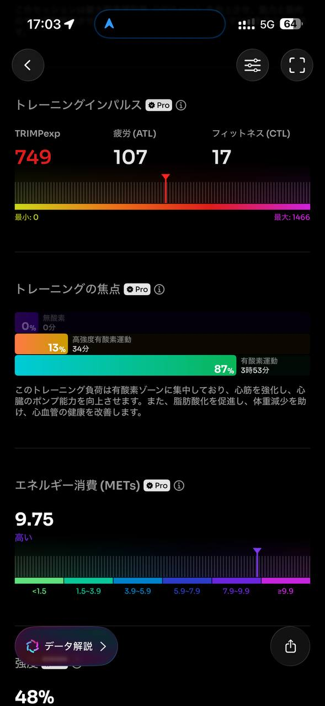
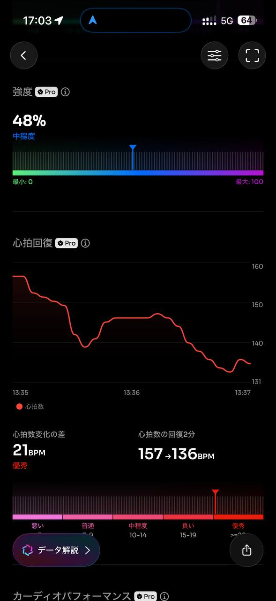
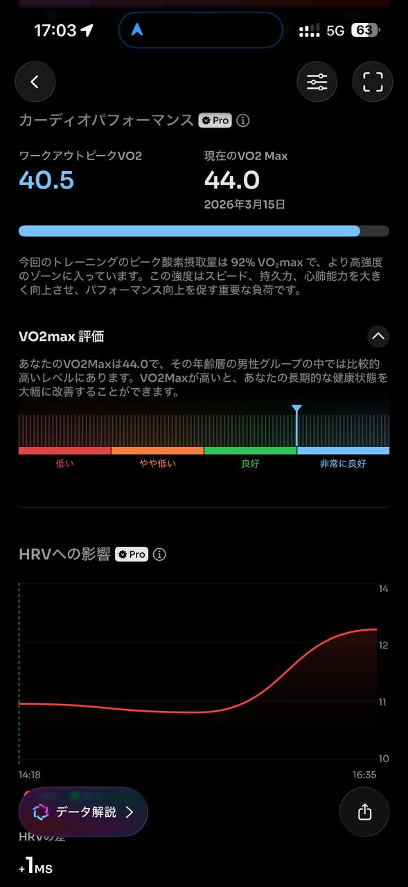
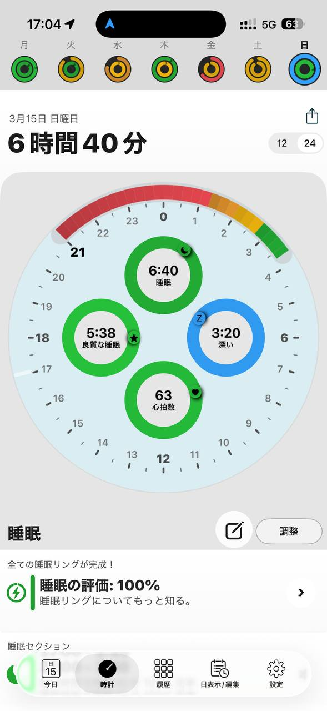
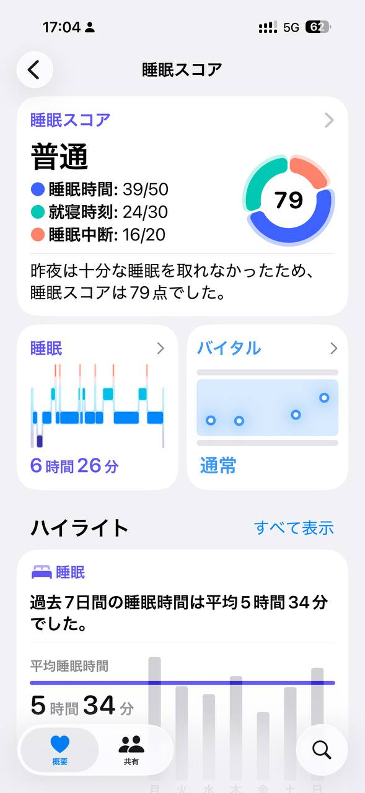
